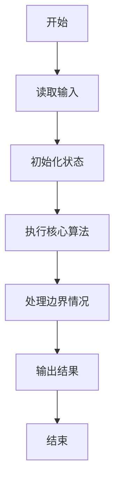
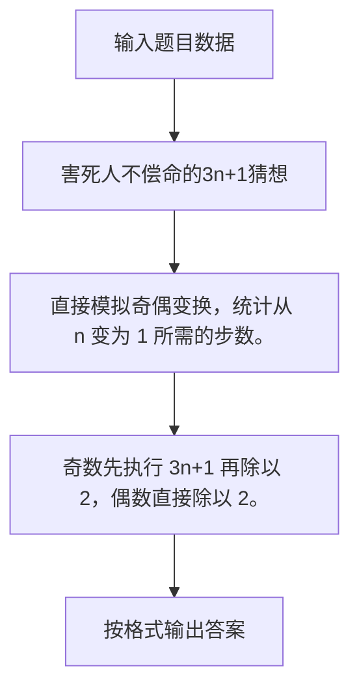

# 1001 害死人不偿命的(3n+1)猜想

- **分值：** 15分

### 题目描述

卡拉兹(Callatz)猜想：

对任何一个正整数 $n$，如果它是偶数，那么把它砍掉一半；如果它是奇数，那么把 $(3n+1)$ 砍掉一半。这样一直反复砍下去，最后一定在某一步得到 $n=1$。卡拉兹在 1950 年的世界数学家大会上公布了这个猜想，传说当时耶鲁大学师生齐动员，拼命想证明这个貌似很傻很天真的命题，结果闹得学生们无心学业，一心只证 $(3n+1)$，以至于有人说这是一个阴谋，卡拉兹是在蓄意延缓美国数学界教学与科研的进展……

我们今天的题目不是证明卡拉兹猜想，而是对给定的任一不超过 1000 的正整数 $n$，简单地数一下，需要多少步（砍几下）才能得到 $n=1$？

### 输入格式：

每个测试输入包含 1 个测试用例，即给出正整数 $n$ 的值。

### 输出格式：

输出从 $n$ 计算到 1 需要的步数。

### 输入样例：
```
3
```

### 输出样例：
```
5
```


### 解题思路

直接模拟奇偶变换，统计从 n 变为 1 所需的步数。 奇数先执行 3n+1 再除以 2，偶数直接除以 2。

实现时按照题目的输入顺序读取数据，使用与数据规模匹配的数据结构保存必要状态，在遍历或模拟过程中完成核心计算，最后严格按照输出格式生成答案。

### 代码流程说明

1. 读取题目输入，初始化计数器、数组、集合或其他辅助状态。
2. 直接模拟奇偶变换，统计从 n 变为 1 所需的步数。
3. 奇数先执行 3n+1 再除以 2，偶数直接除以 2。
4. 根据题目要求处理边界情况，并输出最终结果。

时间复杂度为 O(log n)，空间复杂度主要取决于输入数据和辅助状态，通常为 O(1) 到 O(n)。

### 代码实现

以下是本题对应的完整 C++17 实现：

```cpp
#include <bits/stdc++.h>
using namespace std;
// 算法原理：直接模拟奇偶变换，统计从 n 变为 1 所需的步数。
// 关键步骤：奇数先执行 3n+1 再除以 2，偶数直接除以 2。
int main() {
    long long n;
    if (!(cin >> n))
        return 0;
    int c = 0;
    while (n != 1) {
        n = n % 2 ? (3 * n + 1) / 2 : n / 2;
        ++c;
    }
    cout << c;
}
```

### 代码流程图



### 解题流程图



### 常见易错点

- 注意输入规模，超大整数、长字符串或链表地址不能简单依赖普通整数和下标。
- 严格区分题目中的边界条件，例如是否包含等号、是否需要保留前导零以及是否只处理完整区块。
- 输出时按照题目规定的空格、换行、大小写和小数位数格式，避免计算正确但格式错误。
