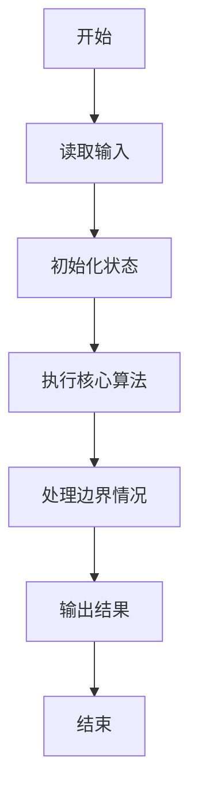
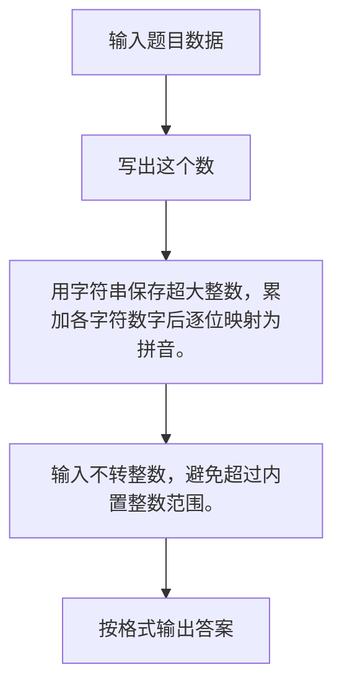

# 1002 写出这个数

- **分值：** 20分

### 题目描述

读入一个正整数 $n$，计算其各位数字之和，用汉语拼音写出和的每一位数字。

### 输入格式：

每个测试输入包含 1 个测试用例，即给出自然数 $n$ 的值。这里保证 $n$ 小于 $10^{100}$。

### 输出格式：

在一行内输出 $n$ 的各位数字之和的每一位，拼音数字间有 1 空格，但一行中最后一个拼音数字后没有空格。

### 输入样例：
```
1234567890987654321123456789
```

### 输出样例：
```
yi san wu
```


### 解题思路

用字符串保存超大整数，累加各字符数字后逐位映射为拼音。 输入不转整数，避免超过内置整数范围。

实现时按照题目的输入顺序读取数据，使用与数据规模匹配的数据结构保存必要状态，在遍历或模拟过程中完成核心计算，最后严格按照输出格式生成答案。

### 代码流程说明

1. 读取题目输入，初始化计数器、数组、集合或其他辅助状态。
2. 用字符串保存超大整数，累加各字符数字后逐位映射为拼音。
3. 输入不转整数，避免超过内置整数范围。
4. 根据题目要求处理边界情况，并输出最终结果。

时间复杂度为 O(L)，空间复杂度主要取决于输入数据和辅助状态，通常为 O(1) 到 O(n)。

### 代码实现

以下是本题对应的完整 C++17 实现：

```cpp
#include <bits/stdc++.h>
using namespace std;
// 算法原理：用字符串保存超大整数，累加各字符数字后逐位映射为拼音。
// 关键步骤：输入不转整数，避免超过内置整数范围。
int main() {
    string s;
    cin >> s;
    int sum = 0;
    for (char c : s)
        sum += c - '0';
    string p[] = {"ling", "yi", "er", "san", "si", "wu", "liu", "qi", "ba", "jiu"},
           t = to_string(sum);
    for (int i = 0; i < (int)t.size(); ++i) {
        if (i)
            cout << ' ';
        cout << p[t[i] - '0'];
    }
}
```

### 代码流程图



### 解题流程图



### 常见易错点

- 注意输入规模，超大整数、长字符串或链表地址不能简单依赖普通整数和下标。
- 严格区分题目中的边界条件，例如是否包含等号、是否需要保留前导零以及是否只处理完整区块。
- 输出时按照题目规定的空格、换行、大小写和小数位数格式，避免计算正确但格式错误。
