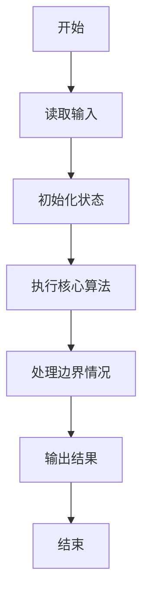
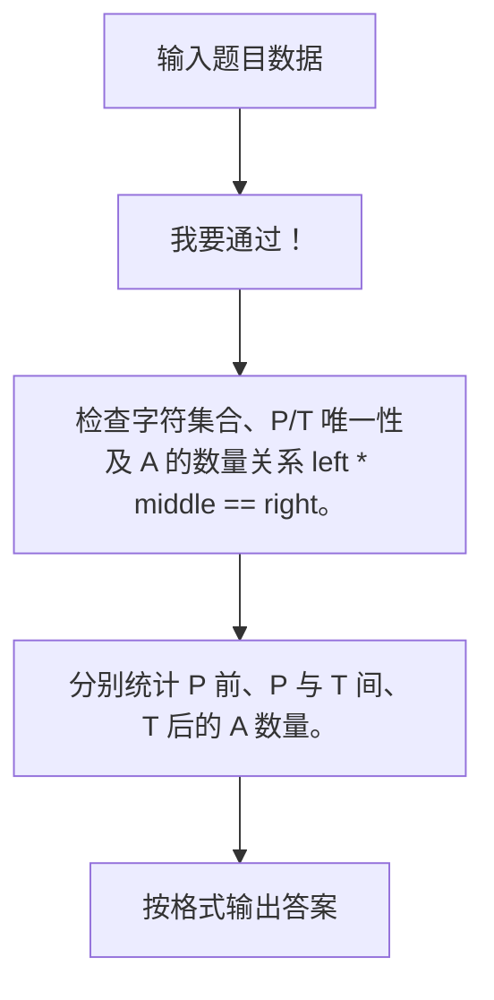

# 1003 我要通过！

- **分值：** 20分

### 题目描述

“**答案正确**”是自动判题系统给出的最令人欢喜的回复。本题属于 PAT 的“**答案正确**”大派送 —— 只要读入的字符串满足下列条件，系统就输出“**答案正确**”，否则输出“**答案错误**”。

得到“**答案正确**”的条件是：

1. 字符串中必须仅有 `P`、 `A`、 `T`这三种字符，不可以包含其它字符；
2. 任意形如 `xPATx` 的字符串都可以获得“**答案正确**”，其中 `x` 或者是空字符串，或者是仅由字母 `A` 组成的字符串；
3. 如果 `aPbTc` 是正确的，那么 `aPbATca` 也是正确的，其中 `a`、 `b`、 `c` 均或者是空字符串，或者是仅由字母 `A` 组成的字符串。

现在就请你为 PAT 写一个自动裁判程序，判定哪些字符串是可以获得“**答案正确**”的。

### 输入格式：

每个测试输入包含 1 个测试用例。第 1 行给出一个正整数 $n$ ($≤10$)，是需要检测的字符串个数。接下来每个字符串占一行，字符串长度不超过 100，且不包含空格。

### 输出格式：

每个字符串的检测结果占一行，如果该字符串可以获得“**答案正确**”，则输出 `YES`，否则输出 `NO`。

### 输入样例：
```
10
PAT
PAAT
AAPATAA
AAPAATAAAA
xPATx
PT
Whatever
APAAATAA
APT
APATTAA

```

### 输出样例：
```
YES
YES
YES
YES
NO
NO
NO
NO
NO
NO
```

**鸣谢江西财经大学软件学院朱政同学、用户 woluo_z 补充测试数据！**


### 解题思路

检查字符集合、P/T 唯一性及 A 的数量关系 left * middle == right。 分别统计 P 前、P 与 T 间、T 后的 A 数量。

实现时按照题目的输入顺序读取数据，使用与数据规模匹配的数据结构保存必要状态，在遍历或模拟过程中完成核心计算，最后严格按照输出格式生成答案。

### 代码流程说明

1. 读取题目输入，初始化计数器、数组、集合或其他辅助状态。
2. 检查字符集合、P/T 唯一性及 A 的数量关系 left * middle == right。
3. 分别统计 P 前、P 与 T 间、T 后的 A 数量。
4. 根据题目要求处理边界情况，并输出最终结果。

时间复杂度为 O(L)，空间复杂度主要取决于输入数据和辅助状态，通常为 O(1) 到 O(n)。

### 代码实现

以下是本题对应的完整 C++17 实现：

```cpp
#include <bits/stdc++.h>
using namespace std;
// 算法原理：检查字符集合、P/T 唯一性及 A 的数量关系 left * middle == right。
// 关键步骤：分别统计 P 前、P 与 T 间、T 后的 A 数量。
int main() {
    int n;
    cin >> n;
    while (n--) {
        string s;
        cin >> s;
        int p = s.find('P'), t = s.find('T');
        bool ok = p != string::npos && t != string::npos && t > p + 1;
        for (char c : s)
            if (c != 'P' && c != 'A' && c != 'T')
                ok = false;
        if (ok) {
            int a = p, b = t - p - 1, c = s.size() - t - 1;
            ok = a * b == c;
        }
        cout << (ok ? "YES" : "NO") << '\n';
    }
}
```

### 代码流程图



### 解题流程图



### 常见易错点

- 注意输入规模，超大整数、长字符串或链表地址不能简单依赖普通整数和下标。
- 严格区分题目中的边界条件，例如是否包含等号、是否需要保留前导零以及是否只处理完整区块。
- 输出时按照题目规定的空格、换行、大小写和小数位数格式，避免计算正确但格式错误。
