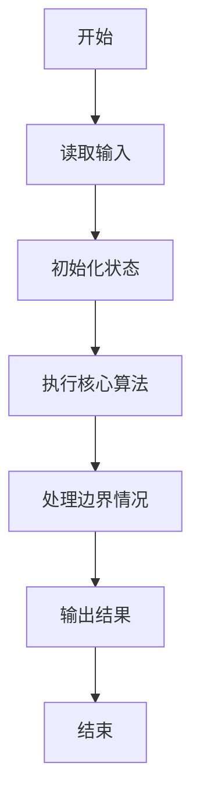
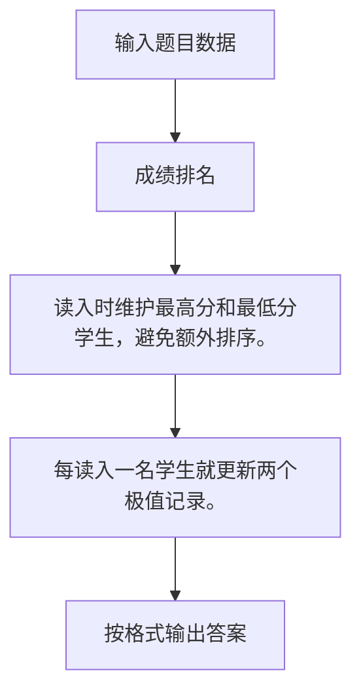

# 1004 成绩排名

- **分值：** 20分

### 题目描述

读入 $n$（$>0$）名学生的姓名、学号、成绩，分别输出成绩最高和成绩最低学生的姓名和学号。

### 输入格式：

每个测试输入包含 1 个测试用例，格式为
```
第 1 行：正整数 n
第 2 行：第 1 个学生的姓名 学号 成绩
第 3 行：第 2 个学生的姓名 学号 成绩
  ... ... ...
第 n+1 行：第 n 个学生的姓名 学号 成绩
```
其中`姓名`和`学号`均为不超过 10 个字符的字符串，成绩为 0 到 100 之间的一个整数，这里保证在一组测试用例中没有两个学生的成绩是相同的。

### 输出格式：

对每个测试用例输出 2 行，第 1 行是成绩最高学生的姓名和学号，第 2 行是成绩最低学生的姓名和学号，字符串间有 1 空格。

### 输入样例：
```
3
Joe Math990112 89
Mike CS991301 100
Mary EE990830 95
```

### 输出样例：
```
Mike CS991301
Joe Math990112
```


### 解题思路

读入时维护最高分和最低分学生，避免额外排序。 每读入一名学生就更新两个极值记录。

实现时按照题目的输入顺序读取数据，使用与数据规模匹配的数据结构保存必要状态，在遍历或模拟过程中完成核心计算，最后严格按照输出格式生成答案。

### 代码流程说明

1. 读取题目输入，初始化计数器、数组、集合或其他辅助状态。
2. 读入时维护最高分和最低分学生，避免额外排序。
3. 每读入一名学生就更新两个极值记录。
4. 根据题目要求处理边界情况，并输出最终结果。

时间复杂度为 O(n)，空间复杂度主要取决于输入数据和辅助状态，通常为 O(1) 到 O(n)。

### 代码实现

以下是本题对应的完整 C++17 实现：

```cpp
#include <bits/stdc++.h>
using namespace std;
// 算法原理：读入时维护最高分和最低分学生，避免额外排序。
// 关键步骤：每读入一名学生就更新两个极值记录。
int main() {
    int n;
    cin >> n;
    string na, ia, nb, ib;
    int a = -1, b = 101;
    while (n--) {
        string x, y;
        int z;
        cin >> x >> y >> z;
        if (z > a)
            na = x, ia = y, a = z;
        if (z < b)
            nb = x, ib = y, b = z;
    }
    cout << na << ' ' << ia << '\n' << nb << ' ' << ib;
}
```

### 代码流程图



### 解题流程图



### 常见易错点

- 注意输入规模，超大整数、长字符串或链表地址不能简单依赖普通整数和下标。
- 严格区分题目中的边界条件，例如是否包含等号、是否需要保留前导零以及是否只处理完整区块。
- 输出时按照题目规定的空格、换行、大小写和小数位数格式，避免计算正确但格式错误。
