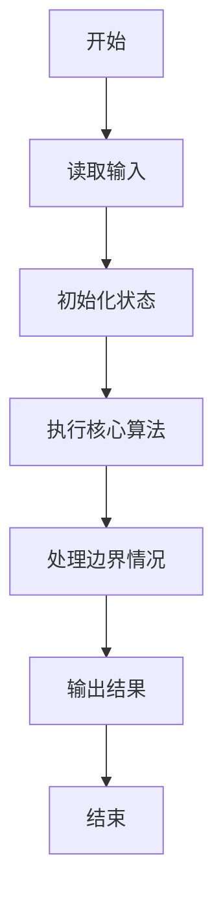
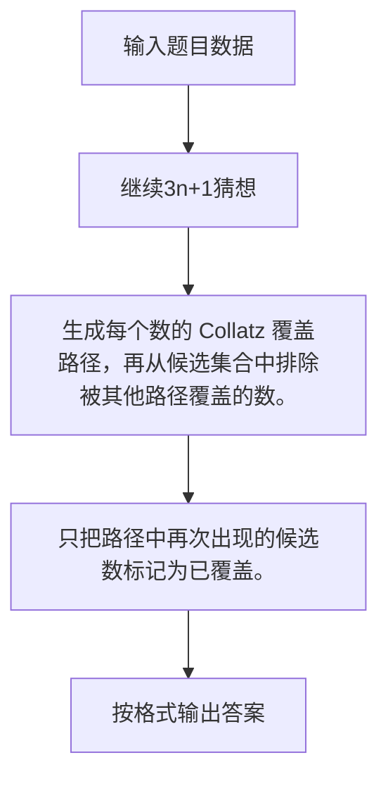

# 1005 继续(3n+1)猜想

- **分值：** 25分

### 题目描述

卡拉兹(Callatz)猜想已经在1001中给出了描述。在这个题目里，情况稍微有些复杂。

当我们验证卡拉兹猜想的时候，为了避免重复计算，可以记录下递推过程中遇到的每一个数。例如对 $n=3$ 进行验证的时候，我们需要计算 3、5、8、4、2、1，则当我们对 $n=5$、8、4、2 进行验证的时候，就可以直接判定卡拉兹猜想的真伪，而不需要重复计算，因为这 4 个数已经在验证3的时候遇到过了，我们称 5、8、4、2 是被 3“覆盖”的数。我们称一个数列中的某个数 $n$ 为“关键数”，如果 $n$ 不能被数列中的其他数字所覆盖。

现在给定一系列待验证的数字，我们只需要验证其中的几个关键数，就可以不必再重复验证余下的数字。你的任务就是找出这些关键数字，并按从大到小的顺序输出它们。

### 输入格式：

每个测试输入包含 1 个测试用例，第 1 行给出一个正整数 $K$ ($<100$)，第 2 行给出 $K$ 个互不相同的待验证的正整数 $n$ ($1<n\le 100$)的值，数字间用空格隔开。

### 输出格式：

每个测试用例的输出占一行，按从大到小的顺序输出关键数字。数字间用 1 个空格隔开，但一行中最后一个数字后没有空格。

### 输入样例：
```
6
3 5 6 7 8 11
```

### 输出样例：
```
7 6
```


### 解题思路

生成每个数的 Collatz 覆盖路径，再从候选集合中排除被其他路径覆盖的数。 只把路径中再次出现的候选数标记为已覆盖。

实现时按照题目的输入顺序读取数据，使用与数据规模匹配的数据结构保存必要状态，在遍历或模拟过程中完成核心计算，最后严格按照输出格式生成答案。

### 代码流程说明

1. 读取题目输入，初始化计数器、数组、集合或其他辅助状态。
2. 生成每个数的 Collatz 覆盖路径，再从候选集合中排除被其他路径覆盖的数。
3. 只把路径中再次出现的候选数标记为已覆盖。
4. 根据题目要求处理边界情况，并输出最终结果。

时间复杂度为 O(k log V)，空间复杂度主要取决于输入数据和辅助状态，通常为 O(1) 到 O(n)。

### 代码实现

以下是本题对应的完整 C++17 实现：

```cpp
#include <bits/stdc++.h>
using namespace std;
// 算法原理：生成每个数的 Collatz 覆盖路径，再从候选集合中排除被其他路径覆盖的数。
// 关键步骤：只把路径中再次出现的候选数标记为已覆盖。
int main() {
    int k;
    cin >> k;
    vector<int> a(k);
    set<int> input, covered;
    for (int &x : a)
        cin >> x, input.insert(x);
    for (int x : a) {
        while (x != 1) {
            x = x % 2 ? 3 * x + 1 : x / 2;
            if (input.count(x))
                covered.insert(x);
        }
    }
    sort(a.rbegin(), a.rend());
    bool first = true;
    for (int x : a)
        if (!covered.count(x)) {
            if (!first)
                cout << ' ';
            cout << x;
            first = false;
        }
}
```

### 代码流程图



### 解题流程图



### 常见易错点

- 注意输入规模，超大整数、长字符串或链表地址不能简单依赖普通整数和下标。
- 严格区分题目中的边界条件，例如是否包含等号、是否需要保留前导零以及是否只处理完整区块。
- 输出时按照题目规定的空格、换行、大小写和小数位数格式，避免计算正确但格式错误。
