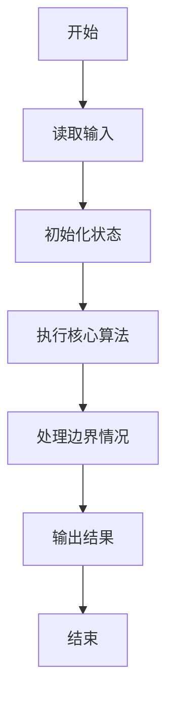
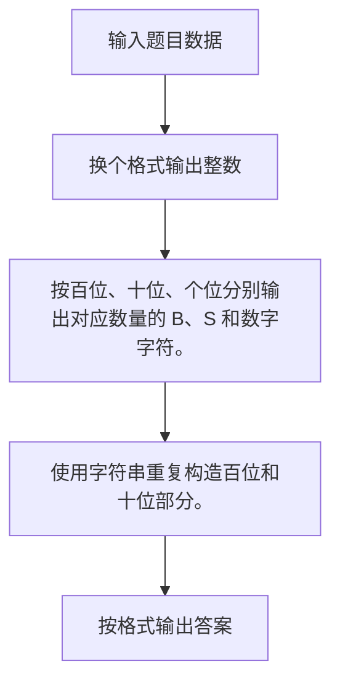

# 1006 换个格式输出整数

- **分值：** 15分

### 题目描述

让我们用字母 `B` 来表示“百”、字母 `S` 表示“十”，用 `12...n` 来表示不为零的个位数字 `n`（$<10$），换个格式来输出任一个不超过 3 位的正整数。例如 `234` 应该被输出为 `BBSSS1234`，因为它有 2 个“百”、3 个“十”、以及个位的 4。

### 输入格式：

每个测试输入包含 1 个测试用例，给出正整数 $n$（$<1000$）。

### 输出格式：

每个测试用例的输出占一行，用规定的格式输出 $n$。

### 输入样例：1
```
234
```

### 输出样例：1
```
BBSSS1234
```

### 输入样例：2
```
23
```

### 输出样例：2
```
SS123
```


### 解题思路

按百位、十位、个位分别输出对应数量的 B、S 和数字字符。 使用字符串重复构造百位和十位部分。

实现时按照题目的输入顺序读取数据，使用与数据规模匹配的数据结构保存必要状态，在遍历或模拟过程中完成核心计算，最后严格按照输出格式生成答案。

### 代码流程说明

1. 读取题目输入，初始化计数器、数组、集合或其他辅助状态。
2. 按百位、十位、个位分别输出对应数量的 B、S 和数字字符。
3. 使用字符串重复构造百位和十位部分。
4. 根据题目要求处理边界情况，并输出最终结果。

时间复杂度为 O(n)，空间复杂度主要取决于输入数据和辅助状态，通常为 O(1) 到 O(n)。

### 代码实现

以下是本题对应的完整 C++17 实现：

```cpp
#include <bits/stdc++.h>
using namespace std;
// 算法原理：按百位、十位、个位分别输出对应数量的 B、S 和数字字符。
// 关键步骤：使用字符串重复构造百位和十位部分。
int main() {
    int n;
    cin >> n;
    cout << string(n / 100, 'B') << string(n / 10 % 10, 'S');
    for (int i = 1; i <= n % 10; ++i)
        cout << i;
}
```

### 代码流程图



### 解题流程图



### 常见易错点

- 注意输入规模，超大整数、长字符串或链表地址不能简单依赖普通整数和下标。
- 严格区分题目中的边界条件，例如是否包含等号、是否需要保留前导零以及是否只处理完整区块。
- 输出时按照题目规定的空格、换行、大小写和小数位数格式，避免计算正确但格式错误。
