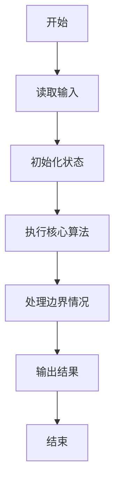
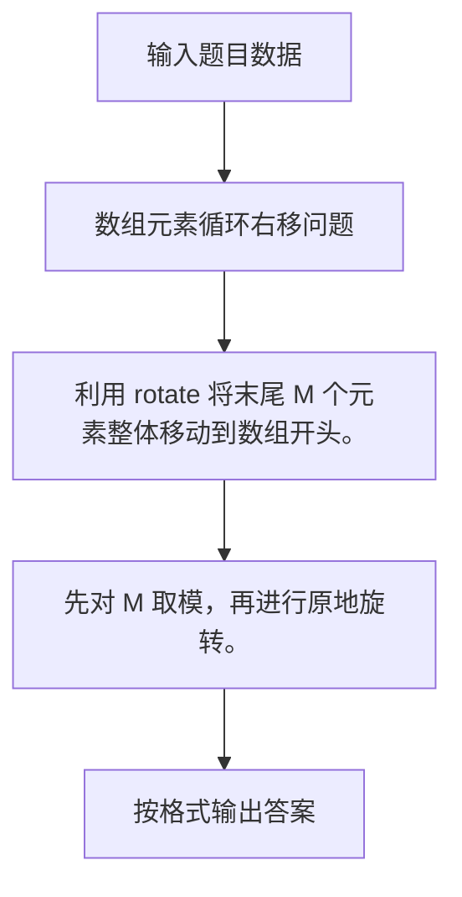

# 1008 数组元素循环右移问题

- **分值：** 20分

### 题目描述

一个数组$A$中存有$N$（$>0$）个整数，在不允许使用另外数组的前提下，将每个整数循环向右移$M$（$\ge 0$）个位置，即将$A$中的数据由（$A_0 A_1 \cdots A_{N-1}$）变换为（$A_{N-M} \cdots A_{N-1} A_0 A_1 \cdots A_{N-M-1}$）（最后$M$个数循环移至最前面的$M$个位置）。如果需要考虑程序移动数据的次数尽量少，要如何设计移动的方法？

### 输入格式：

每个输入包含一个测试用例，第1行输入$N$（$1\le N \le 100$）和$M$（$\ge 0$）；第2行输入$N$个整数，之间用空格分隔。

### 输出格式：

在一行中输出循环右移$M$位以后的整数序列，之间用空格分隔，序列结尾不能有多余空格。

### 输入样例：
```
6 2
1 2 3 4 5 6
```

### 输出样例：
```
5 6 1 2 3 4
```


### 解题思路

利用 rotate 将末尾 M 个元素整体移动到数组开头。 先对 M 取模，再进行原地旋转。

实现时按照题目的输入顺序读取数据，使用与数据规模匹配的数据结构保存必要状态，在遍历或模拟过程中完成核心计算，最后严格按照输出格式生成答案。

### 代码流程说明

1. 读取题目输入，初始化计数器、数组、集合或其他辅助状态。
2. 利用 rotate 将末尾 M 个元素整体移动到数组开头。
3. 先对 M 取模，再进行原地旋转。
4. 根据题目要求处理边界情况，并输出最终结果。

时间复杂度为 O(N)，空间复杂度主要取决于输入数据和辅助状态，通常为 O(1) 到 O(n)。

### 代码实现

以下是本题对应的完整 C++17 实现：

```cpp
#include <bits/stdc++.h>
using namespace std;
// 算法原理：利用 rotate 将末尾 M 个元素整体移动到数组开头。
// 关键步骤：先对 M 取模，再进行原地旋转。
int main() {
    int n, m;
    cin >> n >> m;
    vector<int> a(n);
    for (int &x : a)
        cin >> x;
    m %= n;
    rotate(a.begin(), a.end() - m, a.end());
    for (int i = 0; i < n; ++i) {
        if (i)
            cout << ' ';
        cout << a[i];
    }
}
```

### 代码流程图



### 解题流程图



### 常见易错点

- 注意输入规模，超大整数、长字符串或链表地址不能简单依赖普通整数和下标。
- 严格区分题目中的边界条件，例如是否包含等号、是否需要保留前导零以及是否只处理完整区块。
- 输出时按照题目规定的空格、换行、大小写和小数位数格式，避免计算正确但格式错误。
