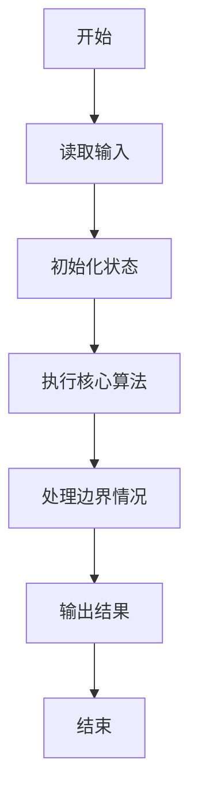
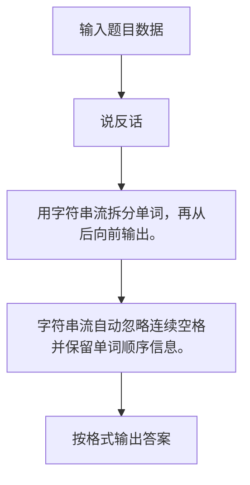

# 1009 说反话

- **分值：** 20分

### 题目描述

给定一句英语，要求你编写程序，将句中所有单词的顺序颠倒输出。

### 输入格式：

测试输入包含一个测试用例，在一行内给出总长度不超过 80 的字符串。字符串由若干单词和若干空格组成，其中单词是由英文字母（大小写有区分）组成的字符串，单词之间用 1 个空格分开，输入保证句子末尾没有多余的空格。

### 输出格式：

每个测试用例的输出占一行，输出倒序后的句子。

### 输入样例：
```
Hello World Here I Come

```

### 输出样例：
```
Come I Here World Hello

```

**鸣谢用户 无影 修正数据！**


### 解题思路

用字符串流拆分单词，再从后向前输出。 字符串流自动忽略连续空格并保留单词顺序信息。

实现时按照题目的输入顺序读取数据，使用与数据规模匹配的数据结构保存必要状态，在遍历或模拟过程中完成核心计算，最后严格按照输出格式生成答案。

### 代码流程说明

1. 读取题目输入，初始化计数器、数组、集合或其他辅助状态。
2. 用字符串流拆分单词，再从后向前输出。
3. 字符串流自动忽略连续空格并保留单词顺序信息。
4. 根据题目要求处理边界情况，并输出最终结果。

时间复杂度为 O(L)，空间复杂度主要取决于输入数据和辅助状态，通常为 O(1) 到 O(n)。

### 代码实现

以下是本题对应的完整 C++17 实现：

```cpp
#include <bits/stdc++.h>
using namespace std;
// 算法原理：用字符串流拆分单词，再从后向前输出。
// 关键步骤：字符串流自动忽略连续空格并保留单词顺序信息。
int main() {
    string s;
    getline(cin, s);
    stringstream ss(s);
    vector<string> a;
    while (ss >> s)
        a.push_back(s);
    for (int i = a.size() - 1; i >= 0; --i) {
        if (i != (int)a.size() - 1)
            cout << ' ';
        cout << a[i];
    }
}
```

### 代码流程图



### 解题流程图



### 常见易错点

- 注意输入规模，超大整数、长字符串或链表地址不能简单依赖普通整数和下标。
- 严格区分题目中的边界条件，例如是否包含等号、是否需要保留前导零以及是否只处理完整区块。
- 输出时按照题目规定的空格、换行、大小写和小数位数格式，避免计算正确但格式错误。
