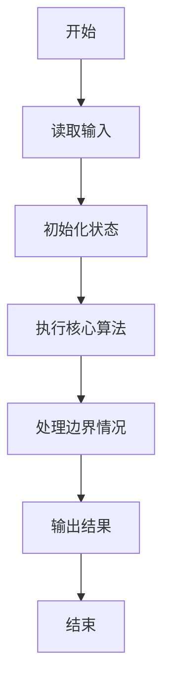
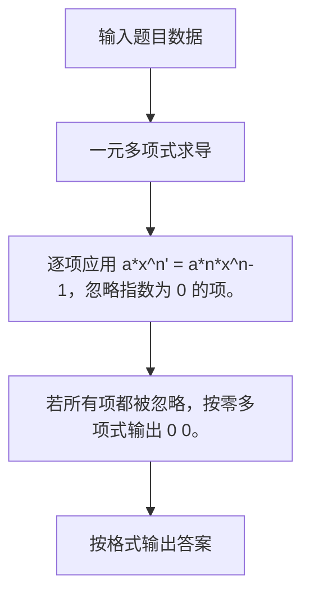

# 1010 一元多项式求导

- **分值：** 25分

### 题目描述

设计函数求一元多项式的导数。（注：$x^n$（$n$为整数）的一阶导数为$n x^{n-1}$。）

### 输入格式：

以指数递降方式输入多项式非零项系数和指数（绝对值均为不超过 1000 的整数）。数字间以空格分隔。

### 输出格式：

以与输入相同的格式输出导数多项式非零项的系数和指数。数字间以空格分隔，但结尾不能有多余空格。注意“零多项式”的指数和系数都是 0，但是表示为 `0 0`。

### 输入样例：
```
3 4 -5 2 6 1 -2 0
```

### 输出样例：
```
12 3 -10 1 6 0
```


### 解题思路

逐项应用 a*x^n' = a*n*x^n-1，忽略指数为 0 的项。 若所有项都被忽略，按零多项式输出 0 0。

实现时按照题目的输入顺序读取数据，使用与数据规模匹配的数据结构保存必要状态，在遍历或模拟过程中完成核心计算，最后严格按照输出格式生成答案。

### 代码流程说明

1. 读取题目输入，初始化计数器、数组、集合或其他辅助状态。
2. 逐项应用 a*x^n' = a*n*x^n-1，忽略指数为 0 的项。
3. 若所有项都被忽略，按零多项式输出 0 0。
4. 根据题目要求处理边界情况，并输出最终结果。

时间复杂度为 O(t)，空间复杂度主要取决于输入数据和辅助状态，通常为 O(1) 到 O(n)。

### 代码实现

以下是本题对应的完整 C++17 实现：

```cpp
#include <bits/stdc++.h>
using namespace std;
// 算法原理：逐项应用 (a*x^n)' = (a*n)*x^(n-1)，忽略指数为 0 的项。
// 关键步骤：若所有项都被忽略，按零多项式输出 0 0。
int main() {
    long long a, n;
    bool first = true, any = false;
    while (cin >> a >> n) {
        if (n == 0)
            continue;
        any = true;
        if (!first)
            cout << ' ';
        cout << a * n << ' ' << n - 1;
        first = false;
    }
    if (!any)
        cout << "0 0";
}
```

### 代码流程图



### 解题流程图



### 常见易错点

- 注意输入规模，超大整数、长字符串或链表地址不能简单依赖普通整数和下标。
- 严格区分题目中的边界条件，例如是否包含等号、是否需要保留前导零以及是否只处理完整区块。
- 输出时按照题目规定的空格、换行、大小写和小数位数格式，避免计算正确但格式错误。
