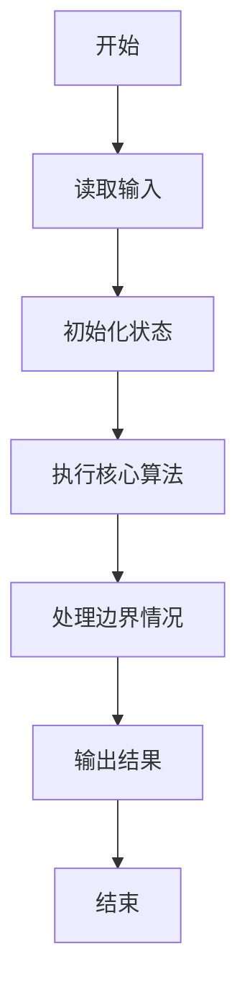
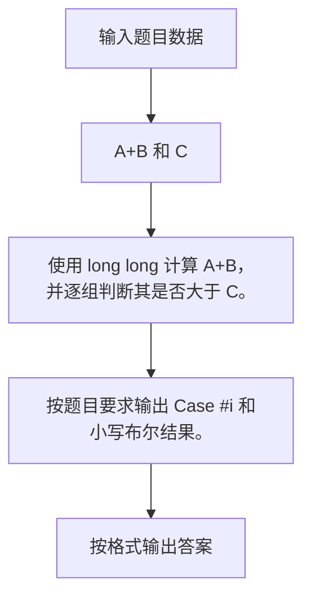

# 1011 A+B 和 C

- **分值：** 15分

### 题目描述

给定区间 [$-2^{31}, 2^{31}$] 内的 3 个整数 $A$、$B$ 和 $C$，请判断 $A+B$ 是否大于 $C$。

### 输入格式：

输入第 1 行给出正整数 $T$ ($\le 10$)，是测试用例的个数。随后给出 $T$ 组测试用例，每组占一行，顺序给出 $A$、$B$ 和 $C$。整数间以空格分隔。

### 输出格式：

对每组测试用例，在一行中输出 `Case #X: true` 如果 $A+B>C$，否则输出 `Case #X: false`，其中 `X` 是测试用例的编号（从 1 开始）。

### 输入样例：
```
4
1 2 3
2 3 4
2147483647 0 2147483646
0 -2147483648 -2147483647
```

### 输出样例：
```
Case #1: false
Case #2: true
Case #3: true
Case #4: false
```


### 解题思路

使用 long long 计算 A+B，并逐组判断其是否大于 C。 按题目要求输出 Case #i 和小写布尔结果。

实现时按照题目的输入顺序读取数据，使用与数据规模匹配的数据结构保存必要状态，在遍历或模拟过程中完成核心计算，最后严格按照输出格式生成答案。

### 代码流程说明

1. 读取题目输入，初始化计数器、数组、集合或其他辅助状态。
2. 使用 long long 计算 A+B，并逐组判断其是否大于 C。
3. 按题目要求输出 Case #i 和小写布尔结果。
4. 根据题目要求处理边界情况，并输出最终结果。

时间复杂度为 O(T)，空间复杂度主要取决于输入数据和辅助状态，通常为 O(1) 到 O(n)。

### 代码实现

以下是本题对应的完整 C++17 实现：

```cpp
#include <bits/stdc++.h>
using namespace std;
// 算法原理：使用 long long 计算 A+B，并逐组判断其是否大于 C。
// 关键步骤：按题目要求输出 Case #i 和小写布尔结果。
int main() {
    int n;
    cin >> n;
    for (int i = 1; i <= n; ++i) {
        long long a, b, c;
        cin >> a >> b >> c;
        cout << "Case #" << i << ": " << (a + b > c ? "true" : "false") << '\n';
    }
}
```

### 代码流程图



### 解题流程图



### 常见易错点

- 注意输入规模，超大整数、长字符串或链表地址不能简单依赖普通整数和下标。
- 严格区分题目中的边界条件，例如是否包含等号、是否需要保留前导零以及是否只处理完整区块。
- 输出时按照题目规定的空格、换行、大小写和小数位数格式，避免计算正确但格式错误。
