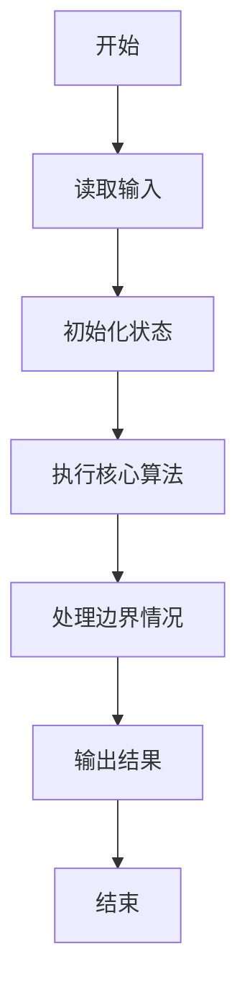
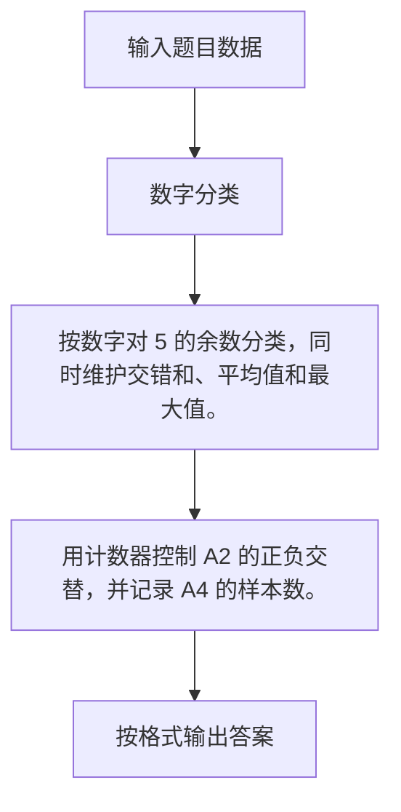

# 1012 数字分类

- **分值：** 20分

### 题目描述

给定一系列正整数，请按要求对数字进行分类，并输出以下 5 个数字：

- $A_1$ = 能被 5 整除的数字中所有偶数的和；
- $A_2$ = 将被 5 除后余 1 的数字按给出顺序进行交错求和，即计算 $n_1-n_2+n_3-n_4\cdots$；
- $A_3$ = 被 5 除后余 2 的数字的个数；
- $A_4$ = 被 5 除后余 3 的数字的平均数，精确到小数点后 1 位；
- $A_5$ = 被 5 除后余 4 的数字中最大数字。

### 输入格式：

每个输入包含 1 个测试用例。每个测试用例先给出一个不超过 1000 的正整数 $N$，随后给出 $N$ 个不超过 1000 的待分类的正整数。数字间以空格分隔。

### 输出格式：

对给定的 $N$ 个正整数，按题目要求计算 $A_1$ ~ $A_5$ 并在一行中顺序输出。数字间以空格分隔，但行末不得有多余空格。

若分类之后某一类不存在数字，则在相应位置输出 `N`。

### 输入样例：1
```
13 1 2 3 4 5 6 7 8 9 10 20 16 18
```

### 输出样例：1
```
30 11 2 9.7 9
```

### 输入样例：2
```
8 1 2 4 5 6 7 9 16
```

### 输出样例：2
```
N 11 2 N 9
```


### 解题思路

按数字对 5 的余数分类，同时维护交错和、平均值和最大值。 用计数器控制 A2 的正负交替，并记录 A4 的样本数。

实现时按照题目的输入顺序读取数据，使用与数据规模匹配的数据结构保存必要状态，在遍历或模拟过程中完成核心计算，最后严格按照输出格式生成答案。

### 代码流程说明

1. 读取题目输入，初始化计数器、数组、集合或其他辅助状态。
2. 按数字对 5 的余数分类，同时维护交错和、平均值和最大值。
3. 用计数器控制 A2 的正负交替，并记录 A4 的样本数。
4. 根据题目要求处理边界情况，并输出最终结果。

时间复杂度为 O(N)，空间复杂度主要取决于输入数据和辅助状态，通常为 O(1) 到 O(n)。

### 代码实现

以下是本题对应的完整 C++17 实现：

```cpp
#include <bits/stdc++.h>
using namespace std;
// 算法原理：按数字对 5 的余数分类，同时维护交错和、平均值和最大值。
// 关键步骤：用计数器控制 A2 的正负交替，并记录 A4 的样本数。
int main() {
    int n;
    cin >> n;
    int a1 = 0, a2 = 0, a3 = 0, a5 = -1, c2 = 0, c4 = 0;
    double s4 = 0;
    for (int x, i = 0; i < n; ++i) {
        cin >> x;
        switch (x % 5) {
        case 0:
            if (x % 2 == 0)
                a1 += x;
            break;
        case 1:
            a2 += (c2++ % 2 ? -x : x);
            break;
        case 2:
            ++a3;
            break;
        case 3:
            s4 += x, ++c4;
            break;
        case 4:
            a5 = max(a5, x);
        }
    }
    if (a1)
        cout << a1;
    else
        cout << 'N';
    cout << ' ';
    if (c2)
        cout << a2;
    else
        cout << 'N';
    cout << ' ';
    if (a3)
        cout << a3;
    else
        cout << 'N';
    cout << ' ';
    if (c4)
        cout << fixed << setprecision(1) << s4 / c4;
    else
        cout << 'N';
    cout << ' ';
    if (a5 >= 0)
        cout << a5;
    else
        cout << 'N';
}
```

### 代码流程图



### 解题流程图



### 常见易错点

- 注意输入规模，超大整数、长字符串或链表地址不能简单依赖普通整数和下标。
- 严格区分题目中的边界条件，例如是否包含等号、是否需要保留前导零以及是否只处理完整区块。
- 输出时按照题目规定的空格、换行、大小写和小数位数格式，避免计算正确但格式错误。
