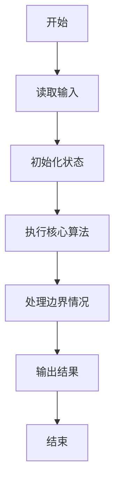
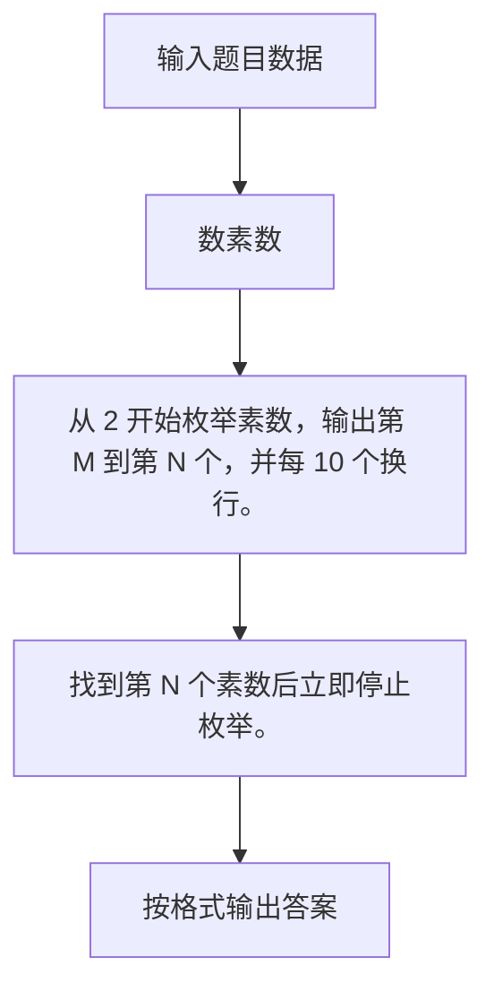

# 1013 数素数

- **分值：** 20分

### 题目描述

令 $P_i$ 表示第 $i$ 个素数。现任给两个正整数 $M \le N \le 10^4$，请输出 $P_M$ 到 $P_N$ 的所有素数。

### 输入格式：

输入在一行中给出 $M$ 和 $N$，其间以空格分隔。

### 输出格式：

输出从 $P_M$ 到 $P_N$ 的所有素数，每 10 个数字占 1 行，其间以空格分隔，但行末不得有多余空格。

### 输入样例：
```
5 27
```

### 输出样例：
```
11 13 17 19 23 29 31 37 41 43
47 53 59 61 67 71 73 79 83 89
97 101 103
```


### 解题思路

从 2 开始枚举素数，输出第 M 到第 N 个，并每 10 个换行。 找到第 N 个素数后立即停止枚举。

实现时按照题目的输入顺序读取数据，使用与数据规模匹配的数据结构保存必要状态，在遍历或模拟过程中完成核心计算，最后严格按照输出格式生成答案。

### 代码流程说明

1. 读取题目输入，初始化计数器、数组、集合或其他辅助状态。
2. 从 2 开始枚举素数，输出第 M 到第 N 个，并每 10 个换行。
3. 找到第 N 个素数后立即停止枚举。
4. 根据题目要求处理边界情况，并输出最终结果。

时间复杂度为 O(P_N√P_N)，空间复杂度主要取决于输入数据和辅助状态，通常为 O(1) 到 O(n)。

### 代码实现

以下是本题对应的完整 C++17 实现：

```cpp
#include <bits/stdc++.h>
using namespace std;
// 算法原理：从 2 开始枚举素数，输出第 M 到第 N 个，并每 10 个换行。
// 关键步骤：找到第 N 个素数后立即停止枚举。
bool prime(int n) {
    if (n < 2)
        return false;
    for (int i = 2; i * i <= n; ++i)
        if (n % i == 0)
            return false;
    return true;
}
int main() {
    int m, n;
    cin >> m >> n;
    int cnt = 0, out = 0;
    for (int x = 2;; ++x)
        if (prime(x)) {
            ++cnt;
            if (cnt >= m && cnt <= n) {
                if (out)
                    cout << (out % 10 ? ' ' : '\n');
                cout << x;
                ++out;
            }
            if (cnt == n)
                break;
        }
}
```

### 代码流程图



### 解题流程图



### 常见易错点

- 注意输入规模，超大整数、长字符串或链表地址不能简单依赖普通整数和下标。
- 严格区分题目中的边界条件，例如是否包含等号、是否需要保留前导零以及是否只处理完整区块。
- 输出时按照题目规定的空格、换行、大小写和小数位数格式，避免计算正确但格式错误。
