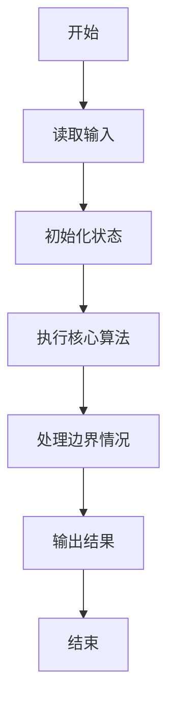
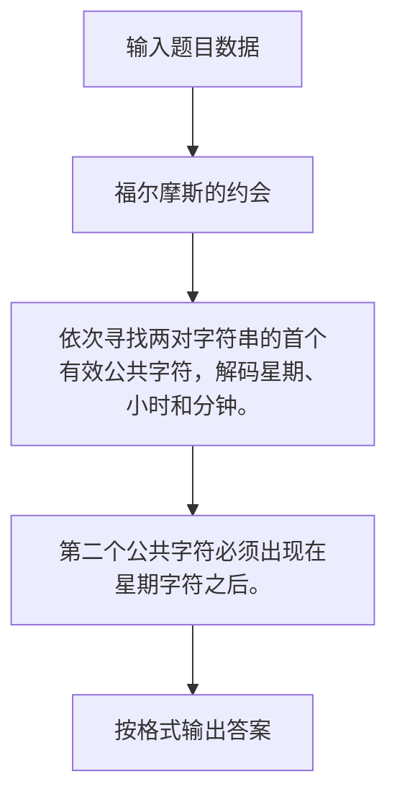

# 1014 福尔摩斯的约会

- **分值：** 20分

### 题目描述

大侦探福尔摩斯接到一张奇怪的字条：
```
我们约会吧！
3485djDkxh4hhGE
2984akDfkkkkggEdsb
s&hgsfdk
d&Hyscvnm
```
大侦探很快就明白了，字条上奇怪的乱码实际上就是约会的时间`星期四 14:04`，因为前面两字符串中第 1 对相同的大写英文字母（大小写有区分）是第 4 个字母 `D`，代表星期四；第 2 对相同的字符是 `E` ，那是第 5 个英文字母，代表一天里的第 14 个钟头（于是一天的 0 点到 23 点由数字 0 到 9、以及大写字母 `A` 到 `N` 表示）；后面两字符串第 1 对相同的英文字母 `s` 出现在第 4 个位置（从 0 开始计数）上，代表第 4 分钟。现给定两对字符串，请帮助福尔摩斯解码得到约会的时间。

### 输入格式：

输入在 4 行中分别给出 4 个非空、不包含空格、且长度不超过 60 的字符串。

### 输出格式：

在一行中输出约会的时间，格式为 `DAY HH:MM`，其中 `DAY` 是某星期的 3 字符缩写，即 `MON` 表示星期一，`TUE` 表示星期二，`WED` 表示星期三，`THU` 表示星期四，`FRI` 表示星期五，`SAT` 表示星期六，`SUN` 表示星期日。题目输入保证每个测试存在唯一解。

### 输入样例：
```
3485djDkxh4hhGE
2984akDfkkkkggEdsb
s&hgsfdk
d&Hyscvnm
```

### 输出样例：
```
THU 14:04
```


### 解题思路

依次寻找两对字符串的首个有效公共字符，解码星期、小时和分钟。 第二个公共字符必须出现在星期字符之后。

实现时按照题目的输入顺序读取数据，使用与数据规模匹配的数据结构保存必要状态，在遍历或模拟过程中完成核心计算，最后严格按照输出格式生成答案。

### 代码流程说明

1. 读取题目输入，初始化计数器、数组、集合或其他辅助状态。
2. 依次寻找两对字符串的首个有效公共字符，解码星期、小时和分钟。
3. 第二个公共字符必须出现在星期字符之后。
4. 根据题目要求处理边界情况，并输出最终结果。

时间复杂度为 O(L)，空间复杂度主要取决于输入数据和辅助状态，通常为 O(1) 到 O(n)。

### 代码实现

以下是本题对应的完整 C++17 实现：

```cpp
#include <bits/stdc++.h>
using namespace std;
// 算法原理：依次寻找两对字符串的首个有效公共字符，解码星期、小时和分钟。
// 关键步骤：第二个公共字符必须出现在星期字符之后。
int main() {
    string a, b, c, d;
    cin >> a >> b >> c >> d;
    string day = "MON TUE WED THU FRI SAT SUN";
    int pos = -1, h = -1, m = -1;
    for (int i = 0; i < (int)min(a.size(), b.size()); ++i)
        if (a[i] == b[i] && a[i] >= 'A' && a[i] <= 'G') {
            pos = i;
            break;
        }
    for (int i = pos + 1; i < (int)min(a.size(), b.size()); ++i)
        if (a[i] == b[i] && ((a[i] >= 'A' && a[i] <= 'N') || (a[i] >= '0' && a[i] <= '9'))) {
            h = a[i] >= 'A' ? a[i] - 'A' + 10 : a[i] - '0';
            break;
        }
    for (int i = 0; i < (int)min(c.size(), d.size()); ++i)
        if (c[i] == d[i] && isalpha((unsigned char)c[i])) {
            m = i;
            break;
        }
    cout << day.substr((a[pos] - 'A') * 4, 3) << ' ' << setw(2) << setfill('0') << h << ':'
         << setw(2) << m;
}
```

### 代码流程图



### 解题流程图



### 常见易错点

- 注意输入规模，超大整数、长字符串或链表地址不能简单依赖普通整数和下标。
- 严格区分题目中的边界条件，例如是否包含等号、是否需要保留前导零以及是否只处理完整区块。
- 输出时按照题目规定的空格、换行、大小写和小数位数格式，避免计算正确但格式错误。
