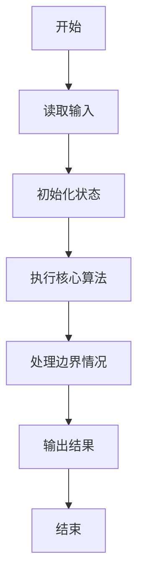
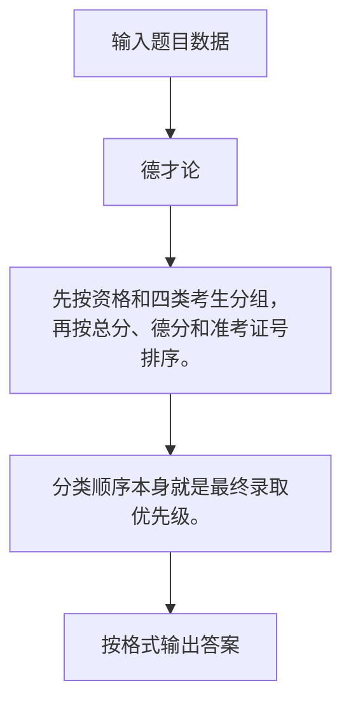

# 1015 德才论

- **分值：** 25分

### 题目描述

宋代史学家司马光在《资治通鉴》中有一段著名的“德才论”：“是故才德全尽谓之圣人，才德兼亡谓之愚人，德胜才谓之君子，才胜德谓之小人。凡取人之术，苟不得圣人，君子而与之，与其得小人，不若得愚人。”

现给出一批考生的德才分数，请根据司马光的理论给出录取排名。

### 输入格式：

输入第一行给出 3 个正整数，分别为：$N$（$\le 10^5$），即考生总数；$L$（$\ge 60$），为录取最低分数线，即德分和才分均不低于 $L$ 的考生才有资格被考虑录取；$H$（$< 100$），为优先录取线——德分和才分均不低于此线的被定义为“才德全尽”，此类考生按德才总分从高到低排序；才分不到但德分到优先录取线的一类考生属于“德胜才”，也按总分排序，但排在第一类考生之后；德才分均低于 $H$，但是德分不低于才分的考生属于“才德兼亡”但尚有“德胜才”者，按总分排序，但排在第二类考生之后；其他达到最低线 $L$ 的考生也按总分排序，但排在第三类考生之后。

随后 $N$ 行，每行给出一位考生的信息，包括：`准考证号 德分 才分`，其中`准考证号`为 8 位整数，德才分为区间 [0, 100] 内的整数。数字间以空格分隔。

### 输出格式：

输出第一行首先给出达到最低分数线的考生人数 $M$，随后 $M$ 行，每行按照输入格式输出一位考生的信息，考生按输入中说明的规则从高到低排序。当某类考生中有多人总分相同时，按其德分降序排列；若德分也并列，则按准考证号的升序输出。

### 输入样例：
```
14 60 80
10000001 64 90
10000002 90 60
10000011 85 80
10000003 85 80
10000004 80 85
10000005 82 77
10000006 83 76
10000007 90 78
10000008 75 79
10000009 59 90
10000010 88 45
10000012 80 100
10000013 90 99
10000014 66 60
```

### 输出样例：
```
12
10000013 90 99
10000012 80 100
10000003 85 80
10000011 85 80
10000004 80 85
10000007 90 78
10000006 83 76
10000005 82 77
10000002 90 60
10000014 66 60
10000008 75 79
10000001 64 90
```


### 解题思路

先按资格和四类考生分组，再按总分、德分和准考证号排序。 分类顺序本身就是最终录取优先级。

实现时按照题目的输入顺序读取数据，使用与数据规模匹配的数据结构保存必要状态，在遍历或模拟过程中完成核心计算，最后严格按照输出格式生成答案。

### 代码流程说明

1. 读取题目输入，初始化计数器、数组、集合或其他辅助状态。
2. 先按资格和四类考生分组，再按总分、德分和准考证号排序。
3. 分类顺序本身就是最终录取优先级。
4. 根据题目要求处理边界情况，并输出最终结果。

时间复杂度为 O(N log N)，空间复杂度主要取决于输入数据和辅助状态，通常为 O(1) 到 O(n)。

### 代码实现

以下是本题对应的完整 C++17 实现：

```cpp
#include <bits/stdc++.h>
using namespace std;
// 算法原理：先按资格和四类考生分组，再按总分、德分和准考证号排序。
// 关键步骤：分类顺序本身就是最终录取优先级。
struct S {
    string id;
    int d, c;
};
int main() {
    int n, L, H;
    cin >> n >> L >> H;
    vector<S> v[4];
    for (int i = 0; i < n; ++i) {
        S s;
        cin >> s.id >> s.d >> s.c;
        if (s.d < L || s.c < L)
            continue;
        int k = s.d >= H && s.c >= H ? 0 : s.d >= H ? 1 : s.d >= s.c ? 2 : 3;
        v[k].push_back(s);
    }
    auto cmp = [](S &a, S &b) {
        int x = a.d + a.c, y = b.d + b.c;
        return x != y ? x > y : a.d != b.d ? a.d > b.d : a.id < b.id;
    };
    cout << accumulate(begin(v), end(v), 0, [](int x, auto &z) { return x + (int)z.size(); })
         << '\n';
    for (auto &z : v) {
        sort(z.begin(), z.end(), cmp);
        for (auto &s : z)
            cout << s.id << ' ' << s.d << ' ' << s.c << '\n';
    }
}
```

### 代码流程图



### 解题流程图



### 常见易错点

- 注意输入规模，超大整数、长字符串或链表地址不能简单依赖普通整数和下标。
- 严格区分题目中的边界条件，例如是否包含等号、是否需要保留前导零以及是否只处理完整区块。
- 输出时按照题目规定的空格、换行、大小写和小数位数格式，避免计算正确但格式错误。
