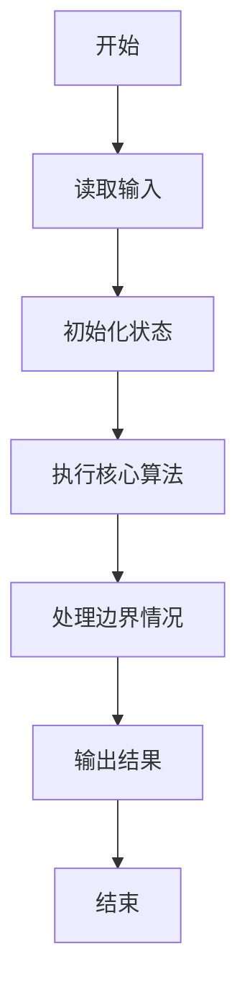
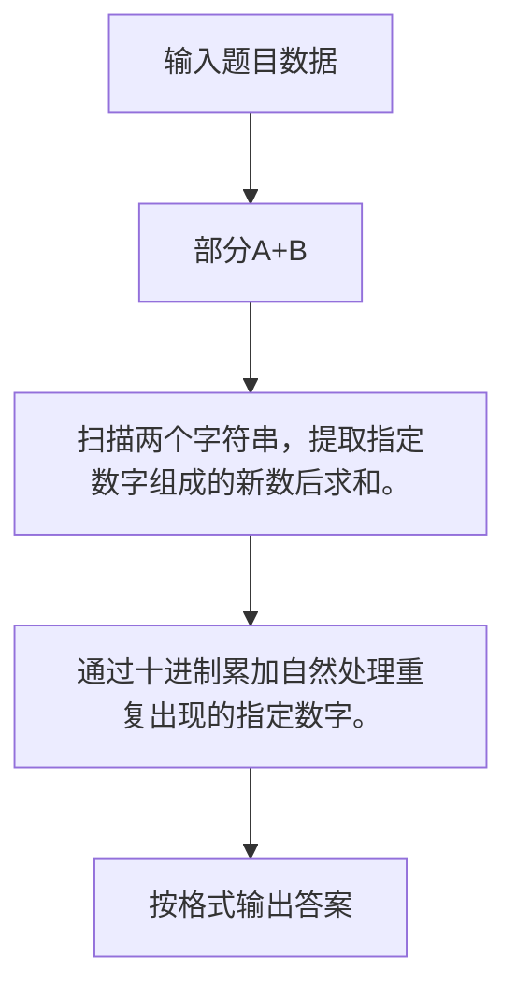

# 1016 部分A+B

- **分值：** 15分

### 题目描述

正整数 $A$ 的“$D_A$（为 1 位整数）部分”定义为由 $A$ 中所有 $D_A$ 组成的新整数 $P_A$。例如：给定 $A = 3862767$，$D_A = 6$，则 $A$ 的“6 部分”$P_A$ 是 66，因为 $A$ 中有 2 个 6。

现给定 $A$、$D_A$、$B$、$D_B$，请编写程序计算 $P_A + P_B$。

### 输入格式：

输入在一行中依次给出 $A$、$D_A$、$B$、$D_B$，中间以空格分隔，其中 $0 < A, B < 10^{9}$。

### 输出格式：

在一行中输出 $P_A + P_B$ 的值。

### 输入样例：1
```
3862767 6 13530293 3

```

### 输出样例：1
```
399

```

### 输入样例：2
```
3862767 1 13530293 8

```

### 输出样例：2
```
0

```

**鸣谢用户 George Hu 修正数据范围！**


### 解题思路

扫描两个字符串，提取指定数字组成的新数后求和。 通过十进制累加自然处理重复出现的指定数字。

实现时按照题目的输入顺序读取数据，使用与数据规模匹配的数据结构保存必要状态，在遍历或模拟过程中完成核心计算，最后严格按照输出格式生成答案。

### 代码流程说明

1. 读取题目输入，初始化计数器、数组、集合或其他辅助状态。
2. 扫描两个字符串，提取指定数字组成的新数后求和。
3. 通过十进制累加自然处理重复出现的指定数字。
4. 根据题目要求处理边界情况，并输出最终结果。

时间复杂度为 O(|A|+|B|)，空间复杂度主要取决于输入数据和辅助状态，通常为 O(1) 到 O(n)。

### 代码实现

以下是本题对应的完整 C++17 实现：

```cpp
#include <bits/stdc++.h>
using namespace std;
// 算法原理：扫描两个字符串，提取指定数字组成的新数后求和。
// 关键步骤：通过十进制累加自然处理重复出现的指定数字。
int main() {
    string a, b;
    char da, db;
    cin >> a >> da >> b >> db;
    long long x = 0, y = 0;
    for (char c : a)
        if (c == da)
            x = x * 10 + c - '0';
    for (char c : b)
        if (c == db)
            y = y * 10 + c - '0';
    cout << x + y;
}
```

### 代码流程图



### 解题流程图



### 常见易错点

- 注意输入规模，超大整数、长字符串或链表地址不能简单依赖普通整数和下标。
- 严格区分题目中的边界条件，例如是否包含等号、是否需要保留前导零以及是否只处理完整区块。
- 输出时按照题目规定的空格、换行、大小写和小数位数格式，避免计算正确但格式错误。
