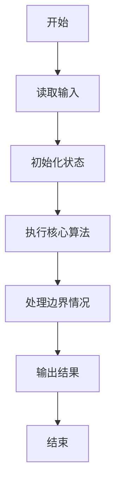
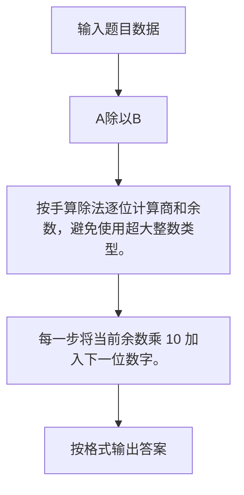

# 1017 A除以B

- **分值：** 20分

### 题目描述

本题要求计算 $A/B$，其中 $A$ 是不超过 1000 位的正整数，$B$ 是 1 位正整数。你需要输出商数 $Q$ 和余数 $R$，使得 $A = B \times Q + R$ 成立。

### 输入格式：

输入在一行中依次给出 $A$ 和 $B$，中间以 1 空格分隔。

### 输出格式：

在一行中依次输出 $Q$ 和 $R$，中间以 1 空格分隔。

### 输入样例：
```
123456789050987654321 7
```

### 输出样例：
```
17636684150141093474 3
```


### 解题思路

按手算除法逐位计算商和余数，避免使用超大整数类型。 每一步将当前余数乘 10 加入下一位数字。

实现时按照题目的输入顺序读取数据，使用与数据规模匹配的数据结构保存必要状态，在遍历或模拟过程中完成核心计算，最后严格按照输出格式生成答案。

### 代码流程说明

1. 读取题目输入，初始化计数器、数组、集合或其他辅助状态。
2. 按手算除法逐位计算商和余数，避免使用超大整数类型。
3. 每一步将当前余数乘 10 加入下一位数字。
4. 根据题目要求处理边界情况，并输出最终结果。

时间复杂度为 O(|A|)，空间复杂度主要取决于输入数据和辅助状态，通常为 O(1) 到 O(n)。

### 代码实现

以下是本题对应的完整 C++17 实现：

```cpp
#include <bits/stdc++.h>
using namespace std;
// 算法原理：按手算除法逐位计算商和余数，避免使用超大整数类型。
// 关键步骤：每一步将当前余数乘 10 加入下一位数字。
int main() {
    string a;
    int b;
    cin >> a >> b;
    string q;
    int r = 0;
    for (char c : a) {
        r = r * 10 + c - '0';
        q += char('0' + r / b);
        r %= b;
    }
    auto p = q.find_first_not_of('0');
    cout << (p == string::npos ? "0" : q.substr(p)) << ' ' << r;
}
```

### 代码流程图



### 解题流程图



### 常见易错点

- 注意输入规模，超大整数、长字符串或链表地址不能简单依赖普通整数和下标。
- 严格区分题目中的边界条件，例如是否包含等号、是否需要保留前导零以及是否只处理完整区块。
- 输出时按照题目规定的空格、换行、大小写和小数位数格式，避免计算正确但格式错误。
