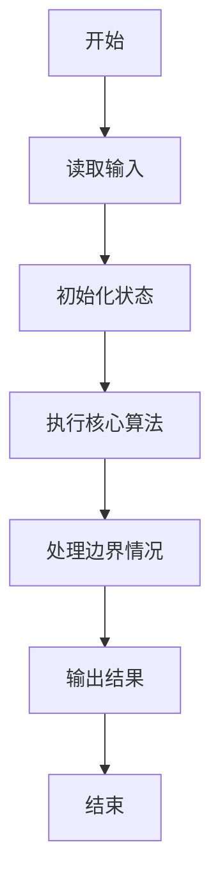
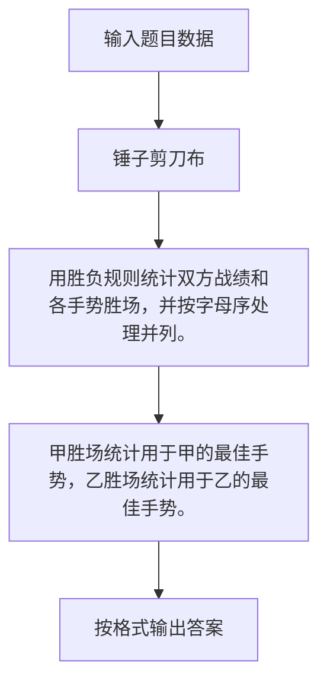

# 1018 锤子剪刀布

- **分值：** 20分

### 题目描述

大家应该都会玩“锤子剪刀布”的游戏：两人同时给出手势，胜负规则如图所示：


现给出两人的交锋记录，请统计双方的胜、平、负次数，并且给出双方分别出什么手势的胜算最大。

### 输入格式：

输入第 1 行给出正整数 $N$（$\le 10^5$），即双方交锋的次数。随后 $N$ 行，每行给出一次交锋的信息，即甲、乙双方同时给出的的手势。`C` 代表“锤子”、`J` 代表“剪刀”、`B` 代表“布”，第 1 个字母代表甲方，第 2 个代表乙方，中间有 1 个空格。

### 输出格式：

输出第 1、2 行分别给出甲、乙的胜、平、负次数，数字间以 1 个空格分隔。第 3 行给出两个字母，分别代表甲、乙获胜次数最多的手势，中间有 1 个空格。如果解不唯一，则输出按字母序最小的解。

### 输入样例：
```
10
C J
J B
C B
B B
B C
C C
C B
J B
B C
J J
```

### 输出样例：
```
5 3 2
2 3 5
B B
```


### 解题思路

用胜负规则统计双方战绩和各手势胜场，并按字母序处理并列。 甲胜场统计用于甲的最佳手势，乙胜场统计用于乙的最佳手势。

实现时按照题目的输入顺序读取数据，使用与数据规模匹配的数据结构保存必要状态，在遍历或模拟过程中完成核心计算，最后严格按照输出格式生成答案。

### 代码流程说明

1. 读取题目输入，初始化计数器、数组、集合或其他辅助状态。
2. 用胜负规则统计双方战绩和各手势胜场，并按字母序处理并列。
3. 甲胜场统计用于甲的最佳手势，乙胜场统计用于乙的最佳手势。
4. 根据题目要求处理边界情况，并输出最终结果。

时间复杂度为 O(N)，空间复杂度主要取决于输入数据和辅助状态，通常为 O(1) 到 O(n)。

### 代码实现

以下是本题对应的完整 C++17 实现：

```cpp
#include <bits/stdc++.h>
using namespace std;
// 算法原理：用胜负规则统计双方战绩和各手势胜场，并按字母序处理并列。
// 关键步骤：甲胜场统计用于甲的最佳手势，乙胜场统计用于乙的最佳手势。
int main() {
    int n;
    cin >> n;
    map<char, int> ca{{'B', 0}, {'C', 0}, {'J', 0}}, cb = ca;
    int aw = 0, draw = 0;
    auto win = [](char a, char b) {
        return (a == 'C' && b == 'J') || (a == 'J' && b == 'B') || (a == 'B' && b == 'C');
    };
    while (n--) {
        char a, b;
        cin >> a >> b;
        if (a == b)
            ++draw;
        else if (win(a, b))
            ++aw, ++ca[a];
        else
            ++cb[b];
    }
    int loss = 0;
    for (auto &[c, x] : cb)
        loss += x;
    cout << aw << ' ' << draw << ' ' << loss << '\n' << loss << ' ' << draw << ' ' << aw << '\n';
    cout << max_element(ca.begin(), ca.end(),
                        [](auto &a, auto &b) {
                            return a.second == b.second ? a.first > b.first : a.second < b.second;
                        })
                ->first
         << ' ' << max_element(cb.begin(), cb.end(), [](auto &a, auto &b) {
                       return a.second == b.second ? a.first > b.first : a.second < b.second;
                   })->first;
}
```

### 代码流程图



### 解题流程图



### 常见易错点

- 注意输入规模，超大整数、长字符串或链表地址不能简单依赖普通整数和下标。
- 严格区分题目中的边界条件，例如是否包含等号、是否需要保留前导零以及是否只处理完整区块。
- 输出时按照题目规定的空格、换行、大小写和小数位数格式，避免计算正确但格式错误。
