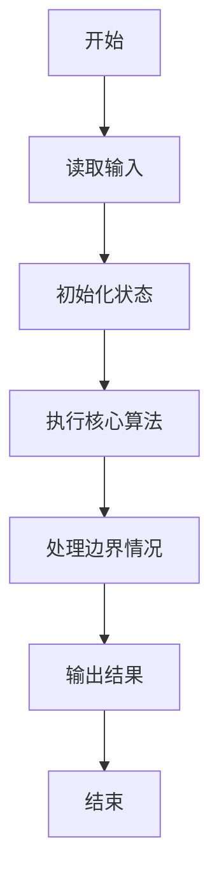
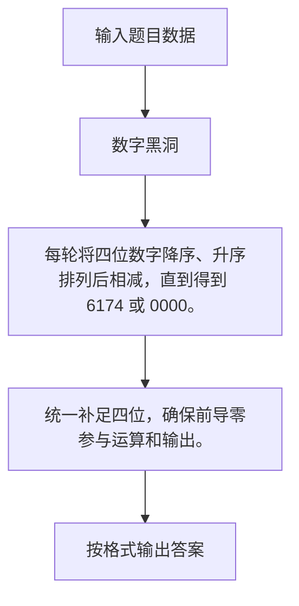

# 1019 数字黑洞

- **分值：** 20分

### 题目描述

给定任一个各位数字不完全相同的 4 位正整数，如果我们先把 4 个数字按非递增排序，再按非递减排序，然后用第 1 个数字减第 2 个数字，将得到一个新的数字。一直重复这样做，我们很快会停在有“数字黑洞”之称的 `6174`，这个神奇的数字也叫 Kaprekar 常数。

例如，我们从`6767`开始，将得到
```
7766 - 6677 = 1089
9810 - 0189 = 9621
9621 - 1269 = 8352
8532 - 2358 = 6174
7641 - 1467 = 6174
... ...
```

现给定任意 4 位正整数，请编写程序演示到达黑洞的过程。

### 输入格式：

输入给出一个 $(0, 10^4)$ 区间内的正整数 $N$。

### 输出格式：

如果 $N$ 的 4 位数字全相等，则在一行内输出 `N - N = 0000`；否则将计算的每一步在一行内输出，直到 `6174` 作为差出现，输出格式见样例。注意每个数字按 `4` 位数格式输出。

### 输入样例：1
```
6767
```

### 输出样例：1
```
7766 - 6677 = 1089
9810 - 0189 = 9621
9621 - 1269 = 8352
8532 - 2358 = 6174
```

### 输入样例：2
```
2222
```

### 输出样例：2
```
2222 - 2222 = 0000
```


### 解题思路

每轮将四位数字降序、升序排列后相减，直到得到 6174 或 0000。 统一补足四位，确保前导零参与运算和输出。

实现时按照题目的输入顺序读取数据，使用与数据规模匹配的数据结构保存必要状态，在遍历或模拟过程中完成核心计算，最后严格按照输出格式生成答案。

### 代码流程说明

1. 读取题目输入，初始化计数器、数组、集合或其他辅助状态。
2. 每轮将四位数字降序、升序排列后相减，直到得到 6174 或 0000。
3. 统一补足四位，确保前导零参与运算和输出。
4. 根据题目要求处理边界情况，并输出最终结果。

时间复杂度为 O(1)，空间复杂度主要取决于输入数据和辅助状态，通常为 O(1) 到 O(n)。

### 代码实现

以下是本题对应的完整 C++17 实现：

```cpp
#include <bits/stdc++.h>
using namespace std;
// 算法原理：每轮将四位数字降序、升序排列后相减，直到得到 6174 或 0000。
// 关键步骤：统一补足四位，确保前导零参与运算和输出。
int main() {
    int n;
    cin >> n;
    while (1) {
        string s = to_string(n);
        s = string(4 - s.size(), '0') + s;
        string a = s, b = s;
        sort(a.rbegin(), a.rend());
        sort(b.begin(), b.end());
        int x = stoi(a), y = stoi(b);
        n = x - y;
        cout << a << " - " << b << " = " << setw(4) << setfill('0') << n << '\n';
        if (n == 0 || n == 6174)
            break;
    }
}
```

### 代码流程图



### 解题流程图



### 常见易错点

- 注意输入规模，超大整数、长字符串或链表地址不能简单依赖普通整数和下标。
- 严格区分题目中的边界条件，例如是否包含等号、是否需要保留前导零以及是否只处理完整区块。
- 输出时按照题目规定的空格、换行、大小写和小数位数格式，避免计算正确但格式错误。
