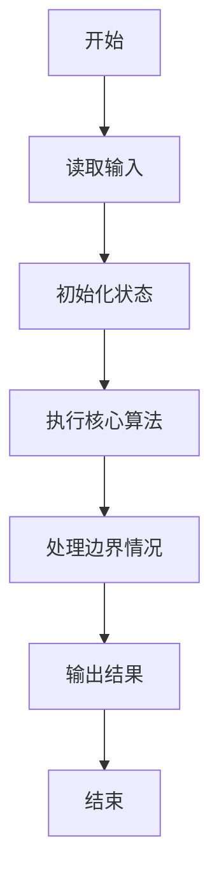
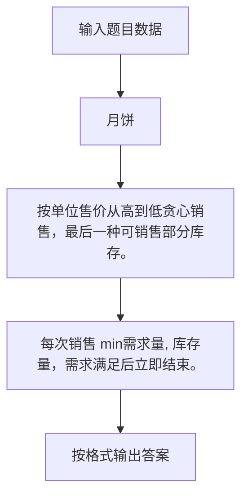

# 1020 月饼

- **分值：** 25分

### 题目描述

月饼是中国人在中秋佳节时吃的一种传统食品，不同地区有许多不同风味的月饼。现给定所有种类月饼的库存量、总售价、以及市场的最大需求量，请你计算可以获得的最大收益是多少。

注意：销售时允许取出一部分库存。样例给出的情形是这样的：假如我们有 3 种月饼，其库存量分别为 18、15、10 万吨，总售价分别为 75、72、45 亿元。如果市场的最大需求量只有 20 万吨，那么我们最大收益策略应该是卖出全部 15 万吨第 2 种月饼、以及 5 万吨第 3 种月饼，获得 72 + 45/2 = 94.5（亿元）。

### 输入格式：

每个输入包含一个测试用例。每个测试用例先给出一个不超过 1000 的正整数 $N$ 表示月饼的种类数、以及不超过 500（以万吨为单位）的正整数 $D$ 表示市场最大需求量。随后一行给出 $N$ 个正数表示每种月饼的库存量（以万吨为单位）；最后一行给出 $N$ 个正数表示每种月饼的总售价（以亿元为单位）。数字间以空格分隔。

### 输出格式：

对每组测试用例，在一行中输出最大收益，以亿元为单位并精确到小数点后 2 位。

### 输入样例：
```
3 20
18 15 10
75 72 45
```

### 输出样例：
```
94.50
```


### 解题思路

按单位售价从高到低贪心销售，最后一种可销售部分库存。 每次销售 min需求量, 库存量，需求满足后立即结束。

实现时按照题目的输入顺序读取数据，使用与数据规模匹配的数据结构保存必要状态，在遍历或模拟过程中完成核心计算，最后严格按照输出格式生成答案。

### 代码流程说明

1. 读取题目输入，初始化计数器、数组、集合或其他辅助状态。
2. 按单位售价从高到低贪心销售，最后一种可销售部分库存。
3. 每次销售 min需求量, 库存量，需求满足后立即结束。
4. 根据题目要求处理边界情况，并输出最终结果。

时间复杂度为 O(N log N)，空间复杂度主要取决于输入数据和辅助状态，通常为 O(1) 到 O(n)。

### 代码实现

以下是本题对应的完整 C++17 实现：

```cpp
#include <bits/stdc++.h>
using namespace std;
// 算法原理：按单位售价从高到低贪心销售，最后一种可销售部分库存。
// 关键步骤：每次销售 min(需求量, 库存量)，需求满足后立即结束。
struct M {
    double q, p;
};
int main() {
    int n;
    double d;
    cin >> n >> d;
    vector<double> q(n), p(n);
    for (auto &x : q)
        cin >> x;
    for (auto &x : p)
        cin >> x;
    vector<M> a;
    for (int i = 0; i < n; ++i)
        a.push_back({q[i], p[i] / q[i]});
    sort(a.begin(), a.end(), [](M &a, M &b) { return a.p > b.p; });
    double ans = 0;
    for (auto &x : a) {
        double t = min(d, x.q);
        ans += t * x.p;
        d -= t;
        if (d <= 0)
            break;
    }
    cout << fixed << setprecision(2) << ans;
}
```

### 代码流程图



### 解题流程图



### 常见易错点

- 注意输入规模，超大整数、长字符串或链表地址不能简单依赖普通整数和下标。
- 严格区分题目中的边界条件，例如是否包含等号、是否需要保留前导零以及是否只处理完整区块。
- 输出时按照题目规定的空格、换行、大小写和小数位数格式，避免计算正确但格式错误。
