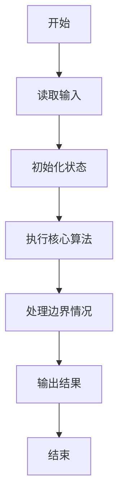
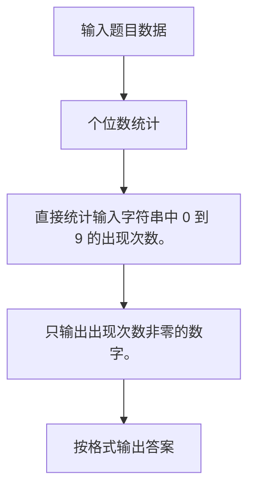

# 1021 个位数统计

- **分值：** 15分

### 题目描述

给定一个 $k$ 位整数 $N = d_{k-1}10^{k-1} + \cdots + d_1 10^1 + d_0$ ($0\le d_i \le 9$, $i=0,\cdots ,k-1$, $d_{k-1}>0$)，请编写程序统计每种不同的个位数字出现的次数。例如：给定 $N = 100311$，则有 2 个 0，3 个 1，和 1 个 3。

### 输入格式：

每个输入包含 1 个测试用例，即一个不超过 1000 位的正整数 $N$。

### 输出格式：

对 $N$ 中每一种不同的个位数字，以 `D:M` 的格式在一行中输出该位数字 `D` 及其在 $N$ 中出现的次数 `M`。要求按 `D` 的升序输出。

### 输入样例：
```
100311
```

### 输出样例：
```
0:2
1:3
3:1
```


### 解题思路

直接统计输入字符串中 0 到 9 的出现次数。 只输出出现次数非零的数字。

实现时按照题目的输入顺序读取数据，使用与数据规模匹配的数据结构保存必要状态，在遍历或模拟过程中完成核心计算，最后严格按照输出格式生成答案。

### 代码流程说明

1. 读取题目输入，初始化计数器、数组、集合或其他辅助状态。
2. 直接统计输入字符串中 0 到 9 的出现次数。
3. 只输出出现次数非零的数字。
4. 根据题目要求处理边界情况，并输出最终结果。

时间复杂度为 O(L)，空间复杂度主要取决于输入数据和辅助状态，通常为 O(1) 到 O(n)。

### 代码实现

以下是本题对应的完整 C++17 实现：

```cpp
#include <bits/stdc++.h>
using namespace std;
// 算法原理：直接统计输入字符串中 0 到 9 的出现次数。
// 关键步骤：只输出出现次数非零的数字。
int main() {
    string s;
    cin >> s;
    int c[10] = {};
    for (char x : s)
        ++c[x - '0'];
    for (int i = 0; i < 10; ++i)
        if (c[i])
            cout << i << ':' << c[i] << '\n';
}
```

### 代码流程图



### 解题流程图



### 常见易错点

- 注意输入规模，超大整数、长字符串或链表地址不能简单依赖普通整数和下标。
- 严格区分题目中的边界条件，例如是否包含等号、是否需要保留前导零以及是否只处理完整区块。
- 输出时按照题目规定的空格、换行、大小写和小数位数格式，避免计算正确但格式错误。
