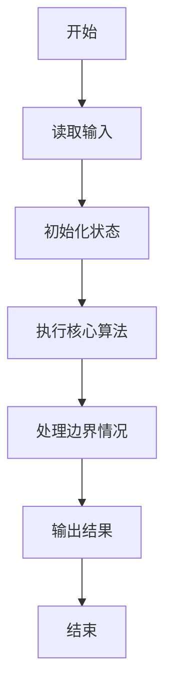
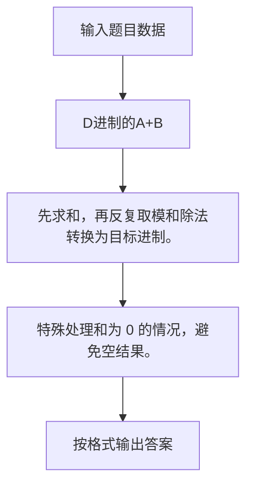

# 1022 D进制的A+B

- **分值：** 20分

### 题目描述

输入两个非负 10 进制整数 $A$ 和 $B$ ($\le 2^{30} -1$)，输出 $A+B$ 的 $D$ ($1 < D \le 10$)进制数。

### 输入格式：

输入在一行中依次给出 3 个整数 $A$、$B$ 和 $D$。

### 输出格式：

输出 $A+B$ 的 $D$ 进制数。

### 输入样例：
```
123 456 8

```

### 输出样例：
```
1103

```

**鸣谢用户谢浩然补充数据！**


### 解题思路

先求和，再反复取模和除法转换为目标进制。 特殊处理和为 0 的情况，避免空结果。

实现时按照题目的输入顺序读取数据，使用与数据规模匹配的数据结构保存必要状态，在遍历或模拟过程中完成核心计算，最后严格按照输出格式生成答案。

### 代码流程说明

1. 读取题目输入，初始化计数器、数组、集合或其他辅助状态。
2. 先求和，再反复取模和除法转换为目标进制。
3. 特殊处理和为 0 的情况，避免空结果。
4. 根据题目要求处理边界情况，并输出最终结果。

时间复杂度为 O(log(A+B))，空间复杂度主要取决于输入数据和辅助状态，通常为 O(1) 到 O(n)。

### 代码实现

以下是本题对应的完整 C++17 实现：

```cpp
#include <bits/stdc++.h>
using namespace std;
// 算法原理：先求和，再反复取模和除法转换为目标进制。
// 关键步骤：特殊处理和为 0 的情况，避免空结果。
int main() {
    long long a, b;
    int d;
    cin >> a >> b >> d;
    long long n = a + b;
    string s;
    if (!n)
        s = "0";
    while (n) {
        s += char('0' + n % d);
        n /= d;
    }
    reverse(s.begin(), s.end());
    cout << s;
}
```

### 代码流程图



### 解题流程图



### 常见易错点

- 注意输入规模，超大整数、长字符串或链表地址不能简单依赖普通整数和下标。
- 严格区分题目中的边界条件，例如是否包含等号、是否需要保留前导零以及是否只处理完整区块。
- 输出时按照题目规定的空格、换行、大小写和小数位数格式，避免计算正确但格式错误。
