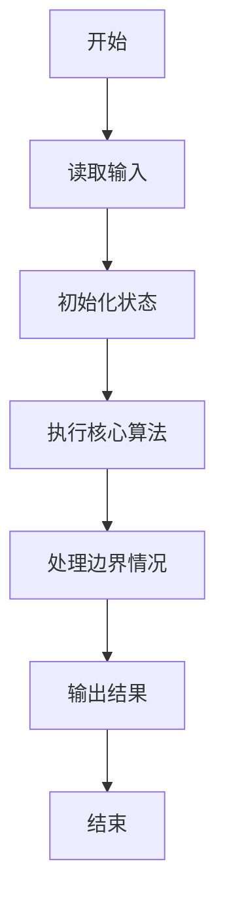
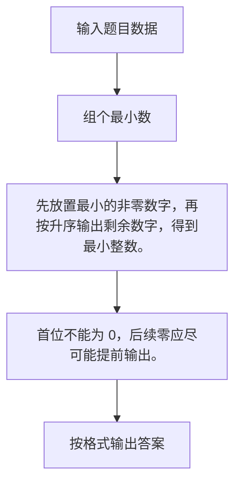

# 1023 组个最小数

- **分值：** 20分

### 题目描述

给定数字 0-9 各若干个。你可以以任意顺序排列这些数字，但必须全部使用。目标是使得最后得到的数尽可能小（注意 0 不能做首位）。例如：给定两个 0，两个 1，三个 5，一个 8，我们得到的最小的数就是 10015558。

现给定数字，请编写程序输出能够组成的最小的数。

### 输入格式：

输入在一行中给出 10 个非负整数，顺序表示我们拥有数字 0、数字 1、……数字 9 的个数。整数间用一个空格分隔。10 个数字的总个数不超过 50，且至少拥有 1 个非 0 的数字。

### 输出格式：

在一行中输出能够组成的最小的数。

### 输入样例：
```
2 2 0 0 0 3 0 0 1 0
```

### 输出样例：
```
10015558
```


### 解题思路

先放置最小的非零数字，再按升序输出剩余数字，得到最小整数。 首位不能为 0，后续零应尽可能提前输出。

实现时按照题目的输入顺序读取数据，使用与数据规模匹配的数据结构保存必要状态，在遍历或模拟过程中完成核心计算，最后严格按照输出格式生成答案。

### 代码流程说明

1. 读取题目输入，初始化计数器、数组、集合或其他辅助状态。
2. 先放置最小的非零数字，再按升序输出剩余数字，得到最小整数。
3. 首位不能为 0，后续零应尽可能提前输出。
4. 根据题目要求处理边界情况，并输出最终结果。

时间复杂度为 O(1)，空间复杂度主要取决于输入数据和辅助状态，通常为 O(1) 到 O(n)。

### 代码实现

以下是本题对应的完整 C++17 实现：

```cpp
#include <bits/stdc++.h>
using namespace std;
// 算法原理：先放置最小的非零数字，再按升序输出剩余数字，得到最小整数。
// 关键步骤：首位不能为 0，后续零应尽可能提前输出。
int main() {
    int c[10];
    for (int &i : c)
        cin >> i;
    int z = c[0];
    for (int i = 1; i < 10; ++i)
        if (c[i]) {
            cout << i;
            --c[i];
            break;
        }
    while (c[0]--)
        cout << 0;
    for (int i = 1; i < 10; ++i)
        while (c[i]--)
            cout << i;
}
```

### 代码流程图



### 解题流程图



### 常见易错点

- 注意输入规模，超大整数、长字符串或链表地址不能简单依赖普通整数和下标。
- 严格区分题目中的边界条件，例如是否包含等号、是否需要保留前导零以及是否只处理完整区块。
- 输出时按照题目规定的空格、换行、大小写和小数位数格式，避免计算正确但格式错误。
