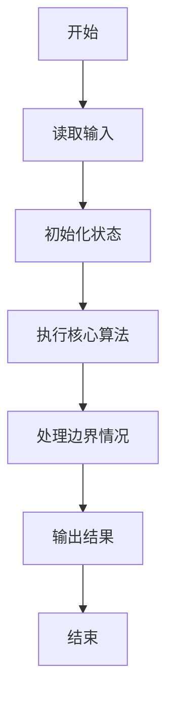
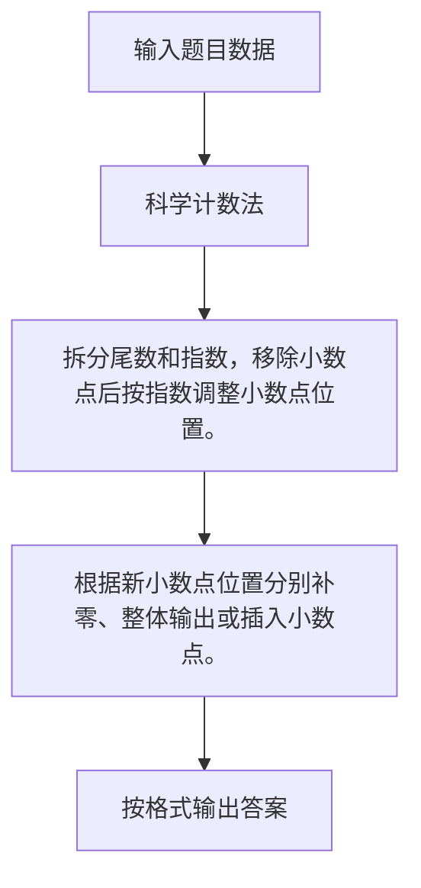

# 1024 科学计数法

- **分值：** 20分

### 题目描述

科学计数法是科学家用来表示很大或很小的数字的一种方便的方法，其满足正则表达式 [+-][1-9]`.`[0-9]+E[+-][0-9]+，即数字的整数部分只有 1 位，小数部分至少有 1 位，该数字及其指数部分的正负号即使对正数也必定明确给出。

现以科学计数法的格式给出实数 $A$，请编写程序按普通数字表示法输出 $A$，并保证所有有效位都被保留。

### 输入格式：

每个输入包含 1 个测试用例，即一个以科学计数法表示的实数 $A$。该数字的存储长度不超过 9999 字节，且其指数的绝对值不超过 9999。

### 输出格式：

对每个测试用例，在一行中按普通数字表示法输出 $A$，并保证所有有效位都被保留，包括末尾的 0。

### 输入样例：1
```
+1.23400E-03
```

### 输出样例：1
```
0.00123400
```

### 输入样例：2
```
-1.2E+10
```

### 输出样例：2
```
-12000000000
```


### 解题思路

拆分尾数和指数，移除小数点后按指数调整小数点位置。 根据新小数点位置分别补零、整体输出或插入小数点。

实现时按照题目的输入顺序读取数据，使用与数据规模匹配的数据结构保存必要状态，在遍历或模拟过程中完成核心计算，最后严格按照输出格式生成答案。

### 代码流程说明

1. 读取题目输入，初始化计数器、数组、集合或其他辅助状态。
2. 拆分尾数和指数，移除小数点后按指数调整小数点位置。
3. 根据新小数点位置分别补零、整体输出或插入小数点。
4. 根据题目要求处理边界情况，并输出最终结果。

时间复杂度为 O(L)，空间复杂度主要取决于输入数据和辅助状态，通常为 O(1) 到 O(n)。

### 代码实现

以下是本题对应的完整 C++17 实现：

```cpp
#include <bits/stdc++.h>
using namespace std;
// 算法原理：拆分尾数和指数，移除小数点后按指数调整小数点位置。
// 关键步骤：根据新小数点位置分别补零、整体输出或插入小数点。
int main() {
    string s;
    cin >> s;
    bool neg = s[0] == '-';
    int e = s.find('E');
    string m = s.substr(1, e - 1);
    int ex = stoi(s.substr(e + 1));
    string d = m.substr(0, m.find('.')) + m.substr(m.find('.') + 1);
    int point = m.find('.') + ex;
    cout << (neg ? "-" : "");
    if (point <= 0)
        cout << "0." << string(-point, '0') << d;
    else if (point >= (int)d.size())
        cout << d << string(point - d.size(), '0');
    else
        cout << d.substr(0, point) << '.' << d.substr(point);
}
```

### 代码流程图



### 解题流程图



### 常见易错点

- 注意输入规模，超大整数、长字符串或链表地址不能简单依赖普通整数和下标。
- 严格区分题目中的边界条件，例如是否包含等号、是否需要保留前导零以及是否只处理完整区块。
- 输出时按照题目规定的空格、换行、大小写和小数位数格式，避免计算正确但格式错误。
