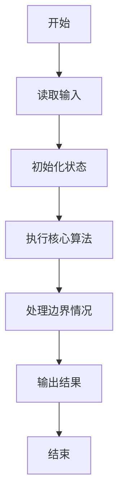
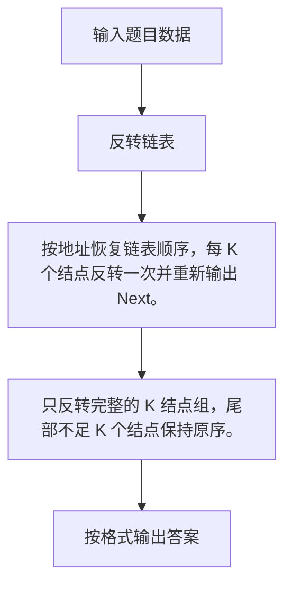

# 1025 反转链表

- **分值：** 25分

### 题目描述

给定一个常数 $K$ 以及一个单链表 $L$，请编写程序将 $L$ 中每 $K$ 个结点反转。例如：给定 $L$ 为 1→2→3→4→5→6，$K$ 为 3，则输出应该为 3→2→1→6→5→4；如果 $K$ 为 4，则输出应该为 4→3→2→1→5→6，即最后不到 $K$ 个元素不反转。

### 输入格式：

每个输入包含 1 个测试用例。每个测试用例第 1 行给出第 1 个结点的地址、结点总个数正整数 $N$ ($\le 10^5$)、以及正整数 $K$ ($\le N$)，即要求反转的子链结点的个数。结点的地址是 5 位非负整数，NULL 地址用 $-1$ 表示。

接下来有 $N$ 行，每行格式为：
```
Address Data Next
```

其中 `Address` 是结点地址，`Data` 是该结点保存的整数数据，`Next` 是下一结点的地址。

### 输出格式：

对每个测试用例，顺序输出反转后的链表，其上每个结点占一行，格式与输入相同。

### 输入样例：
```
00100 6 4
00000 4 99999
00100 1 12309
68237 6 -1
33218 3 00000
99999 5 68237
12309 2 33218
```

### 输出样例：
```
00000 4 33218
33218 3 12309
12309 2 00100
00100 1 99999
99999 5 68237
68237 6 -1
```


### 解题思路

按地址恢复链表顺序，每 K 个结点反转一次并重新输出 Next。 只反转完整的 K 结点组，尾部不足 K 个结点保持原序。

实现时按照题目的输入顺序读取数据，使用与数据规模匹配的数据结构保存必要状态，在遍历或模拟过程中完成核心计算，最后严格按照输出格式生成答案。

### 代码流程说明

1. 读取题目输入，初始化计数器、数组、集合或其他辅助状态。
2. 按地址恢复链表顺序，每 K 个结点反转一次并重新输出 Next。
3. 只反转完整的 K 结点组，尾部不足 K 个结点保持原序。
4. 根据题目要求处理边界情况，并输出最终结果。

时间复杂度为 O(N)，空间复杂度主要取决于输入数据和辅助状态，通常为 O(1) 到 O(n)。

### 代码实现

以下是本题对应的完整 C++17 实现：

```cpp
#include <bits/stdc++.h>
using namespace std;
// 算法原理：按地址恢复链表顺序，每 K 个结点反转一次并重新输出 Next。
// 关键步骤：只反转完整的 K 结点组，尾部不足 K 个结点保持原序。
struct N {
    int d, n;
};
string adr(int x) {
    if (x < 0)
        return "-1";
    ostringstream o;
    o << setw(5) << setfill('0') << x;
    return o.str();
}
int main() {
    int h, n, k;
    cin >> h >> n >> k;
    vector<N> a(100000);
    for (int i = 0; i < n; ++i) {
        int x, d, y;
        cin >> x >> d >> y;
        a[x] = {d, y};
    }
    vector<int> v;
    for (int x = h; x != -1; x = a[x].n)
        v.push_back(x);
    for (int i = 0; i + k <= (int)v.size(); i += k)
        reverse(v.begin() + i, v.begin() + i + k);
    for (int i = 0; i < (int)v.size(); ++i)
        cout << adr(v[i]) << ' ' << a[v[i]].d << ' ' << adr(i + 1 < (int)v.size() ? v[i + 1] : -1)
             << '\n';
}
```

### 代码流程图



### 解题流程图



### 常见易错点

- 注意输入规模，超大整数、长字符串或链表地址不能简单依赖普通整数和下标。
- 严格区分题目中的边界条件，例如是否包含等号、是否需要保留前导零以及是否只处理完整区块。
- 输出时按照题目规定的空格、换行、大小写和小数位数格式，避免计算正确但格式错误。
