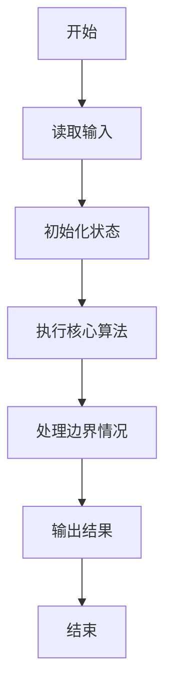
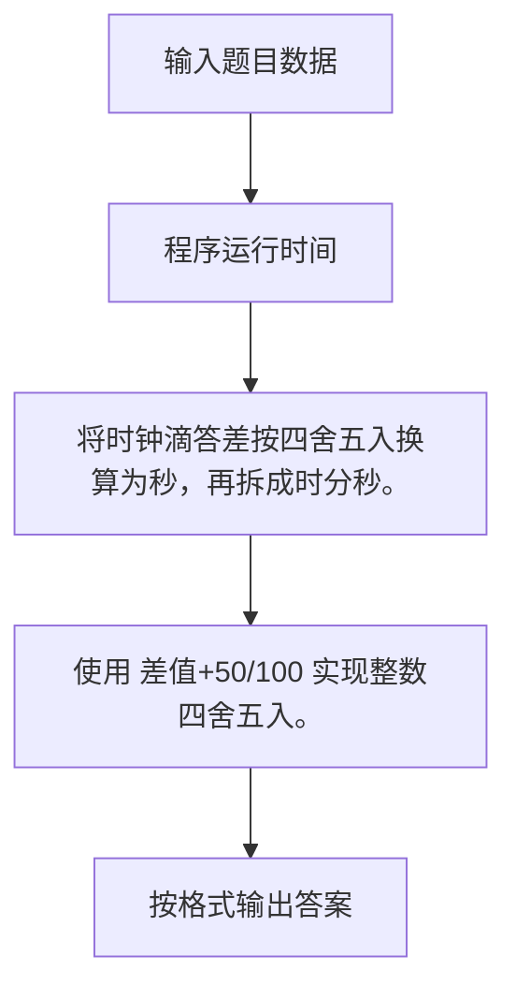

# 1026 程序运行时间

- **分值：** 15分

### 题目描述

要获得一个 C 语言程序的运行时间，常用的方法是调用头文件 time.h，其中提供了 clock() 函数，可以捕捉从程序开始运行到 clock() 被调用时所耗费的时间。这个时间单位是 clock tick，即“时钟打点”。同时还有一个常数 CLK_TCK，给出了机器时钟每秒所走的时钟打点数。于是为了获得一个函数 $f$ 的运行时间，我们只要在调用 $f$ 之前先调用 clock()，获得一个时钟打点数 C1；在 $f$ 执行完成后再调用 clock()，获得另一个时钟打点数 C2；两次获得的时钟打点数之差 (C2-C1) 就是 $f$ 运行所消耗的时钟打点数，再除以常数 CLK_TCK，就得到了以秒为单位的运行时间。

这里不妨简单假设常数 CLK_TCK 为 100。现给定被测函数前后两次获得的时钟打点数，请你给出被测函数运行的时间。

### 输入格式：

输入在一行中顺序给出 2 个整数 C1 和 C2。注意两次获得的时钟打点数肯定不相同，即 C1 $<$ C2，并且取值在 $[0, 10^7]$。

### 输出格式：

在一行中输出被测函数运行的时间。运行时间必须按照 `hh:mm:ss`（即2位的 `时:分:秒`）格式输出；不足 1 秒的时间四舍五入到秒。

### 输入样例：
```
123 4577973
```

### 输出样例：
```
12:42:59
```


### 解题思路

将时钟滴答差按四舍五入换算为秒，再拆成时分秒。 使用 差值+50/100 实现整数四舍五入。

实现时按照题目的输入顺序读取数据，使用与数据规模匹配的数据结构保存必要状态，在遍历或模拟过程中完成核心计算，最后严格按照输出格式生成答案。

### 代码流程说明

1. 读取题目输入，初始化计数器、数组、集合或其他辅助状态。
2. 将时钟滴答差按四舍五入换算为秒，再拆成时分秒。
3. 使用 差值+50/100 实现整数四舍五入。
4. 根据题目要求处理边界情况，并输出最终结果。

时间复杂度为 O(1)，空间复杂度主要取决于输入数据和辅助状态，通常为 O(1) 到 O(n)。

### 代码实现

以下是本题对应的完整 C++17 实现：

```cpp
#include <bits/stdc++.h>
using namespace std;
// 算法原理：将时钟滴答差按四舍五入换算为秒，再拆成时分秒。
// 关键步骤：使用 (差值+50)/100 实现整数四舍五入。
int main() {
    long long c1, c2;
    cin >> c1 >> c2;
    long long s = (c2 - c1 + 50) / 100;
    cout << setw(2) << setfill('0') << s / 3600 << ':' << setw(2) << s / 60 % 60 << ':' << setw(2)
         << s % 60;
}
```

### 代码流程图



### 解题流程图



### 常见易错点

- 注意输入规模，超大整数、长字符串或链表地址不能简单依赖普通整数和下标。
- 严格区分题目中的边界条件，例如是否包含等号、是否需要保留前导零以及是否只处理完整区块。
- 输出时按照题目规定的空格、换行、大小写和小数位数格式，避免计算正确但格式错误。
