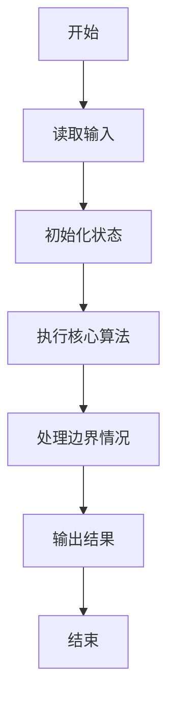
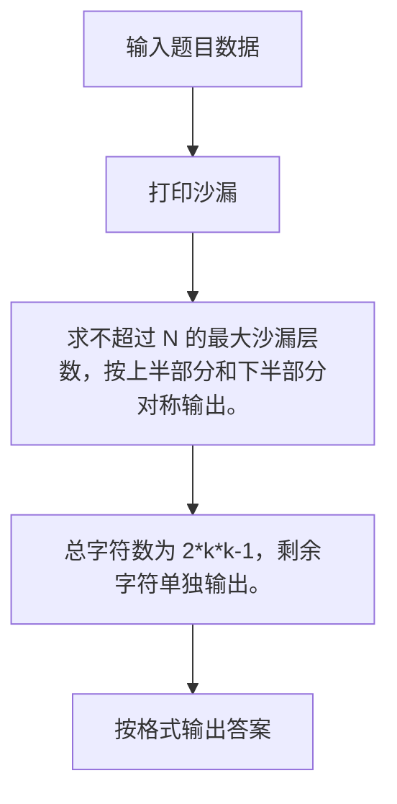

# 1027 打印沙漏

- **分值：** 20分

### 题目描述

本题要求你写个程序把给定的符号打印成沙漏的形状。例如给定17个“*”，要求按下列格式打印
```
*****
 ***
  *
 ***
*****
```

所谓“沙漏形状”，是指每行输出奇数个符号；各行符号中心对齐；相邻两行符号数差2；符号数先从大到小顺序递减到1，再从小到大顺序递增；首尾符号数相等。

给定任意N个符号，不一定能正好组成一个沙漏。要求打印出的沙漏能用掉尽可能多的符号。

### 输入格式：

输入在一行给出1个正整数N（$\le$1000）和一个符号，中间以空格分隔。

### 输出格式：

首先打印出由给定符号组成的最大的沙漏形状，最后在一行中输出剩下没用掉的符号数。

### 输入样例：
```
19 *
```

### 输出样例：
```
*****
 ***
  *
 ***
*****
2
```


### 解题思路

求不超过 N 的最大沙漏层数，按上半部分和下半部分对称输出。 总字符数为 2*k*k-1，剩余字符单独输出。

实现时按照题目的输入顺序读取数据，使用与数据规模匹配的数据结构保存必要状态，在遍历或模拟过程中完成核心计算，最后严格按照输出格式生成答案。

### 代码流程说明

1. 读取题目输入，初始化计数器、数组、集合或其他辅助状态。
2. 求不超过 N 的最大沙漏层数，按上半部分和下半部分对称输出。
3. 总字符数为 2*k*k-1，剩余字符单独输出。
4. 根据题目要求处理边界情况，并输出最终结果。

时间复杂度为 O(N)，空间复杂度主要取决于输入数据和辅助状态，通常为 O(1) 到 O(n)。

### 代码实现

以下是本题对应的完整 C++17 实现：

```cpp
#include <bits/stdc++.h>
using namespace std;
// 算法原理：求不超过 N 的最大沙漏层数，按上半部分和下半部分对称输出。
// 关键步骤：总字符数为 2*k*k-1，剩余字符单独输出。
int main() {
    int n;
    char c;
    cin >> n >> c;
    int k = 1;
    while (2 * (k + 1) * (k + 1) - 1 <= n)
        ++k;
    for (int i = k; i >= 1; --i)
        cout << string(k - i, ' ') << string(2 * i - 1, c) << '\n';
    for (int i = 2; i <= k; ++i)
        cout << string(k - i, ' ') << string(2 * i - 1, c) << '\n';
    cout << n - (2 * k * k - 1);
}
```

### 代码流程图



### 解题流程图



### 常见易错点

- 注意输入规模，超大整数、长字符串或链表地址不能简单依赖普通整数和下标。
- 严格区分题目中的边界条件，例如是否包含等号、是否需要保留前导零以及是否只处理完整区块。
- 输出时按照题目规定的空格、换行、大小写和小数位数格式，避免计算正确但格式错误。
