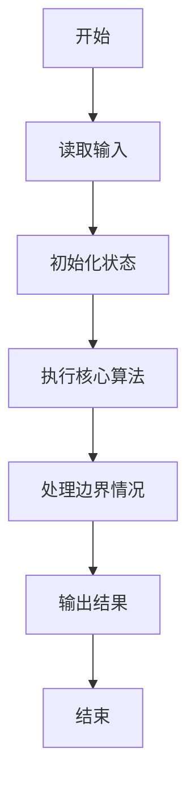
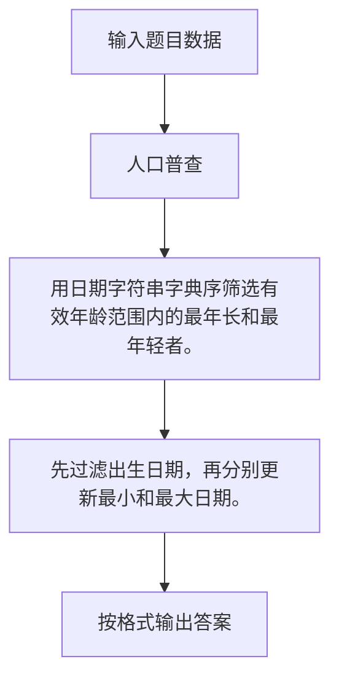

# 1028 人口普查

- **分值：** 20分

### 题目描述

某城镇进行人口普查，得到了全体居民的生日。现请你写个程序，找出镇上最年长和最年轻的人。

这里确保每个输入的日期都是合法的，但不一定是合理的——假设已知镇上没有超过 200 岁的老人，而今天是 2014 年 9 月 6 日，所以超过 200 岁的生日和未出生的生日都是不合理的，应该被过滤掉。

### 输入格式：

输入在第一行给出正整数 $N$，取值在$(0, 10^5]$；随后 $N$ 行，每行给出 1 个人的姓名（由不超过 5 个英文字母组成的字符串）、以及按 `yyyy/mm/dd`（即年/月/日）格式给出的生日。题目保证最年长和最年轻的人没有并列。

### 输出格式：

在一行中顺序输出有效生日的个数、最年长人和最年轻人的姓名，其间以空格分隔。

### 输入样例：
```
5
John 2001/05/12
Tom 1814/09/06
Ann 2121/01/30
James 1814/09/05
Steve 1967/11/20
```

### 输出样例：
```
3 Tom John
```


### 解题思路

用日期字符串字典序筛选有效年龄范围内的最年长和最年轻者。 先过滤出生日期，再分别更新最小和最大日期。

实现时按照题目的输入顺序读取数据，使用与数据规模匹配的数据结构保存必要状态，在遍历或模拟过程中完成核心计算，最后严格按照输出格式生成答案。

### 代码流程说明

1. 读取题目输入，初始化计数器、数组、集合或其他辅助状态。
2. 用日期字符串字典序筛选有效年龄范围内的最年长和最年轻者。
3. 先过滤出生日期，再分别更新最小和最大日期。
4. 根据题目要求处理边界情况，并输出最终结果。

时间复杂度为 O(N)，空间复杂度主要取决于输入数据和辅助状态，通常为 O(1) 到 O(n)。

### 代码实现

以下是本题对应的完整 C++17 实现：

```cpp
#include <bits/stdc++.h>
using namespace std;
// 算法原理：用日期字符串字典序筛选有效年龄范围内的最年长和最年轻者。
// 关键步骤：先过滤出生日期，再分别更新最小和最大日期。
struct P {
    string n, d;
};
int main() {
    int n;
    cin >> n;
    P old{"", "9999/99/99"}, young{"", "0000/00/00"};
    int cnt = 0;
    while (n--) {
        P p;
        cin >> p.n >> p.d;
        if (p.d >= "1814/09/06" && p.d <= "2014/09/06") {
            ++cnt;
            if (p.d < old.d)
                old = p;
            if (p.d > young.d)
                young = p;
        }
    }
    if (!cnt)
        cout << 0;
    else
        cout << cnt << ' ' << old.n << ' ' << young.n;
}
```

### 代码流程图



### 解题流程图



### 常见易错点

- 注意输入规模，超大整数、长字符串或链表地址不能简单依赖普通整数和下标。
- 严格区分题目中的边界条件，例如是否包含等号、是否需要保留前导零以及是否只处理完整区块。
- 输出时按照题目规定的空格、换行、大小写和小数位数格式，避免计算正确但格式错误。
