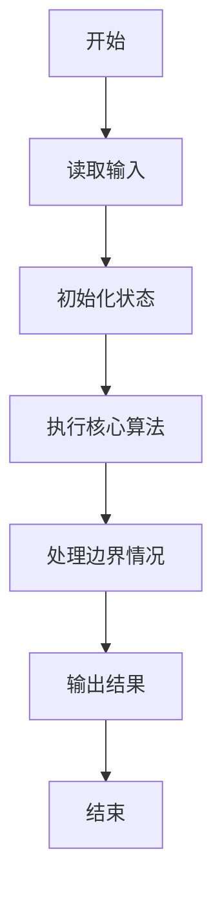
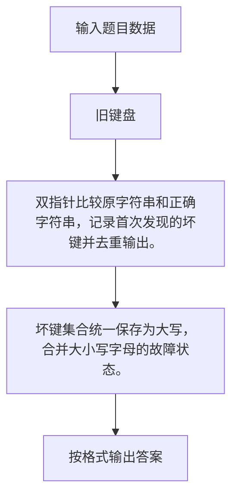

# 1029 旧键盘

- **分值：** 20分

### 题目描述

旧键盘上坏了几个键，于是在敲一段文字的时候，对应的字符就不会出现。现在给出应该输入的一段文字、以及实际被输入的文字，请你列出肯定坏掉的那些键。

### 输入格式：

输入在 2 行中分别给出应该输入的文字、以及实际被输入的文字。每段文字是不超过 80 个字符的串，由字母 A-Z（包括大、小写）、数字 0-9、以及下划线 `_`（代表空格）组成。题目保证 2 个字符串均非空。

### 输出格式：

按照发现顺序，在一行中输出坏掉的键。其中英文字母只输出大写，每个坏键只输出一次。题目保证至少有 1 个坏键。

### 输入样例：
```
7_This_is_a_test
_hs_s_a_es
```

### 输出样例：
```
7TI
```


### 解题思路

双指针比较原字符串和正确字符串，记录首次发现的坏键并去重输出。 坏键集合统一保存为大写，合并大小写字母的故障状态。

实现时按照题目的输入顺序读取数据，使用与数据规模匹配的数据结构保存必要状态，在遍历或模拟过程中完成核心计算，最后严格按照输出格式生成答案。

### 代码流程说明

1. 读取题目输入，初始化计数器、数组、集合或其他辅助状态。
2. 双指针比较原字符串和正确字符串，记录首次发现的坏键并去重输出。
3. 坏键集合统一保存为大写，合并大小写字母的故障状态。
4. 根据题目要求处理边界情况，并输出最终结果。

时间复杂度为 O(L)，空间复杂度主要取决于输入数据和辅助状态，通常为 O(1) 到 O(n)。

### 代码实现

以下是本题对应的完整 C++17 实现：

```cpp
#include <bits/stdc++.h>
using namespace std;
// 算法原理：双指针比较原字符串和正确字符串，记录首次发现的坏键并去重输出。
// 关键步骤：坏键集合统一保存为大写，合并大小写字母的故障状态。
int main() {
    string a, b;
    cin >> a >> b;
    set<char> bad;
    int j = 0;
    for (char c : a) {
        if (j < (int)b.size() && c == b[j])
            ++j;
        else
            bad.insert(toupper(c));
    }
    for (char c : a)
        if (bad.count(toupper(c))) {
            cout << char(toupper(c));
            bad.erase(toupper(c));
        }
}
```

### 代码流程图



### 解题流程图



### 常见易错点

- 注意输入规模，超大整数、长字符串或链表地址不能简单依赖普通整数和下标。
- 严格区分题目中的边界条件，例如是否包含等号、是否需要保留前导零以及是否只处理完整区块。
- 输出时按照题目规定的空格、换行、大小写和小数位数格式，避免计算正确但格式错误。
