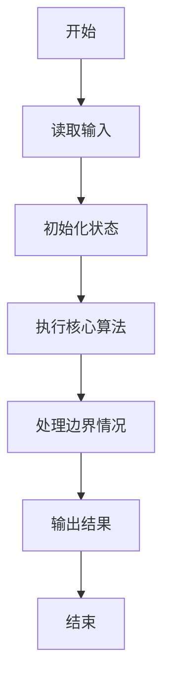
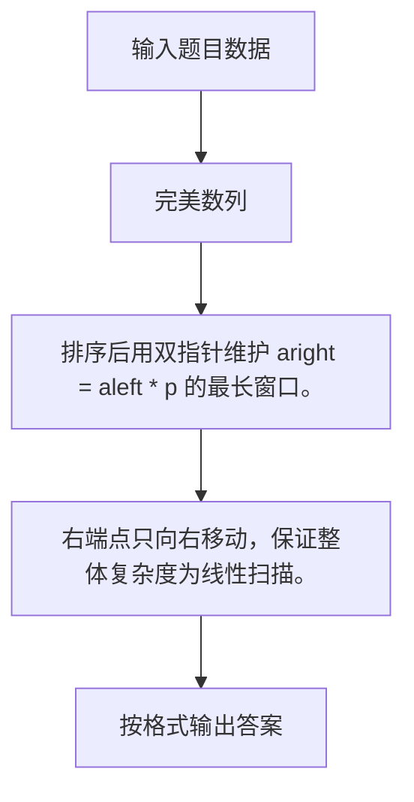

# 1030 完美数列

- **分值：** 25分

### 题目描述

给定一个正整数数列，和正整数 $p$，设这个数列中的最大值是 $M$，最小值是 $m$，如果 $M \le mp$，则称这个数列是完美数列。

现在给定参数 $p$ 和一些正整数，请你从中选择尽可能多的数构成一个完美数列。

### 输入格式：

输入第一行给出两个正整数 $N$ 和 $p$，其中 $N$（$\le 10^5$）是输入的正整数的个数，$p$（$\le 10^9$）是给定的参数。第二行给出 $N$ 个正整数，每个数不超过 $10^9$。

### 输出格式：

在一行中输出最多可以选择多少个数可以用它们组成一个完美数列。

### 输入样例：
```
10 8
2 3 20 4 5 1 6 7 8 9
```

### 输出样例：
```
8
```


### 解题思路

排序后用双指针维护 aright = aleft * p 的最长窗口。 右端点只向右移动，保证整体复杂度为线性扫描。

实现时按照题目的输入顺序读取数据，使用与数据规模匹配的数据结构保存必要状态，在遍历或模拟过程中完成核心计算，最后严格按照输出格式生成答案。

### 代码流程说明

1. 读取题目输入，初始化计数器、数组、集合或其他辅助状态。
2. 排序后用双指针维护 aright = aleft * p 的最长窗口。
3. 右端点只向右移动，保证整体复杂度为线性扫描。
4. 根据题目要求处理边界情况，并输出最终结果。

时间复杂度为 O(N log N)，空间复杂度主要取决于输入数据和辅助状态，通常为 O(1) 到 O(n)。

### 代码实现

以下是本题对应的完整 C++17 实现：

```cpp
#include <bits/stdc++.h>
using namespace std;
// 算法原理：排序后用双指针维护 a[right] <= a[left] * p 的最长窗口。
// 关键步骤：右端点只向右移动，保证整体复杂度为线性扫描。
int main() {
    int n;
    long long p;
    cin >> n >> p;
    vector<long long> a(n);
    for (auto &x : a)
        cin >> x;
    sort(a.begin(), a.end());
    int ans = 0;
    for (int i = 0, j = 0; i < n; ++i) {
        while (j < n && a[j] <= a[i] * p)
            ++j;
        ans = max(ans, j - i);
    }
    cout << ans;
}
```

### 代码流程图



### 解题流程图



### 常见易错点

- 注意输入规模，超大整数、长字符串或链表地址不能简单依赖普通整数和下标。
- 严格区分题目中的边界条件，例如是否包含等号、是否需要保留前导零以及是否只处理完整区块。
- 输出时按照题目规定的空格、换行、大小写和小数位数格式，避免计算正确但格式错误。
