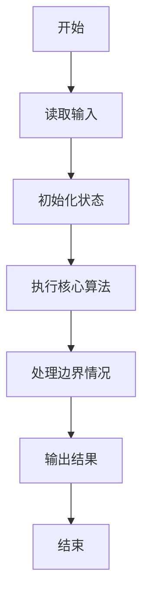
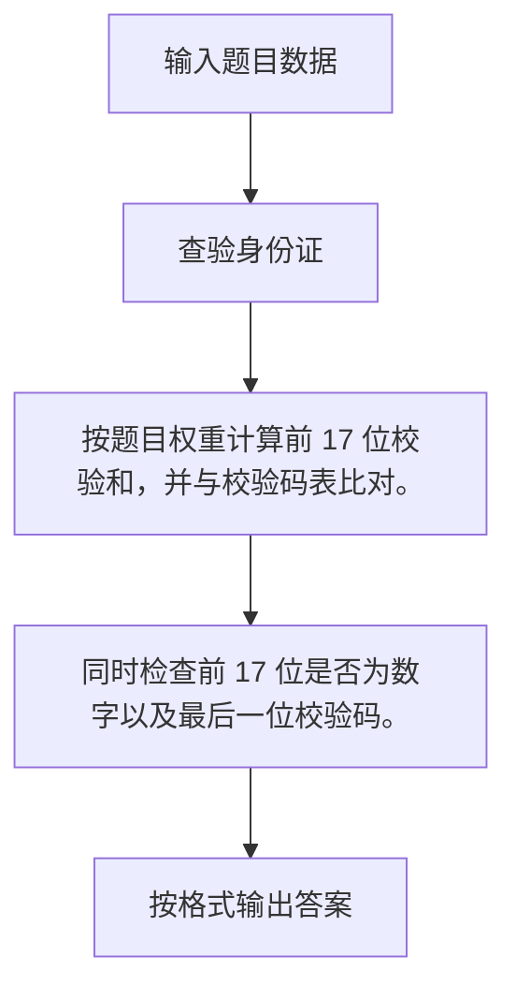

# 1031 查验身份证

- **分值：** 15分

### 题目描述

一个合法的身份证号码由17位地区、日期编号和顺序编号加1位校验码组成。校验码的计算规则如下：

首先对前17位数字加权求和，权重分配为：{7，9，10，5，8，4，2，1，6，3，7，9，10，5，8，4，2}；然后将计算的和对11取模得到值`Z`；最后按照以下关系对应`Z`值与校验码`M`的值：
```
Z：0 1 2 3 4 5 6 7 8 9 10
M：1 0 X 9 8 7 6 5 4 3 2
```
现在给定一些身份证号码，请你验证校验码的有效性，并输出有问题的号码。

### 输入格式：

输入第一行给出正整数$N$（$\le 100$）是输入的身份证号码的个数。随后$N$行，每行给出1个18位身份证号码。

### 输出格式：

按照输入的顺序每行输出1个有问题的身份证号码。这里并不检验前17位是否合理，只检查前17位是否全为数字且最后1位校验码计算准确。如果所有号码都正常，则输出`All passed`。

### 输入样例：1
```
4
320124198808240056
12010X198901011234
110108196711301866
37070419881216001X
```

### 输出样例：1
```
12010X198901011234
110108196711301866
37070419881216001X
```

### 输入样例：2
```
2
320124198808240056
110108196711301862
```

### 输出样例：2
```
All passed
```

**鸣谢阜阳师范学院范建中老师补充数据**

**鸣谢浙江工业大学之江学院石洗凡老师纠正数据**


### 解题思路

按题目权重计算前 17 位校验和，并与校验码表比对。 同时检查前 17 位是否为数字以及最后一位校验码。

实现时按照题目的输入顺序读取数据，使用与数据规模匹配的数据结构保存必要状态，在遍历或模拟过程中完成核心计算，最后严格按照输出格式生成答案。

### 代码流程说明

1. 读取题目输入，初始化计数器、数组、集合或其他辅助状态。
2. 按题目权重计算前 17 位校验和，并与校验码表比对。
3. 同时检查前 17 位是否为数字以及最后一位校验码。
4. 根据题目要求处理边界情况，并输出最终结果。

时间复杂度为 O(N)，空间复杂度主要取决于输入数据和辅助状态，通常为 O(1) 到 O(n)。

### 代码实现

以下是本题对应的完整 C++17 实现：

```cpp
#include <bits/stdc++.h>
using namespace std;
// 算法原理：按题目权重计算前 17 位校验和，并与校验码表比对。
// 关键步骤：同时检查前 17 位是否为数字以及最后一位校验码。
int main() {
    int n;
    cin >> n;
    int w[] = {7, 9, 10, 5, 8, 4, 2, 1, 6, 3, 7, 9, 10, 5, 8, 4, 2};
    char z[] = "10X98765432";
    bool all = true;
    while (n--) {
        string s;
        cin >> s;
        int sum = 0;
        for (int i = 0; i < 17; ++i)
            sum += (s[i] - '0') * w[i];
        if (!isdigit((unsigned char)s[17]) || z[sum % 11] != s[17])
            cout << s << '\n', all = false;
    }
    if (all)
        cout << "All passed";
}
```

### 代码流程图



### 解题流程图



### 常见易错点

- 注意输入规模，超大整数、长字符串或链表地址不能简单依赖普通整数和下标。
- 严格区分题目中的边界条件，例如是否包含等号、是否需要保留前导零以及是否只处理完整区块。
- 输出时按照题目规定的空格、换行、大小写和小数位数格式，避免计算正确但格式错误。
