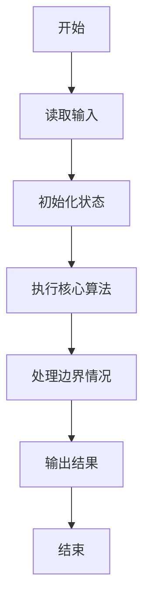
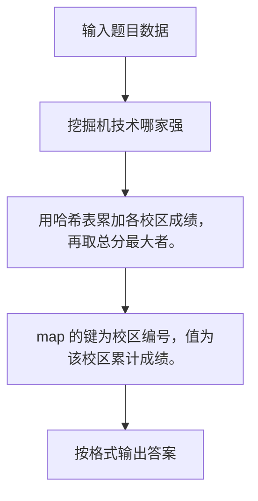

# 1032 挖掘机技术哪家强

- **分值：** 20分

### 题目描述

为了用事实说明挖掘机技术到底哪家强，PAT 组织了一场挖掘机技能大赛。现请你根据比赛结果统计出技术最强的那个学校。

### 输入格式：

输入在第 1 行给出不超过 $10^5$ 的正整数 $N$，即参赛人数。随后 $N$ 行，每行给出一位参赛者的信息和成绩，包括其所代表的学校的编号（从 1 开始连续编号）、及其比赛成绩（百分制），中间以空格分隔。

### 输出格式：

在一行中给出总得分最高的学校的编号、及其总分，中间以空格分隔。题目保证答案唯一，没有并列。

### 输入样例：
```
6
3 65
2 80
1 100
2 70
3 40
3 0

```

### 输出样例：
```
2 150

```

**鸣谢用户 米泰亚德 补充数据！**


### 解题思路

用哈希表累加各校区成绩，再取总分最大者。 map 的键为校区编号，值为该校区累计成绩。

实现时按照题目的输入顺序读取数据，使用与数据规模匹配的数据结构保存必要状态，在遍历或模拟过程中完成核心计算，最后严格按照输出格式生成答案。

### 代码流程说明

1. 读取题目输入，初始化计数器、数组、集合或其他辅助状态。
2. 用哈希表累加各校区成绩，再取总分最大者。
3. map 的键为校区编号，值为该校区累计成绩。
4. 根据题目要求处理边界情况，并输出最终结果。

时间复杂度为 O(N log N)，空间复杂度主要取决于输入数据和辅助状态，通常为 O(1) 到 O(n)。

### 代码实现

以下是本题对应的完整 C++17 实现：

```cpp
#include <bits/stdc++.h>
using namespace std;
// 算法原理：用哈希表累加各校区成绩，再取总分最大者。
// 关键步骤：map 的键为校区编号，值为该校区累计成绩。
int main() {
    int n;
    cin >> n;
    map<int, int> s;
    for (int i = 0, x, y; i < n; ++i)
        cin >> x >> y, s[x] += y;
    auto p = max_element(s.begin(), s.end(), [](auto &a, auto &b) { return a.second < b.second; });
    cout << p->first << ' ' << p->second;
}
```

### 代码流程图



### 解题流程图



### 常见易错点

- 注意输入规模，超大整数、长字符串或链表地址不能简单依赖普通整数和下标。
- 严格区分题目中的边界条件，例如是否包含等号、是否需要保留前导零以及是否只处理完整区块。
- 输出时按照题目规定的空格、换行、大小写和小数位数格式，避免计算正确但格式错误。
