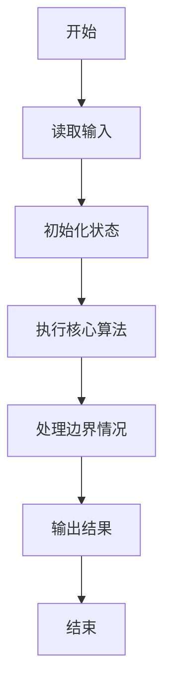
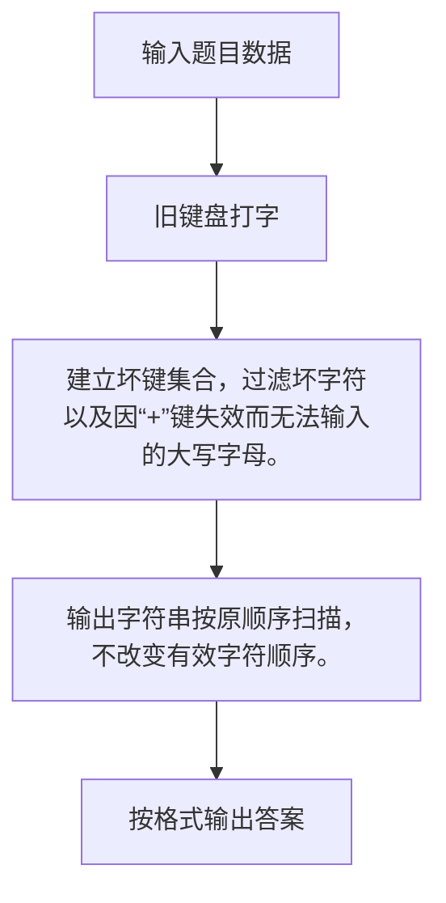

# 1033 旧键盘打字

- **分值：** 20分

### 题目描述

旧键盘上坏了几个键，于是在敲一段文字的时候，对应的字符就不会出现。现在给出应该输入的一段文字、以及坏掉的那些键，打出的结果文字会是怎样？

### 输入格式：

输入在 2 行中分别给出坏掉的那些键、以及应该输入的文字。其中对应英文字母的坏键以大写给出；每段文字是不超过 $10^5$ 个字符的串。可用的字符包括字母 [`a`-`z`, `A`-`Z`]、数字 `0`-`9`、以及下划线 `_`（代表空格）、`,`、`.`、`-`、`+`（代表上档键）。题目保证第 2 行输入的文字串非空。

注意：如果上档键坏掉了，那么大写的英文字母无法被打出。

### 输出格式：

在一行中输出能够被打出的结果文字。如果没有一个字符能被打出，则输出空行。

### 输入样例：
```
7+IE.
7_This_is_a_test.
```

### 输出样例：
```
_hs_s_a_tst
```


### 解题思路

建立坏键集合，过滤坏字符以及因“+”键失效而无法输入的大写字母。 输出字符串按原顺序扫描，不改变有效字符顺序。

实现时按照题目的输入顺序读取数据，使用与数据规模匹配的数据结构保存必要状态，在遍历或模拟过程中完成核心计算，最后严格按照输出格式生成答案。

### 代码流程说明

1. 读取题目输入，初始化计数器、数组、集合或其他辅助状态。
2. 建立坏键集合，过滤坏字符以及因“+”键失效而无法输入的大写字母。
3. 输出字符串按原顺序扫描，不改变有效字符顺序。
4. 根据题目要求处理边界情况，并输出最终结果。

时间复杂度为 O(L)，空间复杂度主要取决于输入数据和辅助状态，通常为 O(1) 到 O(n)。

### 代码实现

以下是本题对应的完整 C++17 实现：

```cpp
#include <bits/stdc++.h>
using namespace std;
// 算法原理：建立坏键集合，过滤坏字符以及因“+”键失效而无法输入的大写字母。
// 关键步骤：输出字符串按原顺序扫描，不改变有效字符顺序。
int main() {
    string bad, s;
    getline(cin, bad);
    getline(cin, s);
    set<char> x(bad.begin(), bad.end());
    for (char c : s) {
        char upper = isalpha((unsigned char)c) ? toupper((unsigned char)c) : c;
        bool blocked = x.count(c) || x.count(upper);
        if (isupper((unsigned char)c) && x.count('+'))
            blocked = true;
        if (!blocked)
            cout << c;
    }
}
```

### 代码流程图



### 解题流程图



### 常见易错点

- 注意输入规模，超大整数、长字符串或链表地址不能简单依赖普通整数和下标。
- 严格区分题目中的边界条件，例如是否包含等号、是否需要保留前导零以及是否只处理完整区块。
- 输出时按照题目规定的空格、换行、大小写和小数位数格式，避免计算正确但格式错误。
