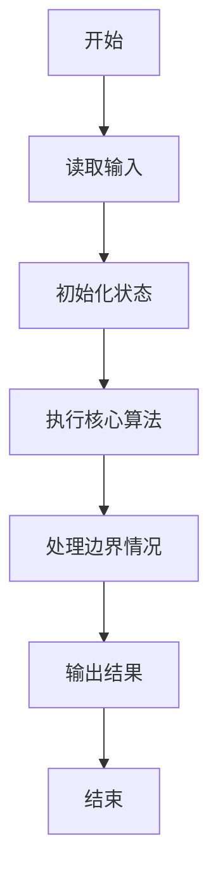
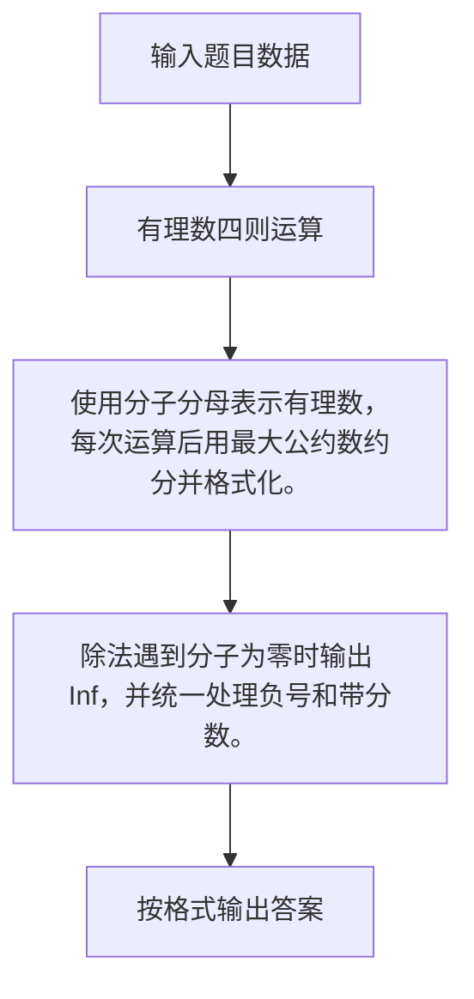

# 1034 有理数四则运算

- **分值：** 20分

### 题目描述

本题要求编写程序，计算 2 个有理数的和、差、积、商。

### 输入格式：

输入在一行中按照 `a1/b1 a2/b2` 的格式给出两个分数形式的有理数，其中分子和分母全是整型范围内的整数，负号只可能出现在分子前，分母不为 0。

### 输出格式：

分别在 4 行中按照 `有理数1 运算符 有理数2 = 结果` 的格式顺序输出 2 个有理数的和、差、积、商。注意输出的每个有理数必须是该有理数的最简形式 `k a/b`，其中 `k` 是整数部分，`a/b` 是最简分数部分；若为负数，则须加括号；若除法分母为 0，则输出 `Inf`。题目保证正确的输出中没有超过整型范围的整数。

### 输入样例：1
```
2/3 -4/2
```

### 输出样例：1
```
2/3 + (-2) = (-1 1/3)
2/3 - (-2) = 2 2/3
2/3 * (-2) = (-1 1/3)
2/3 / (-2) = (-1/3)
```

### 输入样例：2
```
5/3 0/6
```

### 输出样例：2
```
1 2/3 + 0 = 1 2/3
1 2/3 - 0 = 1 2/3
1 2/3 * 0 = 0
1 2/3 / 0 = Inf
```


### 解题思路

使用分子分母表示有理数，每次运算后用最大公约数约分并格式化。 除法遇到分子为零时输出 Inf，并统一处理负号和带分数。

实现时按照题目的输入顺序读取数据，使用与数据规模匹配的数据结构保存必要状态，在遍历或模拟过程中完成核心计算，最后严格按照输出格式生成答案。

### 代码流程说明

1. 读取题目输入，初始化计数器、数组、集合或其他辅助状态。
2. 使用分子分母表示有理数，每次运算后用最大公约数约分并格式化。
3. 除法遇到分子为零时输出 Inf，并统一处理负号和带分数。
4. 根据题目要求处理边界情况，并输出最终结果。

时间复杂度为 O(1)，空间复杂度主要取决于输入数据和辅助状态，通常为 O(1) 到 O(n)。

### 代码实现

以下是本题对应的完整 C++17 实现：

```cpp
#include <bits/stdc++.h>
using namespace std;
// 算法原理：使用分子分母表示有理数，每次运算后用最大公约数约分并格式化。
// 关键步骤：除法遇到分子为零时输出 Inf，并统一处理负号和带分数。
using ll = long long;
struct F {
    ll n, d;
};
ll gcd2(ll a, ll b) { return b ? gcd2(b, a % b) : llabs(a); }
F norm(F x) {
    if (x.d < 0)
        x.n = -x.n, x.d = -x.d;
    ll g = gcd2(x.n, x.d);
    return {x.n / g, x.d / g};
}
void out(F x) {
    x = norm(x);
    if (x.n == 0) {
        cout << 0;
        return;
    }
    bool neg = x.n < 0;
    if (neg)
        cout << '(';
    if (llabs(x.n) >= x.d)
        cout << x.n / x.d;
    else if (neg)
        cout << '-';
    if (llabs(x.n) >= x.d && llabs(x.n) % x.d)
        cout << ' ';
    if (llabs(x.n) % x.d)
        cout << llabs(x.n) % x.d << '/' << x.d;
    if (neg)
        cout << ')';
}
int main() {
    string sa, sb;
    cin >> sa >> sb;
    auto read = [](const string &s) {
        size_t slash = s.find('/');
        return F{stoll(s.substr(0, slash)), stoll(s.substr(slash + 1))};
    };
    F a = read(sa), b = read(sb);
    a = norm(a);
    b = norm(b);
    F x{a.n * b.d + b.n * a.d, a.d * b.d}, y{a.n * b.d - b.n * a.d, a.d * b.d},
        z{a.n * b.n, a.d * b.d}, q{a.n * b.d, a.d * b.n};
    out(a);
    cout << " + ";
    out(b);
    cout << " = ";
    out(x);
    cout << '\n';
    out(a);
    cout << " - ";
    out(b);
    cout << " = ";
    out(y);
    cout << '\n';
    out(a);
    cout << " * ";
    out(b);
    cout << " = ";
    out(z);
    cout << '\n';
    out(a);
    cout << " / ";
    out(b);
    cout << " = ";
    if (b.n == 0)
        cout << "Inf";
    else
        out(q);
}
```

### 代码流程图



### 解题流程图



### 常见易错点

- 注意输入规模，超大整数、长字符串或链表地址不能简单依赖普通整数和下标。
- 严格区分题目中的边界条件，例如是否包含等号、是否需要保留前导零以及是否只处理完整区块。
- 输出时按照题目规定的空格、换行、大小写和小数位数格式，避免计算正确但格式错误。
