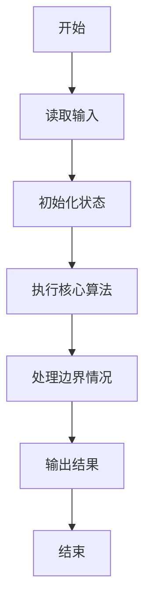
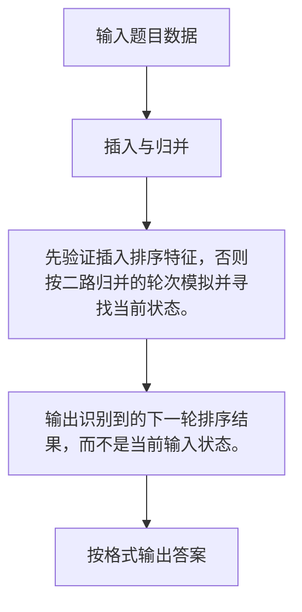

# 1035 插入与归并

- **分值：** 25分

### 题目描述

根据维基百科的定义：

**插入排序**是迭代算法，逐一获得输入数据，逐步产生有序的输出序列。每步迭代中，算法从输入序列中取出一元素，将之插入有序序列中正确的位置。如此迭代直到全部元素有序。

**归并排序**进行如下迭代操作：首先将原始序列看成 N 个只包含 1 个元素的有序子序列，然后每次迭代归并两个相邻的有序子序列，直到最后只剩下 1 个有序的序列。

现给定原始序列和由某排序算法产生的中间序列，请你判断该算法究竟是哪种排序算法？

### 输入格式：

输入在第一行给出正整数 N ($\le$100)；随后一行给出原始序列的 N 个整数；最后一行给出由某排序算法产生的中间序列。这里假设排序的目标序列是升序。数字间以空格分隔。

### 输出格式：

首先在第 1 行中输出`Insertion Sort`表示插入排序、或`Merge Sort`表示归并排序；然后在第 2 行中输出用该排序算法再迭代一轮的结果序列。题目保证每组测试的结果是唯一的。数字间以空格分隔，且行首尾不得有多余空格。

### 输入样例：1
```
10
3 1 2 8 7 5 9 4 6 0
1 2 3 7 8 5 9 4 6 0
```

### 输出样例：1
```
Insertion Sort
1 2 3 5 7 8 9 4 6 0
```

### 输入样例：2
```
10
3 1 2 8 7 5 9 4 0 6
1 3 2 8 5 7 4 9 0 6
```

### 输出样例：2
```
Merge Sort
1 2 3 8 4 5 7 9 0 6
```


### 解题思路

先验证插入排序特征，否则按二路归并的轮次模拟并寻找当前状态。 输出识别到的下一轮排序结果，而不是当前输入状态。

实现时按照题目的输入顺序读取数据，使用与数据规模匹配的数据结构保存必要状态，在遍历或模拟过程中完成核心计算，最后严格按照输出格式生成答案。

### 代码流程说明

1. 读取题目输入，初始化计数器、数组、集合或其他辅助状态。
2. 先验证插入排序特征，否则按二路归并的轮次模拟并寻找当前状态。
3. 输出识别到的下一轮排序结果，而不是当前输入状态。
4. 根据题目要求处理边界情况，并输出最终结果。

时间复杂度为 O(N log N)，空间复杂度主要取决于输入数据和辅助状态，通常为 O(1) 到 O(n)。

### 代码实现

以下是本题对应的完整 C++17 实现：

```cpp
#include <bits/stdc++.h>
using namespace std;
// 算法原理：先验证插入排序特征，否则按二路归并的轮次模拟并寻找当前状态。
// 关键步骤：输出识别到的下一轮排序结果，而不是当前输入状态。
void print(vector<int> &a) {
    for (int i = 0; i < (int)a.size(); ++i)
        cout << (i ? " " : "") << a[i];
}
int main() {
    int n;
    cin >> n;
    vector<int> a(n), b(n);
    for (int &x : a)
        cin >> x;
    for (int &x : b)
        cin >> x;
    int pos = 0;
    while (pos + 1 < n && b[pos] <= b[pos + 1])
        ++pos;
    bool ins = true;
    for (int i = pos + 1; i < n; ++i)
        if (a[i] != b[i])
            ins = false;
    if (ins) {
        sort(b.begin(), b.begin() + min(pos + 2, n));
        cout << "Insertion Sort\n";
        print(b);
        return 0;
    }
    vector<int> x = a;
    for (int width = 1; width < n; width *= 2) {
        for (int i = 0; i < n; i += width * 2)
            sort(x.begin() + i, x.begin() + min(i + width * 2, n));
        if (x == b) {
            width *= 2;
            for (int i = 0; i < n; i += width * 2)
                sort(x.begin() + i, x.begin() + min(i + width * 2, n));
            cout << "Merge Sort\n";
            print(x);
            return 0;
        }
    }
}
```

### 代码流程图



### 解题流程图



### 常见易错点

- 注意输入规模，超大整数、长字符串或链表地址不能简单依赖普通整数和下标。
- 严格区分题目中的边界条件，例如是否包含等号、是否需要保留前导零以及是否只处理完整区块。
- 输出时按照题目规定的空格、换行、大小写和小数位数格式，避免计算正确但格式错误。
