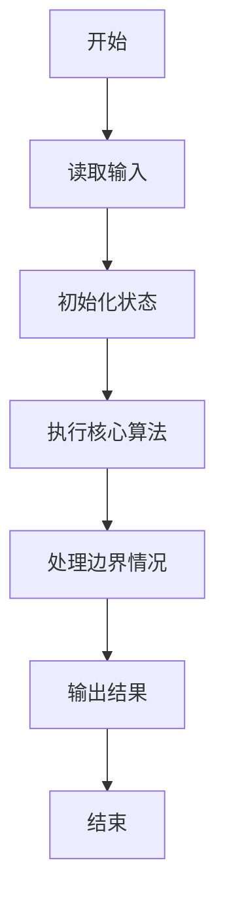
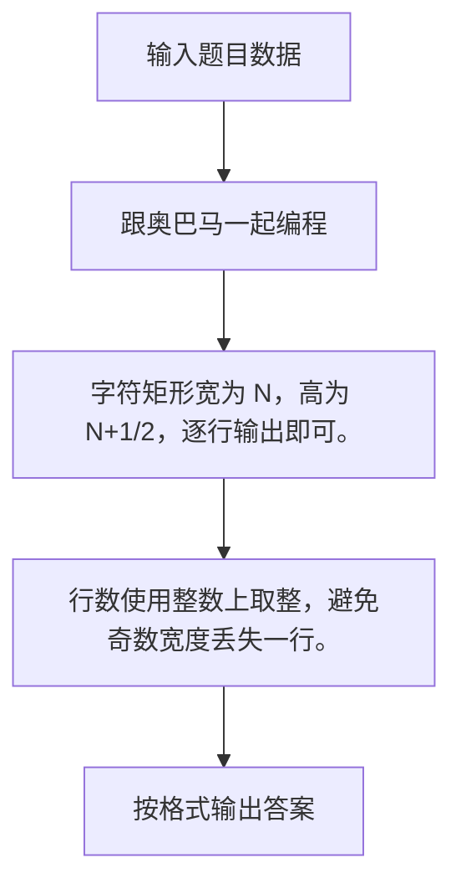

# 1036 跟奥巴马一起编程

- **分值：** 15分

### 题目描述

美国总统奥巴马不仅呼吁所有人都学习编程，甚至以身作则编写代码，成为美国历史上首位编写计算机代码的总统。2014 年底，为庆祝“计算机科学教育周”正式启动，奥巴马编写了很简单的计算机代码：在屏幕上画一个正方形。现在你也跟他一起画吧！

### 输入格式：

输入在一行中给出正方形边长 $N$（$3\le N\le 20$）和组成正方形边的某种字符 C，间隔一个空格。

### 输出格式：

输出由给定字符 C 画出的正方形。但是注意到行间距比列间距大，所以为了让结果看上去更像正方形，我们输出的行数实际上是列数的 50%（四舍五入取整）。

### 输入样例：
```
10 a
```

### 输出样例：
```
aaaaaaaaaa
a        a
a        a
a        a
aaaaaaaaaa
```


### 解题思路

字符矩形宽为 N，高为 N+1/2，逐行输出即可。 行数使用整数上取整，避免奇数宽度丢失一行。

实现时按照题目的输入顺序读取数据，使用与数据规模匹配的数据结构保存必要状态，在遍历或模拟过程中完成核心计算，最后严格按照输出格式生成答案。

### 代码流程说明

1. 读取题目输入，初始化计数器、数组、集合或其他辅助状态。
2. 字符矩形宽为 N，高为 N+1/2，逐行输出即可。
3. 行数使用整数上取整，避免奇数宽度丢失一行。
4. 根据题目要求处理边界情况，并输出最终结果。

时间复杂度为 O(N²)，空间复杂度主要取决于输入数据和辅助状态，通常为 O(1) 到 O(n)。

### 代码实现

以下是本题对应的完整 C++17 实现：

```cpp
#include <bits/stdc++.h>
using namespace std;
// 算法原理：字符矩形宽为 N，高为 (N+1)/2，逐行输出即可。
// 关键步骤：行数使用整数上取整，避免奇数宽度丢失一行。
int main() {
    int n;
    char c;
    cin >> n >> c;
    int r = (n + 1) / 2;
    for (int i = 0; i < r; ++i) {
        if (i == 0 || i == r - 1) {
            for (int j = 0; j < n; ++j)
                cout << c;
        } else {
            cout << c;
            for (int j = 0; j < n - 2; ++j)
                cout << ' ';
            cout << c;
        }
        cout << '\n';
    }
}
```

### 代码流程图



### 解题流程图



### 常见易错点

- 注意输入规模，超大整数、长字符串或链表地址不能简单依赖普通整数和下标。
- 严格区分题目中的边界条件，例如是否包含等号、是否需要保留前导零以及是否只处理完整区块。
- 输出时按照题目规定的空格、换行、大小写和小数位数格式，避免计算正确但格式错误。
