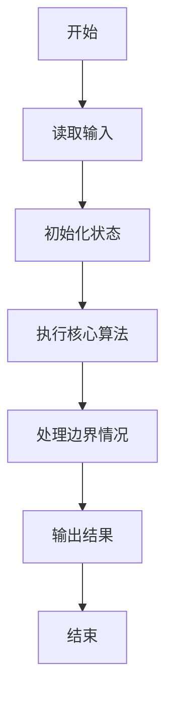
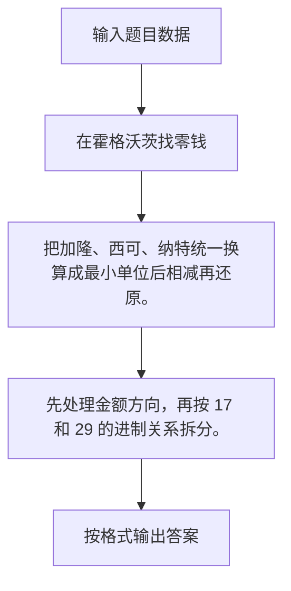

# 1037 在霍格沃茨找零钱

- **分值：** 20分

### 题目描述

如果你是哈利·波特迷，你会知道魔法世界有它自己的货币系统 —— 就如海格告诉哈利的：“十七个银西可(Sickle)兑一个加隆(Galleon)，二十九个纳特(Knut)兑一个西可，很容易。”现在，给定哈利应付的价钱 $P$ 和他实付的钱 $A$，你的任务是写一个程序来计算他应该被找的零钱。

### 输入格式：

输入在 1 行中分别给出 $P$ 和 $A$，格式为 `Galleon.Sickle.Knut`，其间用 1 个空格分隔。这里 `Galleon` 是 [0, $10^7$] 区间内的整数，`Sickle` 是 [0, 17) 区间内的整数，`Knut` 是 [0, 29) 区间内的整数。

### 输出格式：

在一行中用与输入同样的格式输出哈利应该被找的零钱。如果他没带够钱，那么输出的应该是负数。

### 输入样例：1
```
10.16.27 14.1.28
```

### 输出样例：1
```
3.2.1
```

### 输入样例：2
```
14.1.28 10.16.27
```

### 输出样例：2
```
-3.2.1
```


### 解题思路

把加隆、西可、纳特统一换算成最小单位后相减再还原。 先处理金额方向，再按 17 和 29 的进制关系拆分。

实现时按照题目的输入顺序读取数据，使用与数据规模匹配的数据结构保存必要状态，在遍历或模拟过程中完成核心计算，最后严格按照输出格式生成答案。

### 代码流程说明

1. 读取题目输入，初始化计数器、数组、集合或其他辅助状态。
2. 把加隆、西可、纳特统一换算成最小单位后相减再还原。
3. 先处理金额方向，再按 17 和 29 的进制关系拆分。
4. 根据题目要求处理边界情况，并输出最终结果。

时间复杂度为 O(1)，空间复杂度主要取决于输入数据和辅助状态，通常为 O(1) 到 O(n)。

### 代码实现

以下是本题对应的完整 C++17 实现：

```cpp
#include <bits/stdc++.h>
using namespace std;
// 算法原理：把加隆、西可、纳特统一换算成最小单位后相减再还原。
// 关键步骤：先处理金额方向，再按 17 和 29 的进制关系拆分。
int main() {
    int a, b, c, d, e, f;
    scanf("%d.%d.%d %d.%d.%d", &a, &b, &c, &d, &e, &f);
    long long x = a * 17 * 29 + b * 29 + c, y = d * 17 * 29 + e * 29 + f, z = y - x;
    if (z < 0)
        cout << '-', z = -z;
    cout << z / (17 * 29) << '.' << z / 29 % 17 << '.' << z % 29;
}
```

### 代码流程图



### 解题流程图



### 常见易错点

- 注意输入规模，超大整数、长字符串或链表地址不能简单依赖普通整数和下标。
- 严格区分题目中的边界条件，例如是否包含等号、是否需要保留前导零以及是否只处理完整区块。
- 输出时按照题目规定的空格、换行、大小写和小数位数格式，避免计算正确但格式错误。
