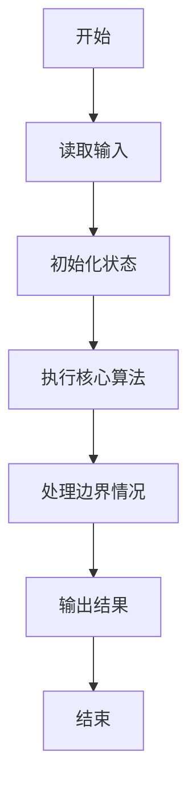
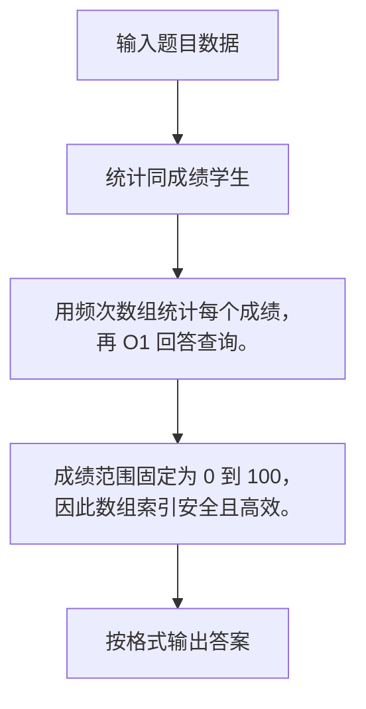

# 1038 统计同成绩学生

- **分值：** 20分

### 题目描述

本题要求读入 $N$ 名学生的成绩，将获得某一给定分数的学生人数输出。

### 输入格式：

输入在第 1 行给出不超过 $10^5$ 的正整数 $N$，即学生总人数。随后一行给出 $N$ 名学生的百分制整数成绩，中间以空格分隔。最后一行给出要查询的分数个数 $K$（不超过 $N$ 的正整数），随后是 $K$ 个分数，中间以空格分隔。

### 输出格式：

在一行中按查询顺序给出得分等于指定分数的学生人数，中间以空格分隔，但行末不得有多余空格。

### 输入样例：
```
10
60 75 90 55 75 99 82 90 75 50
3 75 90 88
```

### 输出样例：
```
3 2 0
```


### 解题思路

用频次数组统计每个成绩，再 O1 回答查询。 成绩范围固定为 0 到 100，因此数组索引安全且高效。

实现时按照题目的输入顺序读取数据，使用与数据规模匹配的数据结构保存必要状态，在遍历或模拟过程中完成核心计算，最后严格按照输出格式生成答案。

### 代码流程说明

1. 读取题目输入，初始化计数器、数组、集合或其他辅助状态。
2. 用频次数组统计每个成绩，再 O1 回答查询。
3. 成绩范围固定为 0 到 100，因此数组索引安全且高效。
4. 根据题目要求处理边界情况，并输出最终结果。

时间复杂度为 O(N+Q)，空间复杂度主要取决于输入数据和辅助状态，通常为 O(1) 到 O(n)。

### 代码实现

以下是本题对应的完整 C++17 实现：

```cpp
#include <bits/stdc++.h>
using namespace std;
// 算法原理：用频次数组统计每个成绩，再 O(1) 回答查询。
// 关键步骤：成绩范围固定为 0 到 100，因此数组索引安全且高效。
int main() {
    int n;
    cin >> n;
    vector<int> c(101);
    for (int i = 0, x; i < n; ++i)
        cin >> x, ++c[x];
    int k;
    cin >> k;
    for (int i = 0, x; i < k; ++i) {
        cin >> x;
        cout << (i ? " " : "") << c[x];
    }
}
```

### 代码流程图



### 解题流程图



### 常见易错点

- 注意输入规模，超大整数、长字符串或链表地址不能简单依赖普通整数和下标。
- 严格区分题目中的边界条件，例如是否包含等号、是否需要保留前导零以及是否只处理完整区块。
- 输出时按照题目规定的空格、换行、大小写和小数位数格式，避免计算正确但格式错误。
