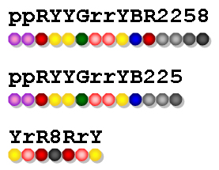
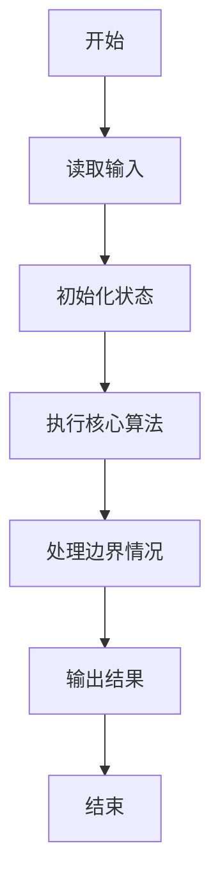
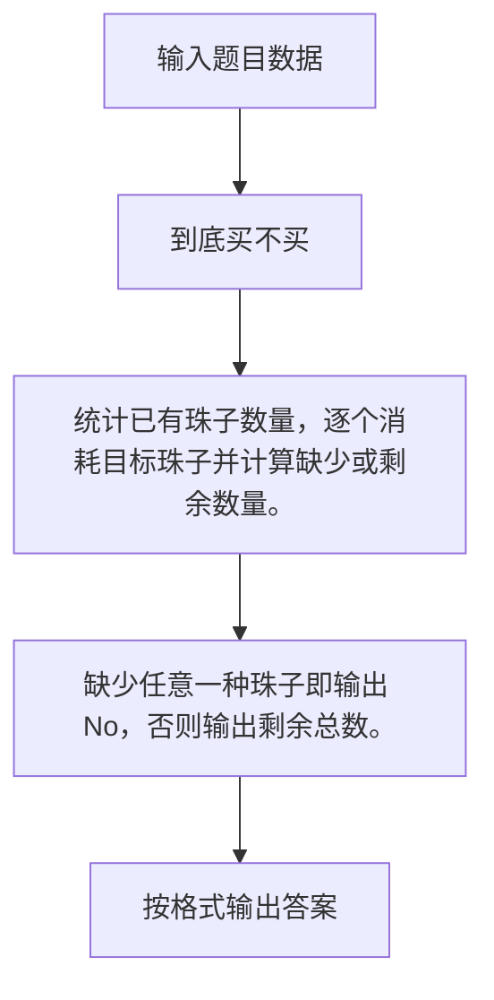

# 1039 到底买不买

- **分值：** 20分

### 题目描述

小红想买些珠子做一串自己喜欢的珠串。卖珠子的摊主有很多串五颜六色的珠串，但是不肯把任何一串拆散了卖。于是小红要你帮忙判断一下，某串珠子里是否包含了全部自己想要的珠子？如果是，那么告诉她有多少多余的珠子；如果不是，那么告诉她缺了多少珠子。

为方便起见，我们用[0-9]、[a-z]、[A-Z]范围内的字符来表示颜色。例如在图1中，第3串是小红想做的珠串；那么第1串可以买，因为包含了全部她想要的珠子，还多了8颗不需要的珠子；第2串不能买，因为没有黑色珠子，并且少了一颗红色的珠子。



图 1

### 输入格式：

每个输入包含 1 个测试用例。每个测试用例分别在 2 行中先后给出摊主的珠串和小红想做的珠串，两串都不超过 1000 个珠子。

### 输出格式：

如果可以买，则在一行中输出 `Yes` 以及有多少多余的珠子；如果不可以买，则在一行中输出 `No` 以及缺了多少珠子。其间以 1 个空格分隔。

### 输入样例：1
```
ppRYYGrrYBR2258
YrR8RrY
```

### 输出样例：1
```
Yes 8
```

### 输入样例：2
```
ppRYYGrrYB225
YrR8RrY
```

### 输出样例：2
```
No 2
```


### 解题思路

统计已有珠子数量，逐个消耗目标珠子并计算缺少或剩余数量。 缺少任意一种珠子即输出 No，否则输出剩余总数。

实现时按照题目的输入顺序读取数据，使用与数据规模匹配的数据结构保存必要状态，在遍历或模拟过程中完成核心计算，最后严格按照输出格式生成答案。

### 代码流程说明

1. 读取题目输入，初始化计数器、数组、集合或其他辅助状态。
2. 统计已有珠子数量，逐个消耗目标珠子并计算缺少或剩余数量。
3. 缺少任意一种珠子即输出 No，否则输出剩余总数。
4. 根据题目要求处理边界情况，并输出最终结果。

时间复杂度为 O(|A|+|B|)，空间复杂度主要取决于输入数据和辅助状态，通常为 O(1) 到 O(n)。

### 代码实现

以下是本题对应的完整 C++17 实现：

```cpp
#include <bits/stdc++.h>
using namespace std;
// 算法原理：统计已有珠子数量，逐个消耗目标珠子并计算缺少或剩余数量。
// 关键步骤：缺少任意一种珠子即输出 No，否则输出剩余总数。
int main() {
    string a, b;
    cin >> a >> b;
    int c[128] = {};
    for (char x : a)
        ++c[(int)x];
    int lack = 0;
    for (char x : b)
        if (c[(int)x])
            --c[(int)x];
        else
            ++lack;
    if (lack)
        cout << "No " << lack;
    else
        cout << "Yes " << a.size() - b.size();
}
```

### 代码流程图



### 解题流程图



### 常见易错点

- 注意输入规模，超大整数、长字符串或链表地址不能简单依赖普通整数和下标。
- 严格区分题目中的边界条件，例如是否包含等号、是否需要保留前导零以及是否只处理完整区块。
- 输出时按照题目规定的空格、换行、大小写和小数位数格式，避免计算正确但格式错误。
