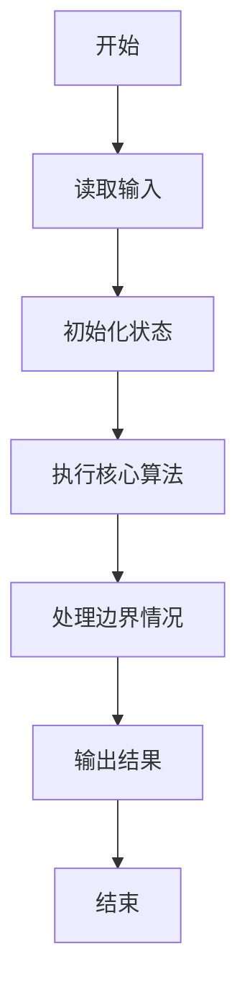
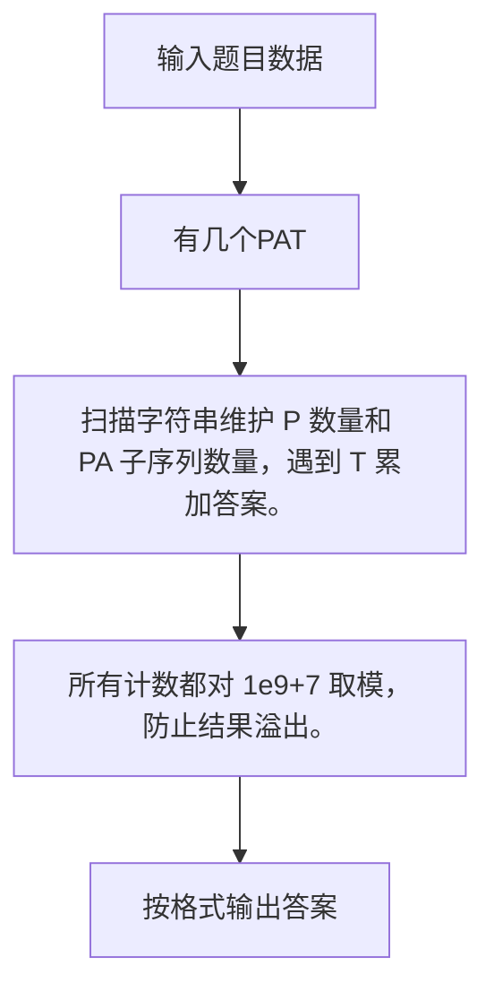

# 1040 有几个PAT

- **分值：** 25分

### 题目描述

字符串 `APPAPT` 中包含了两个单词 `PAT`，其中第一个 `PAT` 是第 2 位(`P`)，第 4 位(`A`)，第 6 位(`T`)；第二个 `PAT` 是第 3 位(`P`)，第 4 位(`A`)，第 6 位(`T`)。

现给定字符串，问一共可以形成多少个 `PAT`？

### 输入格式：

输入只有一行，包含一个字符串，长度不超过$10^5$，只包含 `P`、`A`、`T` 三种字母。

### 输出格式：

在一行中输出给定字符串中包含多少个 `PAT`。由于结果可能比较大，只输出对 1000000007 取余数的结果。

### 输入样例：
```
APPAPT
```

### 输出样例：
```
2
```


### 解题思路

扫描字符串维护 P 数量和 PA 子序列数量，遇到 T 累加答案。 所有计数都对 1e9+7 取模，防止结果溢出。

实现时按照题目的输入顺序读取数据，使用与数据规模匹配的数据结构保存必要状态，在遍历或模拟过程中完成核心计算，最后严格按照输出格式生成答案。

### 代码流程说明

1. 读取题目输入，初始化计数器、数组、集合或其他辅助状态。
2. 扫描字符串维护 P 数量和 PA 子序列数量，遇到 T 累加答案。
3. 所有计数都对 1e9+7 取模，防止结果溢出。
4. 根据题目要求处理边界情况，并输出最终结果。

时间复杂度为 O(L)，空间复杂度主要取决于输入数据和辅助状态，通常为 O(1) 到 O(n)。

### 代码实现

以下是本题对应的完整 C++17 实现：

```cpp
#include <bits/stdc++.h>
using namespace std;
// 算法原理：扫描字符串维护 P 数量和 PA 子序列数量，遇到 T 累加答案。
// 关键步骤：所有计数都对 1e9+7 取模，防止结果溢出。
int main() {
    string s;
    cin >> s;
    long long p = 0, pa = 0, ans = 0;
    for (char c : s) {
        if (c == 'P')
            ++p;
        else if (c == 'A')
            pa = (pa + p) % 1000000007;
        else if (c == 'T')
            ans = (ans + pa) % 1000000007;
    }
    cout << ans;
}
```

### 代码流程图



### 解题流程图



### 常见易错点

- 注意输入规模，超大整数、长字符串或链表地址不能简单依赖普通整数和下标。
- 严格区分题目中的边界条件，例如是否包含等号、是否需要保留前导零以及是否只处理完整区块。
- 输出时按照题目规定的空格、换行、大小写和小数位数格式，避免计算正确但格式错误。
