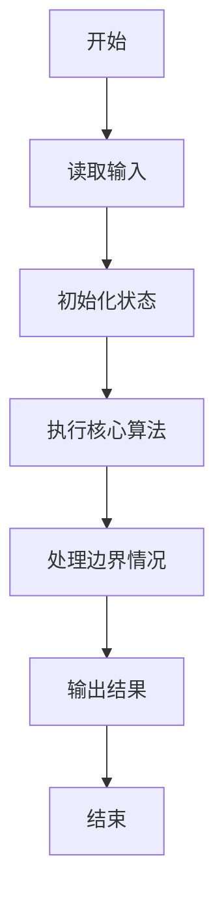
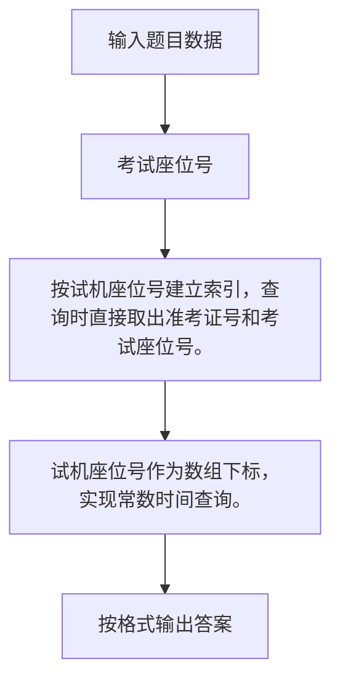

# 1041 考试座位号

- **分值：** 15分

### 题目描述

每个 PAT 考生在参加考试时都会被分配两个座位号，一个是试机座位，一个是考试座位。正常情况下，考生在入场时先得到试机座位号码，入座进入试机状态后，系统会显示该考生的考试座位号码，考试时考生需要换到考试座位就座。但有些考生迟到了，试机已经结束，他们只能拿着领到的试机座位号码求助于你，从后台查出他们的考试座位号码。

### 输入格式：

输入第一行给出一个正整数 $N$（$\le 1000$），随后 $N$ 行，每行给出一个考生的信息：`准考证号 试机座位号 考试座位号`。其中`准考证号`由 16 位数字组成，座位从 1 到 $N$ 编号。输入保证每个人的准考证号都不同，并且任何时候都不会把两个人分配到同一个座位上。

考生信息之后，给出一个正整数 $M$（$\le N$），随后一行中给出 $M$ 个待查询的试机座位号码，以空格分隔。

### 输出格式：

对应每个需要查询的试机座位号码，在一行中输出对应考生的准考证号和考试座位号码，中间用 1 个空格分隔。

### 输入样例：
```
4
3310120150912233 2 4
3310120150912119 4 1
3310120150912126 1 3
3310120150912002 3 2
2
3 4
```

### 输出样例：
```
3310120150912002 2
3310120150912119 1
```


### 解题思路

按试机座位号建立索引，查询时直接取出准考证号和考试座位号。 试机座位号作为数组下标，实现常数时间查询。

实现时按照题目的输入顺序读取数据，使用与数据规模匹配的数据结构保存必要状态，在遍历或模拟过程中完成核心计算，最后严格按照输出格式生成答案。

### 代码流程说明

1. 读取题目输入，初始化计数器、数组、集合或其他辅助状态。
2. 按试机座位号建立索引，查询时直接取出准考证号和考试座位号。
3. 试机座位号作为数组下标，实现常数时间查询。
4. 根据题目要求处理边界情况，并输出最终结果。

时间复杂度为 O(N+Q)，空间复杂度主要取决于输入数据和辅助状态，通常为 O(1) 到 O(n)。

### 代码实现

以下是本题对应的完整 C++17 实现：

```cpp
#include <bits/stdc++.h>
using namespace std;
// 算法原理：按试机座位号建立索引，查询时直接取出准考证号和考试座位号。
// 关键步骤：试机座位号作为数组下标，实现常数时间查询。
struct S {
    string id;
    int seat;
};
int main() {
    int n;
    cin >> n;
    vector<S> a(1001);
    for (int i = 0, test, exam; i < n; ++i) {
        string id;
        cin >> id >> test >> exam;
        a[test].id = id;
        a[test].seat = exam;
    }
    int m;
    cin >> m;
    while (m--) {
        int x;
        cin >> x;
        cout << a[x].id << ' ' << a[x].seat << '\n';
    }
}
```

### 代码流程图



### 解题流程图



### 常见易错点

- 注意输入规模，超大整数、长字符串或链表地址不能简单依赖普通整数和下标。
- 严格区分题目中的边界条件，例如是否包含等号、是否需要保留前导零以及是否只处理完整区块。
- 输出时按照题目规定的空格、换行、大小写和小数位数格式，避免计算正确但格式错误。
