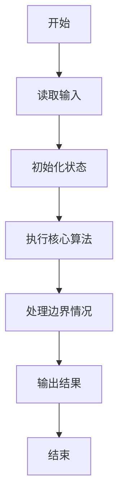
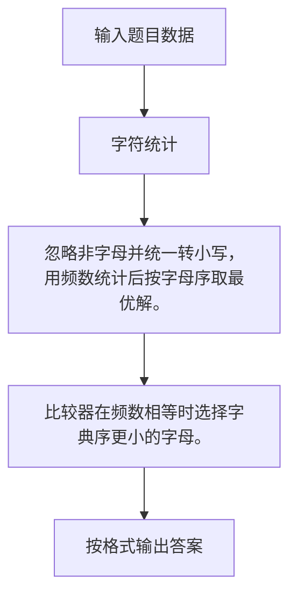

# 1042 字符统计

- **分值：** 20分

### 题目描述

请编写程序，找出一段给定文字中出现最频繁的那个英文字母。

### 输入格式：

输入在一行中给出一个长度不超过 1000 的字符串。字符串由 ASCII 码表中任意可见字符及空格组成，至少包含 1 个英文字母，以回车结束（回车不算在内）。

### 输出格式：

在一行中输出出现频率最高的那个英文字母及其出现次数，其间以空格分隔。如果有并列，则输出按字母序最小的那个字母。统计时不区分大小写，输出小写字母。

### 输入样例：
```
This is a simple TEST.  There ARE numbers and other symbols 1&2&3...........
```

### 输出样例：
```
e 7
```


### 解题思路

忽略非字母并统一转小写，用频数统计后按字母序取最优解。 比较器在频数相等时选择字典序更小的字母。

实现时按照题目的输入顺序读取数据，使用与数据规模匹配的数据结构保存必要状态，在遍历或模拟过程中完成核心计算，最后严格按照输出格式生成答案。

### 代码流程说明

1. 读取题目输入，初始化计数器、数组、集合或其他辅助状态。
2. 忽略非字母并统一转小写，用频数统计后按字母序取最优解。
3. 比较器在频数相等时选择字典序更小的字母。
4. 根据题目要求处理边界情况，并输出最终结果。

时间复杂度为 O(L)，空间复杂度主要取决于输入数据和辅助状态，通常为 O(1) 到 O(n)。

### 代码实现

以下是本题对应的完整 C++17 实现：

```cpp
#include <bits/stdc++.h>
using namespace std;
// 算法原理：忽略非字母并统一转小写，用频数统计后按字母序取最优解。
// 关键步骤：比较器在频数相等时选择字典序更小的字母。
int main() {
    string s;
    getline(cin, s);
    map<char, int> c;
    for (char x : s)
        if (isalpha((unsigned char)x))
            ++c[tolower((unsigned char)x)];
    auto p = max_element(c.begin(), c.end(), [](auto &a, auto &b) {
        return a.second == b.second ? a.first > b.first : a.second < b.second;
    });
    cout << p->first << ' ' << p->second;
}
```

### 代码流程图



### 解题流程图



### 常见易错点

- 注意输入规模，超大整数、长字符串或链表地址不能简单依赖普通整数和下标。
- 严格区分题目中的边界条件，例如是否包含等号、是否需要保留前导零以及是否只处理完整区块。
- 输出时按照题目规定的空格、换行、大小写和小数位数格式，避免计算正确但格式错误。
