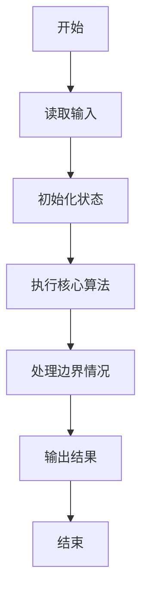
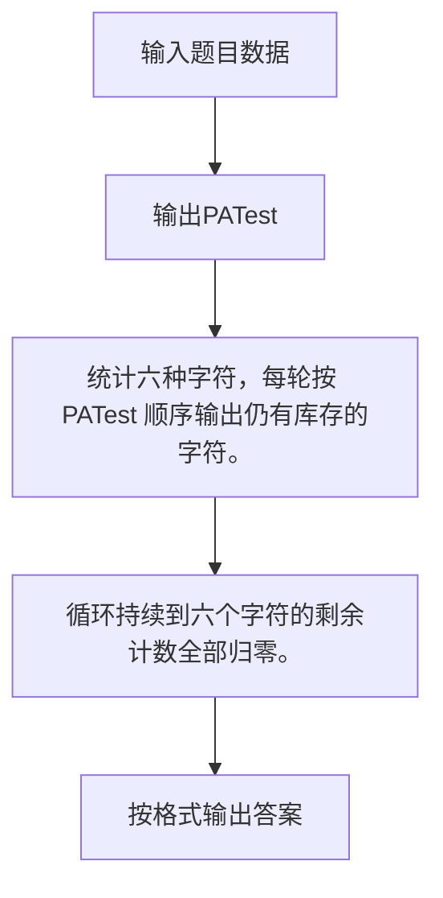

# 1043 输出PATest

- **分值：** 20分

### 题目描述

给定一个长度不超过 $10^4$ 的、仅由英文字母构成的字符串。请将字符重新调整顺序，按 `PATestPATest....` 这样的顺序输出，并忽略其它字符。当然，六种字符的个数不一定是一样多的，若某种字符已经输出完，则余下的字符仍按 PATest 的顺序打印，直到所有字符都被输出。

### 输入格式：

输入在一行中给出一个长度不超过 $10^4$ 的、仅由英文字母构成的非空字符串。

### 输出格式：

在一行中按题目要求输出排序后的字符串。题目保证输出非空。

### 输入样例：
```
redlesPayBestPATTopTeePHPereatitAPPT
```

### 输出样例：
```
PATestPATestPTetPTePePee
```


### 解题思路

统计六种字符，每轮按 PATest 顺序输出仍有库存的字符。 循环持续到六个字符的剩余计数全部归零。

实现时按照题目的输入顺序读取数据，使用与数据规模匹配的数据结构保存必要状态，在遍历或模拟过程中完成核心计算，最后严格按照输出格式生成答案。

### 代码流程说明

1. 读取题目输入，初始化计数器、数组、集合或其他辅助状态。
2. 统计六种字符，每轮按 PATest 顺序输出仍有库存的字符。
3. 循环持续到六个字符的剩余计数全部归零。
4. 根据题目要求处理边界情况，并输出最终结果。

时间复杂度为 O(L)，空间复杂度主要取决于输入数据和辅助状态，通常为 O(1) 到 O(n)。

### 代码实现

以下是本题对应的完整 C++17 实现：

```cpp
#include <bits/stdc++.h>
using namespace std;
// 算法原理：统计六种字符，每轮按 PATest 顺序输出仍有库存的字符。
// 关键步骤：循环持续到六个字符的剩余计数全部归零。
int main() {
    string s;
    cin >> s;
    int c[6] = {};
    for (char x : s) {
        int p = string("PATest").find(x);
        if (p >= 0)
            ++c[p];
    }
    bool ok = true;
    while (ok) {
        ok = false;
        for (int i = 0; i < 6; ++i)
            if (c[i])
                cout << "PATest"[i], --c[i], ok = true;
    }
}
```

### 代码流程图



### 解题流程图



### 常见易错点

- 注意输入规模，超大整数、长字符串或链表地址不能简单依赖普通整数和下标。
- 严格区分题目中的边界条件，例如是否包含等号、是否需要保留前导零以及是否只处理完整区块。
- 输出时按照题目规定的空格、换行、大小写和小数位数格式，避免计算正确但格式错误。
