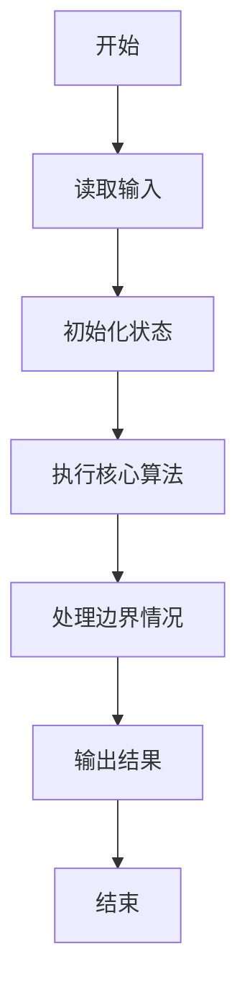
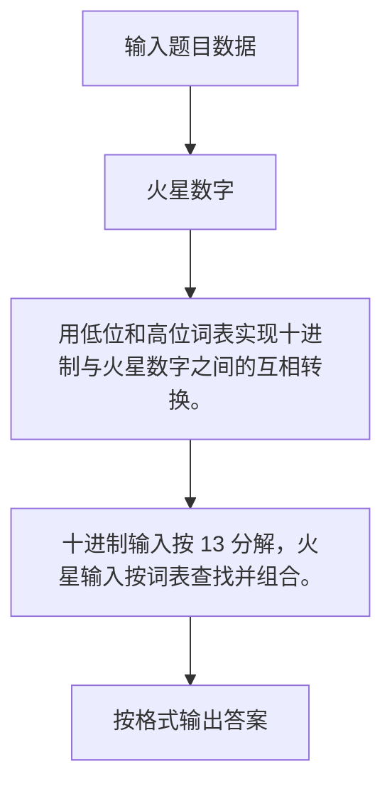

# 1044 火星数字

- **分值：** 20分

### 题目描述

火星人是以 13 进制计数的：

- 地球人的 0 被火星人称为 tret。
- 地球人数字 1 到 12 的火星文分别为：jan, feb, mar, apr, may, jun, jly, aug, sep, oct, nov, dec。
- 火星人将进位以后的 12 个高位数字分别称为：tam, hel, maa, huh, tou, kes, hei, elo, syy, lok, mer, jou。

例如地球人的数字 `29` 翻译成火星文就是 `hel mar`；而火星文 `elo nov` 对应地球数字 `115`。为了方便交流，请你编写程序实现地球和火星数字之间的互译。

### 输入格式：

输入第一行给出一个正整数 $N$（$<100$），随后 $N$ 行，每行给出一个 [0, 169) 区间内的数字 —— 或者是地球文，或者是火星文。

### 输出格式：

对应输入的每一行，在一行中输出翻译后的另一种语言的数字。

### 输入样例：
```
4
29
5
elo nov
tam
```

### 输出样例：
```
hel mar
may
115
13
```


### 解题思路

用低位和高位词表实现十进制与火星数字之间的互相转换。 十进制输入按 13 分解，火星输入按词表查找并组合。

实现时按照题目的输入顺序读取数据，使用与数据规模匹配的数据结构保存必要状态，在遍历或模拟过程中完成核心计算，最后严格按照输出格式生成答案。

### 代码流程说明

1. 读取题目输入，初始化计数器、数组、集合或其他辅助状态。
2. 用低位和高位词表实现十进制与火星数字之间的互相转换。
3. 十进制输入按 13 分解，火星输入按词表查找并组合。
4. 根据题目要求处理边界情况，并输出最终结果。

时间复杂度为 O(Q)，空间复杂度主要取决于输入数据和辅助状态，通常为 O(1) 到 O(n)。

### 代码实现

以下是本题对应的完整 C++17 实现：

```cpp
#include <bits/stdc++.h>
using namespace std;
// 算法原理：用低位和高位词表实现十进制与火星数字之间的互相转换。
// 关键步骤：十进制输入按 13 分解，火星输入按词表查找并组合。
string low[] = {"tret", "jan", "feb", "mar", "apr", "may", "jun",
                "jly",  "aug", "sep", "oct", "nov", "dec"};
string high[] = {"",    "tam", "hel", "maa", "huh", "tou", "kes",
                 "hei", "elo", "syy", "lok", "mer", "jou"};
int main() {
    int n;
    cin >> n;
    string s;
    getline(cin, s);
    while (n--) {
        getline(cin, s);
        if (isdigit((unsigned char)s[0])) {
            int x = stoi(s);
            if (x < 13)
                cout << low[x];
            else
                cout << high[x / 13] << (x % 13 ? ' ' + low[x % 13] : "");
        } else {
            stringstream ss(s);
            string a, b;
            ss >> a >> b;
            int x = find(low, low + 13, a) - low;
            if (x < 13) {
                if (b.empty())
                    cout << x;
                else
                    cout << x + (find(high, high + 13, b) - high) * 13;
            } else {
                int h = find(high, high + 13, a) - high;
                cout << h * 13 + (b.empty() ? 0 : find(low, low + 13, b) - low);
            }
        }
        if (n)
            cout << '\n';
    }
}
```

### 代码流程图



### 解题流程图



### 常见易错点

- 注意输入规模，超大整数、长字符串或链表地址不能简单依赖普通整数和下标。
- 严格区分题目中的边界条件，例如是否包含等号、是否需要保留前导零以及是否只处理完整区块。
- 输出时按照题目规定的空格、换行、大小写和小数位数格式，避免计算正确但格式错误。
