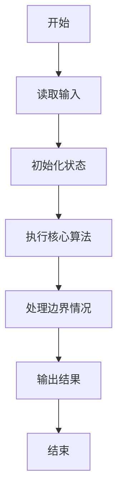
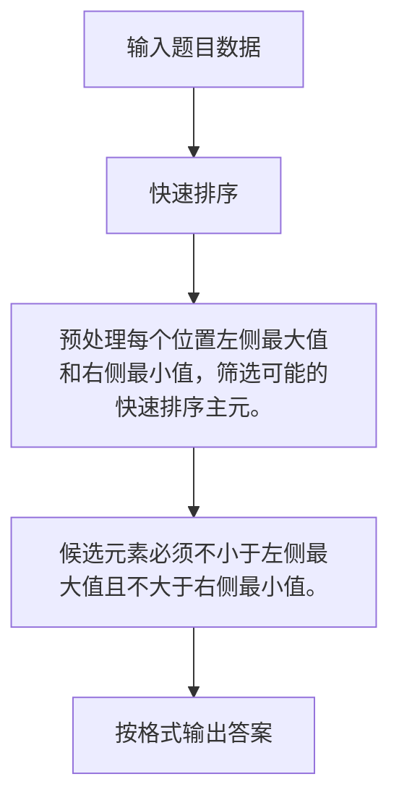

# 1045 快速排序

- **分值：** 25分

### 题目描述

著名的快速排序算法里有一个经典的划分过程：我们通常采用某种方法取一个元素作为主元，通过交换，把比主元小的元素放到它的左边，比主元大的元素放到它的右边。 给定划分后的 $N$ 个互不相同的正整数的排列，请问有多少个元素可能是划分前选取的主元？

例如给定 $N = 5$, 排列是1、3、2、4、5。则：

- 1 的左边没有元素，右边的元素都比它大，所以它可能是主元；
- 尽管 3 的左边元素都比它小，但其右边的 2 比它小，所以它不能是主元；
- 尽管 2 的右边元素都比它大，但其左边的 3 比它大，所以它不能是主元；
- 类似原因，4 和 5 都可能是主元。

因此，有 3 个元素可能是主元。

### 输入格式：

输入在第 1 行中给出一个正整数 $N$（$\le 10^5$）； 第 2 行是空格分隔的 $N$ 个不同的正整数，每个数不超过 $10^9$。

### 输出格式：

在第 1 行中输出有可能是主元的元素个数；在第 2 行中按递增顺序输出这些元素，其间以 1 个空格分隔，行首尾不得有多余空格。

### 输入样例：
```
5
1 3 2 4 5
```

### 输出样例：
```
3
1 4 5
```


### 解题思路

预处理每个位置左侧最大值和右侧最小值，筛选可能的快速排序主元。 候选元素必须不小于左侧最大值且不大于右侧最小值。

实现时按照题目的输入顺序读取数据，使用与数据规模匹配的数据结构保存必要状态，在遍历或模拟过程中完成核心计算，最后严格按照输出格式生成答案。

### 代码流程说明

1. 读取题目输入，初始化计数器、数组、集合或其他辅助状态。
2. 预处理每个位置左侧最大值和右侧最小值，筛选可能的快速排序主元。
3. 候选元素必须不小于左侧最大值且不大于右侧最小值。
4. 根据题目要求处理边界情况，并输出最终结果。

时间复杂度为 O(N log N)，空间复杂度主要取决于输入数据和辅助状态，通常为 O(1) 到 O(n)。

### 代码实现

以下是本题对应的完整 C++17 实现：

```cpp
#include <bits/stdc++.h>
using namespace std;
// 算法原理：预处理每个位置左侧最大值和右侧最小值，筛选可能的快速排序主元。
// 关键步骤：候选元素必须不小于左侧最大值且不大于右侧最小值。
int main() {
    int n;
    cin >> n;
    vector<int> a(n), l(n), r(n);
    for (int &x : a)
        cin >> x;
    l[0] = a[0];
    for (int i = 1; i < n; ++i)
        l[i] = max(l[i - 1], a[i]);
    r[n - 1] = INT_MAX;
    for (int i = n - 2; i >= 0; --i)
        r[i] = min(r[i + 1], a[i]);
    vector<int> v;
    for (int i = 0; i < n; ++i)
        if (a[i] >= l[i] && a[i] <= r[i])
            v.push_back(a[i]);
    sort(v.begin(), v.end());
    cout << v.size() << '\n';
    for (int i = 0; i < (int)v.size(); ++i)
        cout << (i ? " " : "") << v[i];
}
```

### 代码流程图



### 解题流程图



### 常见易错点

- 注意输入规模，超大整数、长字符串或链表地址不能简单依赖普通整数和下标。
- 严格区分题目中的边界条件，例如是否包含等号、是否需要保留前导零以及是否只处理完整区块。
- 输出时按照题目规定的空格、换行、大小写和小数位数格式，避免计算正确但格式错误。
