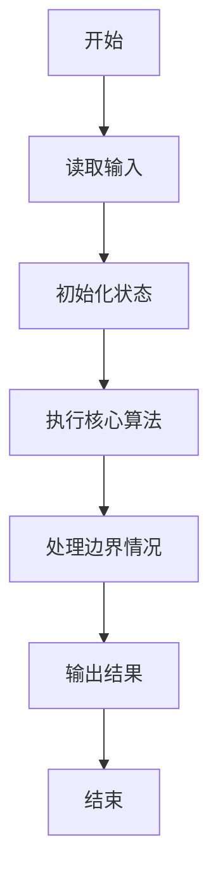
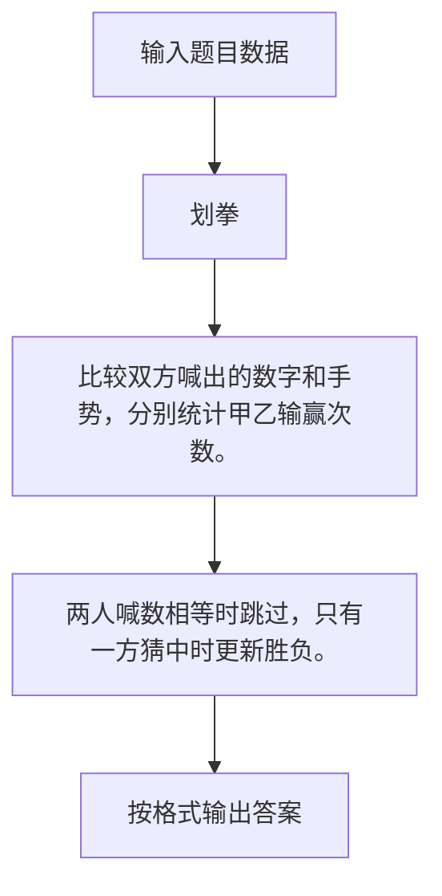

# 1046 划拳

- **分值：** 15分

### 题目描述

划拳是古老中国酒文化的一个有趣的组成部分。酒桌上两人划拳的方法为：每人口中喊出一个数字，同时用手比划出一个数字。如果谁比划出的数字正好等于两人喊出的数字之和，谁就赢了，输家罚一杯酒。两人同赢或两人同输则继续下一轮，直到唯一的赢家出现。

下面给出甲、乙两人的划拳记录，请你统计他们最后分别喝了多少杯酒。

### 输入格式：

输入第一行先给出一个正整数 $N$（$\le 100$），随后 $N$ 行，每行给出一轮划拳的记录，格式为：
```
甲喊 甲划 乙喊 乙划
```
其中`喊`是喊出的数字，`划`是划出的数字，均为不超过 100 的正整数（两只手一起划）。

### 输出格式：

在一行中先后输出甲、乙两人喝酒的杯数，其间以一个空格分隔。

### 输入样例：
```
5
8 10 9 12
5 10 5 10
3 8 5 12
12 18 1 13
4 16 12 15
```

### 输出样例：
```
1 2
```


### 解题思路

比较双方喊出的数字和手势，分别统计甲乙输赢次数。 两人喊数相等时跳过，只有一方猜中时更新胜负。

实现时按照题目的输入顺序读取数据，使用与数据规模匹配的数据结构保存必要状态，在遍历或模拟过程中完成核心计算，最后严格按照输出格式生成答案。

### 代码流程说明

1. 读取题目输入，初始化计数器、数组、集合或其他辅助状态。
2. 比较双方喊出的数字和手势，分别统计甲乙输赢次数。
3. 两人喊数相等时跳过，只有一方猜中时更新胜负。
4. 根据题目要求处理边界情况，并输出最终结果。

时间复杂度为 O(N)，空间复杂度主要取决于输入数据和辅助状态，通常为 O(1) 到 O(n)。

### 代码实现

以下是本题对应的完整 C++17 实现：

```cpp
#include <bits/stdc++.h>
using namespace std;
// 算法原理：比较双方喊出的数字和手势，分别统计甲乙输赢次数。
// 关键步骤：两人喊数相等时跳过，只有一方猜中时更新胜负。
int main() {
    int n, a, b, c, d, x = 0, y = 0;
    cin >> n;
    while (n--) {
        cin >> a >> b >> c >> d;
        int sum = a + c;
        if (sum == b && sum == d)
            continue;
        if (sum == b)
            ++y;
        else if (sum == d)
            ++x;
    }
    cout << x << ' ' << y;
}
```

### 代码流程图



### 解题流程图



### 常见易错点

- 注意输入规模，超大整数、长字符串或链表地址不能简单依赖普通整数和下标。
- 严格区分题目中的边界条件，例如是否包含等号、是否需要保留前导零以及是否只处理完整区块。
- 输出时按照题目规定的空格、换行、大小写和小数位数格式，避免计算正确但格式错误。
