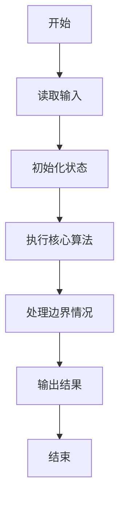
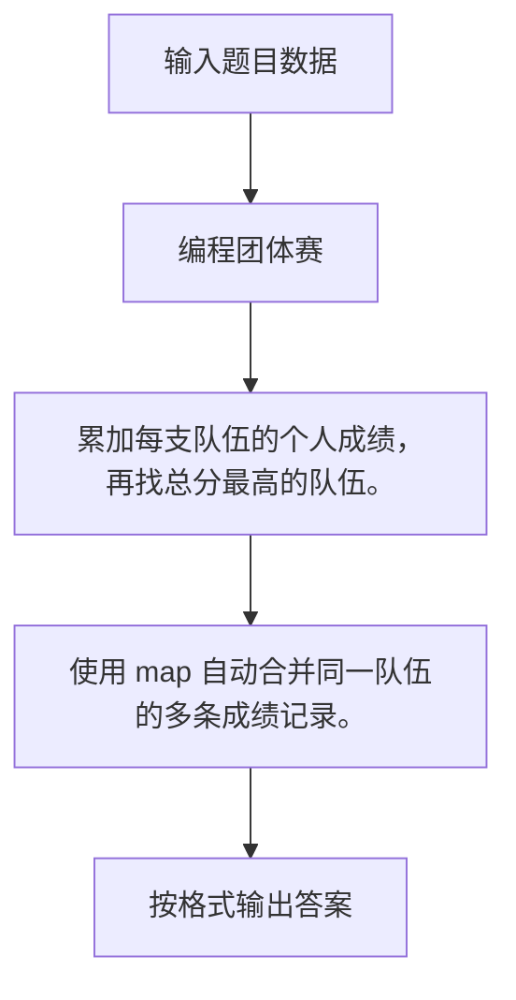

# 1047 编程团体赛

- **分值：** 20分

### 题目描述

编程团体赛的规则为：每个参赛队由若干队员组成；所有队员独立比赛；参赛队的成绩为所有队员的成绩和；成绩最高的队获胜。

现给定所有队员的比赛成绩，请你编写程序找出冠军队。

### 输入格式：

输入第一行给出一个正整数 $N$（$\le 10^4$），即所有参赛队员总数。随后 $N$ 行，每行给出一位队员的成绩，格式为：`队伍编号-队员编号 成绩`，其中`队伍编号`为 1 到 1000 的正整数，`队员编号`为 1 到 10 的正整数，`成绩`为 0 到 100 的整数。

### 输出格式：

在一行中输出冠军队的编号和总成绩，其间以一个空格分隔。注意：题目保证冠军队是唯一的。

### 输入样例：
```
6
3-10 99
11-5 87
102-1 0
102-3 100
11-9 89
3-2 61
```

### 输出样例：
```
11 176
```


### 解题思路

累加每支队伍的个人成绩，再找总分最高的队伍。 使用 map 自动合并同一队伍的多条成绩记录。

实现时按照题目的输入顺序读取数据，使用与数据规模匹配的数据结构保存必要状态，在遍历或模拟过程中完成核心计算，最后严格按照输出格式生成答案。

### 代码流程说明

1. 读取题目输入，初始化计数器、数组、集合或其他辅助状态。
2. 累加每支队伍的个人成绩，再找总分最高的队伍。
3. 使用 map 自动合并同一队伍的多条成绩记录。
4. 根据题目要求处理边界情况，并输出最终结果。

时间复杂度为 O(N log N)，空间复杂度主要取决于输入数据和辅助状态，通常为 O(1) 到 O(n)。

### 代码实现

以下是本题对应的完整 C++17 实现：

```cpp
#include <bits/stdc++.h>
using namespace std;
// 算法原理：累加每支队伍的个人成绩，再找总分最高的队伍。
// 关键步骤：使用 map 自动合并同一队伍的多条成绩记录。
int main() {
    int n;
    cin >> n;
    map<int, int> a;
    for (int i = 0; i < n; ++i) {
        string id;
        int score;
        cin >> id >> score;
        a[stoi(id.substr(0, id.find('-')))] += score;
    }
    auto p = max_element(a.begin(), a.end(), [](auto &x, auto &y) { return x.second < y.second; });
    cout << p->first << ' ' << p->second;
}
```

### 代码流程图



### 解题流程图



### 常见易错点

- 注意输入规模，超大整数、长字符串或链表地址不能简单依赖普通整数和下标。
- 严格区分题目中的边界条件，例如是否包含等号、是否需要保留前导零以及是否只处理完整区块。
- 输出时按照题目规定的空格、换行、大小写和小数位数格式，避免计算正确但格式错误。
