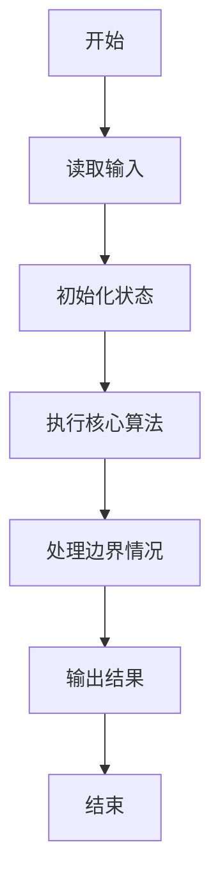
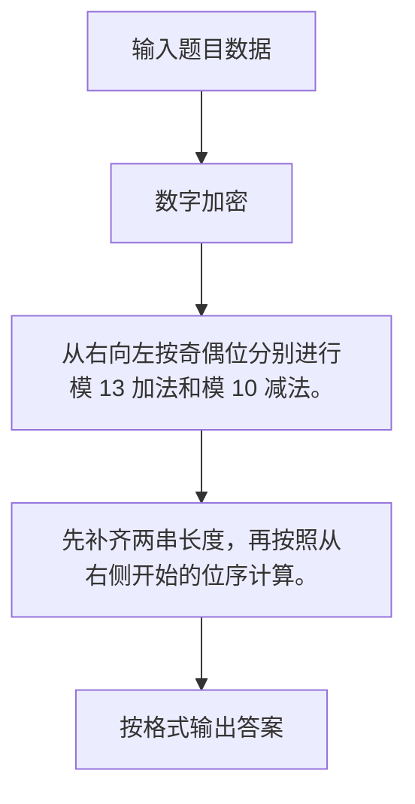

# 1048 数字加密

- **分值：** 20分

### 题目描述

本题要求实现一种数字加密方法。首先固定一个加密用正整数 A，对任一正整数 B，将其每 1 位数字与 A 的对应位置上的数字进行以下运算：对奇数位，对应位的数字相加后对 13 取余——这里用 J 代表 10、Q 代表 11、K 代表 12；对偶数位，用 B 的数字减去 A 的数字，若结果为负数，则再加 10。这里令个位为第 1 位。

### 输入格式：

输入在一行中依次给出 A 和 B，均为不超过 100 位的正整数，其间以空格分隔。

### 输出格式：

在一行中输出加密后的结果。

### 输入样例：
```
1234567 368782971
```

### 输出样例：
```
3695Q8118
```


### 解题思路

从右向左按奇偶位分别进行模 13 加法和模 10 减法。 先补齐两串长度，再按照从右侧开始的位序计算。

实现时按照题目的输入顺序读取数据，使用与数据规模匹配的数据结构保存必要状态，在遍历或模拟过程中完成核心计算，最后严格按照输出格式生成答案。

### 代码流程说明

1. 读取题目输入，初始化计数器、数组、集合或其他辅助状态。
2. 从右向左按奇偶位分别进行模 13 加法和模 10 减法。
3. 先补齐两串长度，再按照从右侧开始的位序计算。
4. 根据题目要求处理边界情况，并输出最终结果。

时间复杂度为 O(L)，空间复杂度主要取决于输入数据和辅助状态，通常为 O(1) 到 O(n)。

### 代码实现

以下是本题对应的完整 C++17 实现：

```cpp
#include <bits/stdc++.h>
using namespace std;
// 算法原理：从右向左按奇偶位分别进行模 13 加法和模 10 减法。
// 关键步骤：先补齐两串长度，再按照从右侧开始的位序计算。
int main() {
    string a, b;
    cin >> a >> b;
    int n = max(a.size(), b.size());
    a = string(n - a.size(), '0') + a;
    b = string(n - b.size(), '0') + b;
    string ans;
    for (int i = n - 1, k = 0; i >= 0; --i, ++k) {
        int x = a[i] - '0', y = b[i] - '0';
        if (k % 2 == 0) {
            int z = (x + y) % 13;
            ans += string("0123456789JQK")[z];
        } else {
            int z = (y - x + 10) % 10;
            ans += char('0' + z);
        }
    }
    reverse(ans.begin(), ans.end());
    cout << ans;
}
```

### 代码流程图



### 解题流程图



### 常见易错点

- 注意输入规模，超大整数、长字符串或链表地址不能简单依赖普通整数和下标。
- 严格区分题目中的边界条件，例如是否包含等号、是否需要保留前导零以及是否只处理完整区块。
- 输出时按照题目规定的空格、换行、大小写和小数位数格式，避免计算正确但格式错误。
