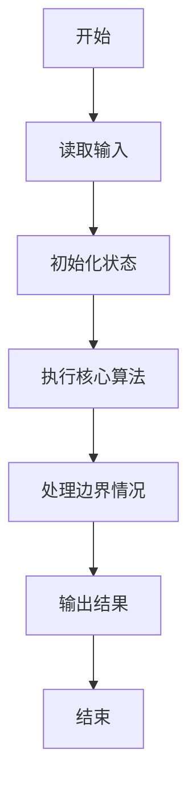
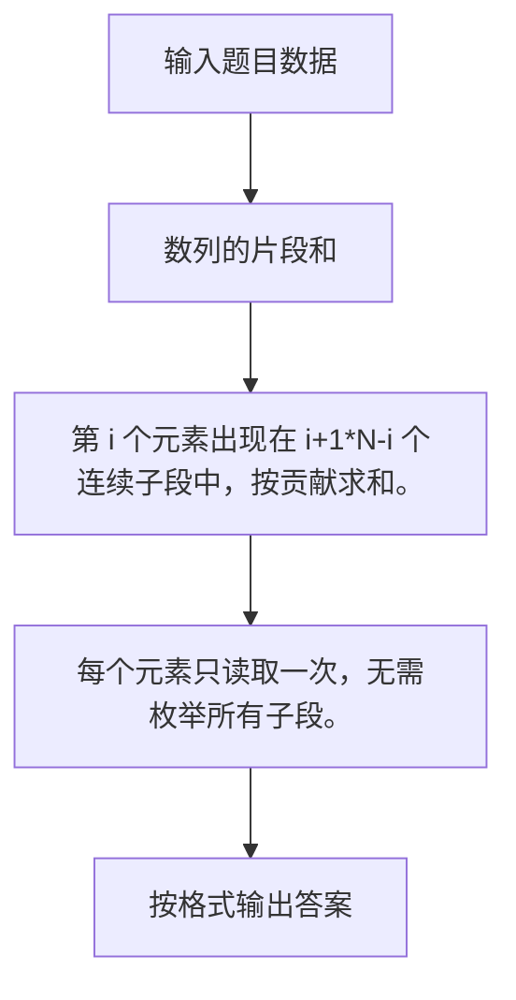

# 1049 数列的片段和

- **分值：** 20分

### 题目描述

给定一个正数数列，我们可以从中截取任意的连续的几个数，称为片段。例如，给定数列 { 0.1, 0.2, 0.3, 0.4 }，我们有 (0.1) (0.1, 0.2) (0.1, 0.2, 0.3) (0.1, 0.2, 0.3, 0.4) (0.2) (0.2, 0.3) (0.2, 0.3, 0.4) (0.3) (0.3, 0.4) (0.4) 这 10 个片段。

给定正整数数列，求出全部片段包含的所有的数之和。如本例中 10 个片段总和是 0.1 + 0.3 + 0.6 + 1.0 + 0.2 + 0.5 + 0.9 + 0.3 + 0.7 + 0.4 = 5.0。

### 输入格式：

输入第一行给出一个不超过 $10^5$ 的正整数 $N$，表示数列中数的个数，第二行给出 $N $ 个不超过 1.0 的正数，是数列中的数，其间以一个空格分隔。

### 输出格式：

在一行中输出该序列所有片段包含的数之和，精确到小数点后 2 位。

### 输入样例：
```
4
0.1 0.2 0.3 0.4
```

### 输出样例：
```
5.00
```

**感谢 Ruihan Zheng 对测试数据的修正。**


### 解题思路

第 i 个元素出现在 i+1*N-i 个连续子段中，按贡献求和。 每个元素只读取一次，无需枚举所有子段。

实现时按照题目的输入顺序读取数据，使用与数据规模匹配的数据结构保存必要状态，在遍历或模拟过程中完成核心计算，最后严格按照输出格式生成答案。

### 代码流程说明

1. 读取题目输入，初始化计数器、数组、集合或其他辅助状态。
2. 第 i 个元素出现在 i+1*N-i 个连续子段中，按贡献求和。
3. 每个元素只读取一次，无需枚举所有子段。
4. 根据题目要求处理边界情况，并输出最终结果。

时间复杂度为 O(N)，空间复杂度主要取决于输入数据和辅助状态，通常为 O(1) 到 O(n)。

### 代码实现

以下是本题对应的完整 C++17 实现：

```cpp
#include <bits/stdc++.h>
using namespace std;
// 算法原理：第 i 个元素出现在 (i+1)*(N-i) 个连续子段中，按贡献求和。
// 关键步骤：每个元素只读取一次，无需枚举所有子段。
int main() {
    int n;
    cin >> n;
    long double ans = 0;
    for (int i = 0; i < n; ++i) {
        long double x;
        cin >> x;
        ans += x * (i + 1) * (n - i);
    }
    cout << fixed << setprecision(2) << (double)ans;
}
```

### 代码流程图



### 解题流程图



### 常见易错点

- 注意输入规模，超大整数、长字符串或链表地址不能简单依赖普通整数和下标。
- 严格区分题目中的边界条件，例如是否包含等号、是否需要保留前导零以及是否只处理完整区块。
- 输出时按照题目规定的空格、换行、大小写和小数位数格式，避免计算正确但格式错误。
