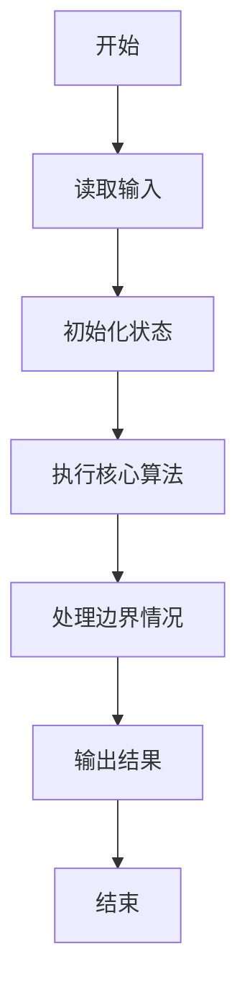
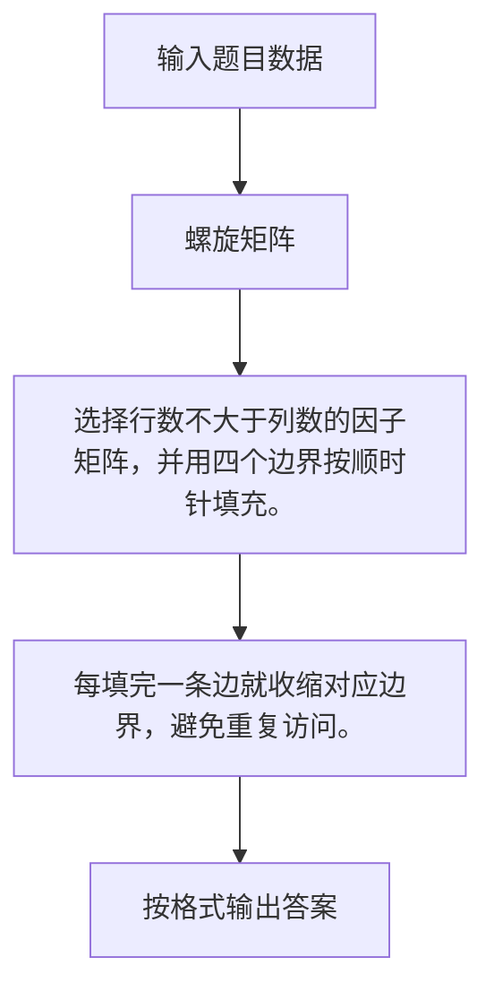

# 1050 螺旋矩阵

- **分值：** 25分

### 题目描述

本题要求将给定的 $N$ 个正整数按非递增的顺序，填入“螺旋矩阵”。所谓“螺旋矩阵”，是指从左上角第 1 个格子开始，按顺时针螺旋方向填充。要求矩阵的规模为 $m$ 行 $n$ 列，满足条件：$m\times n$ 等于 $N$；$m\ge n$；且 $m-n$ 取所有可能值中的最小值。

### 输入格式：

输入在第 1 行中给出一个正整数 $N$，第 2 行给出 $N$ 个待填充的正整数。所有数字不超过 $10^4$，相邻数字以空格分隔。

### 输出格式：

输出螺旋矩阵。每行 $n$ 个数字，共 $m$ 行。相邻数字以 1 个空格分隔，行末不得有多余空格。

### 输入样例：
```
12
37 76 20 98 76 42 53 95 60 81 58 93
```

### 输出样例：
```
98 95 93
42 37 81
53 20 76
58 60 76
```


### 解题思路

选择行数不大于列数的因子矩阵，并用四个边界按顺时针填充。 每填完一条边就收缩对应边界，避免重复访问。

实现时按照题目的输入顺序读取数据，使用与数据规模匹配的数据结构保存必要状态，在遍历或模拟过程中完成核心计算，最后严格按照输出格式生成答案。

### 代码流程说明

1. 读取题目输入，初始化计数器、数组、集合或其他辅助状态。
2. 选择行数不大于列数的因子矩阵，并用四个边界按顺时针填充。
3. 每填完一条边就收缩对应边界，避免重复访问。
4. 根据题目要求处理边界情况，并输出最终结果。

时间复杂度为 O(N)，空间复杂度主要取决于输入数据和辅助状态，通常为 O(1) 到 O(n)。

### 代码实现

以下是本题对应的完整 C++17 实现：

```cpp
#include <bits/stdc++.h>
using namespace std;
// 算法原理：选择行数不大于列数的因子矩阵，并用四个边界按顺时针填充。
// 关键步骤：每填完一条边就收缩对应边界，避免重复访问。
int main() {
    int n;
    cin >> n;
    vector<int> a(n);
    for (int &x : a)
        cin >> x;
    sort(a.rbegin(), a.rend());
    int c = sqrt(n);
    while (n % c)
        --c;
    int r = n / c;
    vector<vector<int>> m(r, vector<int>(c));
    int u = 0, d = r - 1, l = 0, rr = c - 1, k = 0;
    while (u <= d && l <= rr) {
        for (int j = l; j <= rr; ++j)
            m[u][j] = a[k++];
        ++u;
        for (int i = u; i <= d; ++i)
            m[i][rr] = a[k++];
        --rr;
        if (u <= d)
            for (int j = rr; j >= l; --j)
                m[d][j] = a[k++];
        --d;
        if (l <= rr)
            for (int i = d; i >= u; --i)
                m[i][l] = a[k++];
        ++l;
    }
    for (auto &row : m) {
        for (int j = 0; j < c; ++j)
            cout << (j ? " " : "") << row[j];
        cout << '\n';
    }
}
```

### 代码流程图



### 解题流程图



### 常见易错点

- 注意输入规模，超大整数、长字符串或链表地址不能简单依赖普通整数和下标。
- 严格区分题目中的边界条件，例如是否包含等号、是否需要保留前导零以及是否只处理完整区块。
- 输出时按照题目规定的空格、换行、大小写和小数位数格式，避免计算正确但格式错误。
