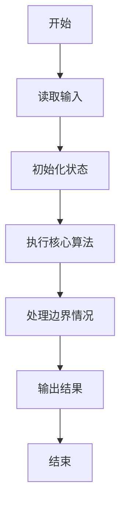
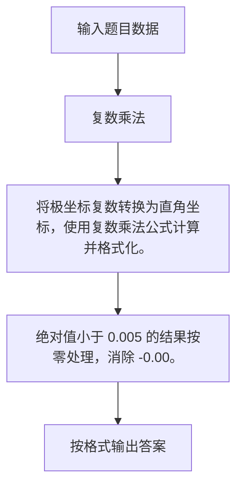

# 1051 复数乘法

- **分值：** 15分

### 题目描述

复数可以写成 $(A + Bi)$ 的常规形式，其中 $A$ 是实部，$B$ 是虚部，$i$ 是虚数单位，满足 $i^2 = -1$；也可以写成极坐标下的指数形式 $(R\times e^{(Pi)})$，其中 $R$ 是复数模，$P$ 是辐角，$i$ 是虚数单位，其等价于三角形式 $R(\cos (P) + i \sin (P))$。

现给定两个复数的 $R$ 和 $P$，要求输出两数乘积的常规形式。

### 输入格式：

输入在一行中依次给出两个非零复数的 $R_1$, $P_1$, $R_2$, $P_2$，数字间以空格分隔。

### 输出格式：

在一行中按照 `A+Bi` 的格式输出两数乘积的常规形式，实部和虚部均保留 2 位小数。注意：如果 `B` 是负数，则应该写成 `A-|B|i` 的形式。

### 输入样例：
```
2.3 3.5 5.2 0.4
```

### 输出样例：
```
-8.68-8.23i
```

**鸣谢福建医科大学刘睿妤同学修正题面！**


### 解题思路

将极坐标复数转换为直角坐标，使用复数乘法公式计算并格式化。 绝对值小于 0.005 的结果按零处理，消除 -0.00。

实现时按照题目的输入顺序读取数据，使用与数据规模匹配的数据结构保存必要状态，在遍历或模拟过程中完成核心计算，最后严格按照输出格式生成答案。

### 代码流程说明

1. 读取题目输入，初始化计数器、数组、集合或其他辅助状态。
2. 将极坐标复数转换为直角坐标，使用复数乘法公式计算并格式化。
3. 绝对值小于 0.005 的结果按零处理，消除 -0.00。
4. 根据题目要求处理边界情况，并输出最终结果。

时间复杂度为 O(1)，空间复杂度主要取决于输入数据和辅助状态，通常为 O(1) 到 O(n)。

### 代码实现

以下是本题对应的完整 C++17 实现：

```cpp
#include <bits/stdc++.h>
using namespace std;
// 算法原理：将极坐标复数转换为直角坐标，使用复数乘法公式计算并格式化。
// 关键步骤：绝对值小于 0.005 的结果按零处理，消除 -0.00。
int main() {
    double r1, p1, r2, p2;
    cin >> r1 >> p1 >> r2 >> p2;
    double a = r1 * cos(p1) * r2 * cos(p2) - r1 * sin(p1) * r2 * sin(p2),
           b = r1 * cos(p1) * r2 * sin(p2) + r2 * cos(p2) * r1 * sin(p1);
    if (fabs(a) < 0.005)
        a = 0;
    if (fabs(b) < 0.005)
        b = 0;
    cout << fixed << setprecision(2) << a << (b >= 0 ? "+" : "") << b << "i";
}
```

### 代码流程图



### 解题流程图



### 常见易错点

- 注意输入规模，超大整数、长字符串或链表地址不能简单依赖普通整数和下标。
- 严格区分题目中的边界条件，例如是否包含等号、是否需要保留前导零以及是否只处理完整区块。
- 输出时按照题目规定的空格、换行、大小写和小数位数格式，避免计算正确但格式错误。
